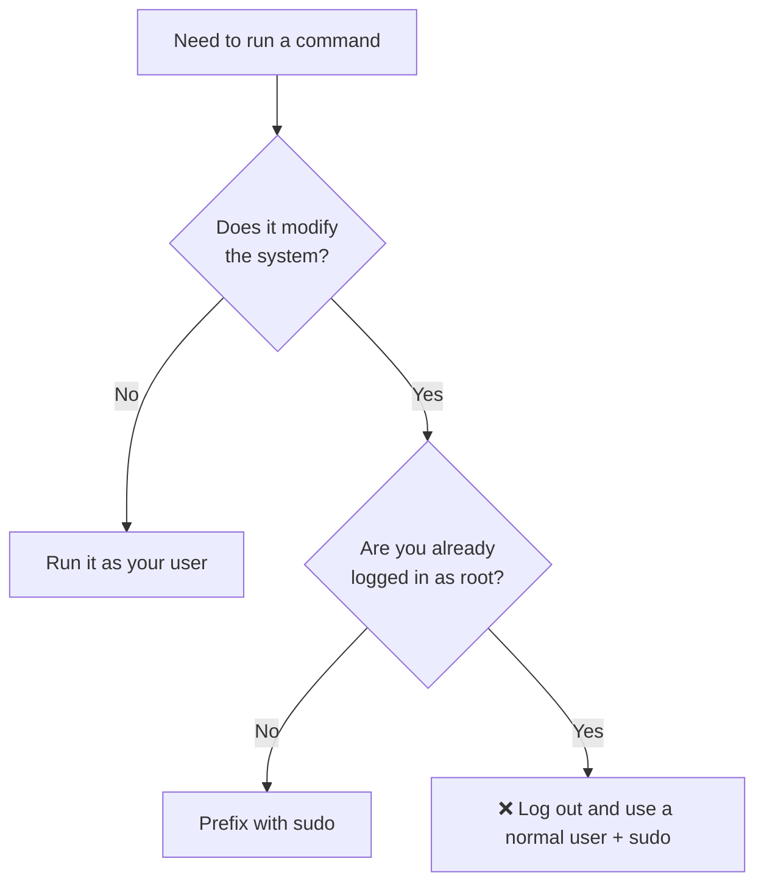
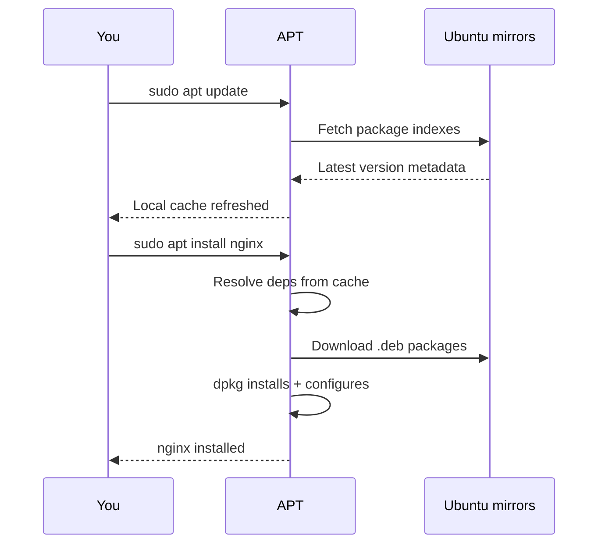
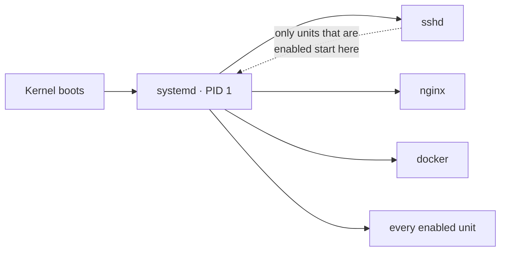

<ChapterMeta />

## TL;DR

- **Ubuntu Server is headless by design** — no desktop environment means ~600 MB less RAM burned while idle, fewer packages to attack, and every GPU cycle left for AI work.
- **`sudo` grants temporary root powers** to a normal user. You never log in as `root`; that habit is what keeps a compromised session from owning the whole box.
- **APT is "npm for the OS."** `apt update` refreshes the package index, `apt install`/`upgrade` act on it. Update first, always.
- **systemd is PID 1** — the service manager that starts, restarts, and logs every long-running process (`sshd`, `nginx`, `docker`) and can re-start them automatically on boot.
- After this chapter you can safely install software, control services, and read service status — the three verbs you'll use in every chapter that follows.

## Prerequisites

| Requirement | Why |
|-------------|-----|
| The home-lab machine | Everything here is run *on the server*, not your Mac. |
| A terminal (SSH or local console) | All steps are command-line. |
| Your install-time user account | You'll prefix privileged commands with `sudo`. |

::: info No prior chapters needed
This is the entry point. If you can open a terminal and type a password, you're ready.
:::

## Why Ubuntu Server (Not Desktop)?

When you install Ubuntu **Server**, you get a minimal system with no graphical interface — just a terminal. This might seem scary at first, but it's actually a huge advantage for a home lab:

- **Less RAM wasted** — No desktop environment means more RAM for your apps. A Ubuntu desktop uses ~800MB just sitting idle. Ubuntu Server uses ~200MB.
- **More secure** — Fewer packages = fewer attack surfaces. No browser, no file manager, no Bluetooth stack running unnecessarily.
- **Faster** — No GPU resources spent rendering a desktop. Your GTX 1050 Ti can focus entirely on CUDA/AI work.
- **How real servers work** — Every cloud server (AWS, DigitalOcean, Hetzner) you'll ever deploy to is headless. Learning this now makes you a better engineer.

<figure>
  <svg viewBox="0 0 640 210" role="img" aria-label="Bar chart comparing idle RAM: Ubuntu Desktop about 800 megabytes versus Ubuntu Server about 200 megabytes" width="100%" style="max-width:640px;height:auto;border-radius:10px;border:1px solid var(--vp-c-divider);background:var(--vp-c-bg-soft);padding:1rem;box-sizing:border-box;">
    <text x="16" y="34" font-family="Inter, system-ui, sans-serif" font-size="15" font-weight="700" fill="var(--vp-c-text-1)">Idle RAM usage (fresh install)</text>
    <text x="16" y="88" font-family="Inter, system-ui, sans-serif" font-size="13" fill="var(--vp-c-text-2)">Ubuntu Desktop</text>
    <rect x="150" y="72" width="400" height="26" rx="6" fill="var(--vp-c-text-3)"></rect>
    <text x="562" y="90" font-family="Inter, system-ui, sans-serif" font-size="13" font-weight="600" fill="var(--vp-c-text-2)">~800 MB</text>
    <text x="16" y="140" font-family="Inter, system-ui, sans-serif" font-size="13" fill="var(--vp-c-text-2)">Ubuntu Server</text>
    <rect x="150" y="124" width="100" height="26" rx="6" fill="var(--vp-c-brand-1)"></rect>
    <text x="262" y="142" font-family="Inter, system-ui, sans-serif" font-size="13" font-weight="600" fill="var(--vp-c-text-2)">~200 MB</text>
    <text x="16" y="186" font-family="Inter, system-ui, sans-serif" font-size="11.5" fill="var(--vp-c-text-3)">Approximate figures quoted in this guide. Lower is better for a 24/7 server.</text>
  </svg>
  <figcaption><strong>Figure 1.1</strong> — Ubuntu Server leaves roughly 600 MB more RAM for your workloads than the desktop edition.</figcaption>
</figure>

## How Linux is Different from Windows/Mac

| Concept | Windows | Linux |
|---------|---------|-------|
| File paths | `C:\Users\Ahmed\` | `/home/ahmed/` |
| Admin | Run as Administrator | `sudo` prefix |
| Software install | Download .exe | `apt install package` |
| Services | Task Manager | `systemctl` |
| Config files | Registry + .ini | Plain text files in `/etc/` |
| Everything is... | Files and Registry | **Files** (even hardware!) |

## Step 1 — Understand privilege with `sudo`

**Run** `whoami`. **Expected:** your username (e.g. `ahmed`) — **not** `root`. If it prints `root`, log out and use a normal user account.

`sudo` stands for "superuser do". In Linux, the root user (like Administrator in Windows) has full control. Instead of logging in as root (dangerous), you use `sudo` before commands that need elevated privileges.

```bash [privilege.sh]
# This FAILS — normal user can't install software
apt install nginx

# This WORKS — sudo gives temporary root powers
sudo apt install nginx
```

::: tip
Never log in as root. Always use a regular user + sudo. This way, even if someone hacks your session, they still need your password to do serious damage.
:::

::: details Why this matters — why not just log in as root?
`sudo` doesn't make you root permanently; it elevates a *single* command and logs the action. If you logged in as root instead, every process you started would run with full power — a stray `rm -rf` or a hijacked session would be catastrophic. Keeping a normal user as your default identity shrinks the blast radius to "needs your password."
:::



<p class="ahl-diagram-caption"><strong>Figure 1.2</strong> — The privilege decision tree: only system-modifying commands get `sudo`, and you never sit at a root shell.</p>

## Step 2 — Manage packages with APT

**Run** `sudo apt update && sudo apt install nginx`. **Expected:** the update ends with a package summary, then nginx installs without errors (verify in [Verification](#verification) below).

Ubuntu uses APT (Advanced Package Tool) to install software. Think of it like npm but for your entire operating system.

```bash [apt.sh]
sudo apt update          # Refresh the list of available packages (like npm registry fetch)
sudo apt upgrade -y      # Install all available updates
sudo apt install nginx   # Install a specific package
sudo apt remove nginx    # Remove a package
sudo apt autoremove      # Remove packages no longer needed
apt search nginx         # Search for packages
apt show nginx           # Show package details
```

::: info
**Why `apt update` before `apt install`?** APT keeps a local cache of available package versions. Without updating, you might install an outdated version. Always run `apt update` first, especially on a fresh install.
:::

::: details Why this matters — update is not upgrade
`update` and `upgrade` are two different phases. `update` downloads the *index* of what versions exist (a few KB of metadata). `upgrade` downloads and installs the actual package files. Running `upgrade` without a fresh `update` is like `npm install` using a week-old lockfile — you get stale versions and, worse, missing dependencies.
:::



<p class="ahl-diagram-caption"><strong>Figure 1.3</strong> — `update` then `install`: APT refreshes its metadata cache before it can resolve dependencies and download packages.</p>

## Step 3 — Control a service with systemd

**Run** `sudo systemctl enable --now nginx`. **Expected:** no errors; then `systemctl is-active nginx` prints `active`.

Every long-running process on your server (nginx, ssh, docker) is managed by `systemd`. It starts services on boot, restarts them if they crash, and logs their output.

```bash [systemctl.sh]
sudo systemctl start nginx      # Start a service now
sudo systemctl stop nginx       # Stop it
sudo systemctl restart nginx    # Stop then start
sudo systemctl reload nginx     # Reload config without stopping (graceful)
sudo systemctl enable nginx     # Start automatically at boot
sudo systemctl disable nginx    # Don't start at boot
sudo systemctl status nginx     # Show current status + recent logs
```

Think of `systemctl enable` like adding something to Windows Startup programs.

::: details Why this matters — start ≠ enable
`start` and `enable` are independent switches. `start` runs the service **now**; `enable` wires it into boot. A service you `start` but never `enable` silently disappears after a reboot — a classic "it worked yesterday" bug. `systemctl status` shows both: `Active:` (running now) and `Loaded:` (…; enabled/disabled).
:::



<p class="ahl-diagram-caption"><strong>Figure 1.4</strong> — systemd is PID 1: on boot it starts every <em>enabled</em> unit, and only those.</p>

<figure>
  
  <figcaption><strong>Figure 1.5</strong> — During boot, systemd (PID 1) takes over and starts every <em>enabled</em> unit — the same mechanism that will keep your nginx, Docker, and PM2 services alive in later chapters. (Screenshot: Debian systemd boot, CC0.)</figcaption>
</figure>

## Verification

Confirm each concept with a command that proves it worked.

| Check | Command | Expected |
|-------|---------|----------|
| You are **not** root | `whoami` | your username (e.g. `ahmed`), **not** `root` |
| APT is up to date | `sudo apt update` | ends with `All packages are up to date.` (or a list of upgradable packages) |
| A package is installed | `apt list --installed 2>/dev/null \| grep nginx` | a line containing `nginx/...` |
| The service is running | `systemctl is-active nginx` | `active` |
| The service survives reboot | `systemctl is-enabled nginx` | `enabled` |

```bash [verify.sh]
whoami                    # → ahmed
systemctl is-active nginx # → active
systemctl is-enabled nginx # → enabled
```

## Common pitfalls

::: warning Top 3 failure modes
1. **Running `apt install` without `update` first.** You get stale or unresolvable versions. Always `sudo apt update` before installing on a fresh box.
2. **Forgetting `sudo`.** `apt install nginx` fails with `E: Could not open lock file` or `Permission denied`. Re-run with `sudo`.
3. **Using `start` but not `enable`.** The service works until the next reboot, then never comes back. If it should always run, `enable` it too.
:::

::: warning The `apt upgrade` reboot prompt
`sudo apt upgrade -y` auto-confirms *package* prompts, but a **kernel or libc upgrade still needs a reboot** to take effect. Depending on your install you may also hit the `needrestart` dialog asking *"Which services should be restarted?"*. Don't blindly dismiss it.

After any upgrade, check whether a reboot is pending:

```bash [reboot-check.sh]
cat /var/run/reboot-required 2>/dev/null && echo "REBOOT REQUIRED" || echo "no reboot needed"
```

If the file exists, schedule a reboot (`sudo reboot`) at a safe time — the new kernel is only active after it.
:::

## Troubleshooting

| Symptom | Likely cause | Fix |
|---------|--------------|-----|
| `E: Unable to locate package` | Stale/empty package index | `sudo apt update`, then retry the install |
| `E: Could not open lock file … are you root?` | Missing `sudo`, or another apt process is running | Prefix with `sudo`; wait for the other apt run to finish |
| `systemctl: command not found` | Not a systemd system (e.g. WSL, container without systemd) | Use a real Ubuntu Server install or enable systemd in your environment |
| Service shows `inactive (dead)` | It crashed or was never started | `systemctl status <svc>` and `journalctl -u <svc> -n 50` to see why |
| Service missing after reboot | `start`ed but never `enable`d | `sudo systemctl enable <svc>` |

## Recap & next

You now know the three primitives every later chapter leans on: **privilege** (`sudo`), **packages** (APT), and **services** (systemd). You can install software, control it, verify it, and make it survive a reboot.

Next, you'll turn a blank machine into this server: **[Chapter 2 — Installation & Disk Partitioning](/chapters/02-installation-disk-partitioning)**.

## References

- [Ubuntu Server documentation](https://documentation.ubuntu.com/server/) — official reference for everything covered here and beyond.
- [Install Ubuntu Server (official tutorial)](https://ubuntu.com/tutorials/install-ubuntu-server) — the upstream walkthrough for Chapter 2.
- [`man apt`](https://manpages.ubuntu.com/manpages/noble/en/man8/apt.8.html) — authoritative behaviour of `update`, `upgrade`, `install`, `remove`, `autoremove`.
- [`man systemctl`](https://manpages.ubuntu.com/manpages/noble/en/man1/systemctl.1.html) — every verb (`start`, `enable`, `status`, …) with exact semantics.
- [systemd documentation](https://systemd.io/) — what PID 1 actually does and how units work.
- [`systemd.service` man page](https://manpages.ubuntu.com/manpages/noble/en/man5/systemd.service.5.html) — unit file reference used in later chapters.
