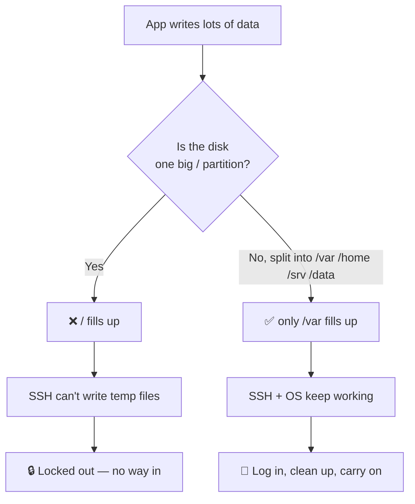
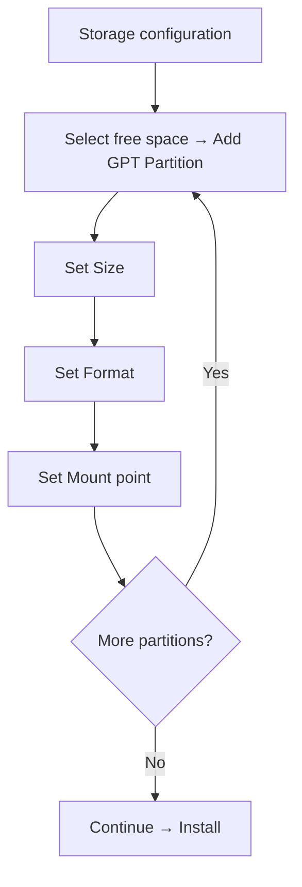

<ChapterMeta />

## TL;DR

- **Partitioning splits one physical disk into isolated logical disks.** If one fills up, the others keep working — so a runaway Docker log can't lock you out of SSH.
- **Separate `/var`, `/home`, `/srv`, and `/data`** from `/`. That's the difference between "clean the logs" and "the server is dead".
- **`/boot/efi` must be FAT32 and ≥512 MB** on UEFI systems. Too small is the classic install failure.
- **ext4 for everything except EFI; swap = your RAM size (16 GB)** to absorb AI-workload memory spikes.
- After this chapter you'll have a laid-out NVMe ready for a clean Ubuntu Server install.

## Prerequisites

| Requirement | Why |
|-------------|-----|
| Ubuntu Server 24.04 LTS ISO on a USB stick | The installer is where you create these partitions. |
| The Samsung 500 GB NVMe (target disk) | Everything on it will be erased — back up first. |
| Chapter 1 (sudo / APT / systemd) | You'll verify the layout from a shell after install. |

::: danger Back up first
The installer's "reformat" step is destructive and irreversible. If the NVMe already holds data you care about, copy it off **before** you begin.
:::

## Understanding Disk Partitioning — The Why

Partitioning means dividing your physical disk into separate logical sections. Each section acts as an independent disk with its own filesystem. Here's why this matters for a server:

**Imagine this scenario:** You have one big `/` partition. Your Docker logs fill up the disk. Now your entire system crashes because there's no space for anything — not even for SSH to write its temporary files. You're locked out.

With separate partitions:
- Docker logs fill up `/var` → only `/var` is full
- Your OS, SSH, and other services still work fine
- You SSH in, clean the logs, and continue

This is why separating `/var`, `/home`, `/srv`, and `/data` is professional practice, not just preference.



<p class="ahl-diagram-caption"><strong>Figure 2.1</strong> — Why separate partitions: isolation turns a total outage into a manageable cleanup.</p>

::: details Why this matters — the blast radius of a full disk
A single `/` partition means every service competes for the same space. Logs, Docker images, database files, and your projects all share one pool. When any one of them grows unchecked, the kernel can't even create a temp file for `sshd` to accept a new login — and the only fix is physical access. Splitting the disk caps each failure domain: `/var` can fill without touching `/home` or the OS.

:::

## Your Partition Layout Explained

```
Samsung NVMe 500GB (nvme0n1)
├── /boot/efi   512MB  FAT32   ← UEFI bootloader lives here
├── /boot         1GB  ext4    ← Linux kernel & initrd images
├── /             80GB ext4    ← OS root: system binaries, configs
├── /var          50GB ext4    ← Variable data: logs, Docker, apt cache
├── /home         50GB ext4    ← Your personal files, SSH keys, dotfiles
├── /srv          80GB ext4    ← Service data: your NestJS apps, websites
├── swap          16GB swap    ← Virtual RAM (= your physical RAM size)
└── /data        ~188GB ext4   ← Datasets, ML models, backups
```

<figure>
  <svg viewBox="0 0 720 350" role="img" aria-label="Partition map of the 500 GB NVMe: boot/efi 512 MB FAT32, boot 1 GB ext4, root 80 GB ext4, var 50 GB ext4, home 50 GB ext4, srv 80 GB ext4, swap 16 GB, data 188 GB ext4" width="100%" style="max-width:720px;height:auto;border-radius:10px;border:1px solid var(--vp-c-divider);background:var(--vp-c-bg-soft);padding:1rem;box-sizing:border-box;font-family:Inter,system-ui,sans-serif;">
    <text x="16" y="30" font-size="15" font-weight="700" fill="var(--vp-c-text-1)">Samsung 500 GB NVMe — partition map (nvme0n1)</text>
    <g font-size="13" fill="var(--vp-c-text-2)">
      <text x="16" y="69">/boot/efi</text>
      <rect x="150" y="55" width="8" height="18" rx="4" fill="var(--vp-c-text-3)"></rect>
      <text x="170" y="69" font-size="12" fill="var(--vp-c-text-3)">512 MB · FAT32</text>
      <text x="16" y="103">/boot</text>
      <rect x="150" y="89" width="8" height="18" rx="4" fill="var(--vp-c-text-3)"></rect>
      <text x="170" y="103" font-size="12" fill="var(--vp-c-text-3)">1 GB · ext4</text>
      <text x="16" y="137">/</text>
      <rect x="150" y="123" width="170" height="18" rx="4" fill="var(--vp-c-brand-1)"></rect>
      <text x="330" y="137" font-size="12" fill="var(--vp-c-text-3)">80 GB · ext4</text>
      <text x="16" y="171">/var</text>
      <rect x="150" y="157" width="106" height="18" rx="4" fill="var(--vp-c-brand-1)"></rect>
      <text x="266" y="171" font-size="12" fill="var(--vp-c-text-3)">50 GB · ext4</text>
      <text x="16" y="205">/home</text>
      <rect x="150" y="191" width="106" height="18" rx="4" fill="var(--vp-c-brand-1)"></rect>
      <text x="266" y="205" font-size="12" fill="var(--vp-c-text-3)">50 GB · ext4</text>
      <text x="16" y="239">/srv</text>
      <rect x="150" y="225" width="170" height="18" rx="4" fill="var(--vp-c-brand-1)"></rect>
      <text x="330" y="239" font-size="12" fill="var(--vp-c-text-3)">80 GB · ext4</text>
      <text x="16" y="273">swap</text>
      <rect x="150" y="259" width="34" height="18" rx="4" fill="var(--vp-c-yellow-1, #d97706)"></rect>
      <text x="194" y="273" font-size="12" fill="var(--vp-c-text-3)">16 GB · swap</text>
      <text x="16" y="307">/data</text>
      <rect x="150" y="293" width="400" height="18" rx="4" fill="var(--vp-c-brand-3)"></rect>
      <text x="560" y="307" font-size="12" fill="var(--vp-c-text-3)">~188 GB · ext4</text>
    </g>
    <text x="16" y="336" font-size="11.5" fill="var(--vp-c-text-3)">Bar length is proportional to size; tiny boot partitions are shown at minimum width.</text>
  </svg>
  <figcaption><strong>Figure 2.2</strong> — The target partition map: eight partitions on one 500 GB NVMe, each with a single job.</figcaption>
</figure>

### What Goes Where?

**`/boot/efi`** — The UEFI firmware needs a FAT32 partition to find the bootloader. This is non-negotiable on modern UEFI systems. 512MB is plenty (it only stores a few MB of bootloader files, but we give it 512MB for safety — this was literally the bug you hit during installation: the old partition was too small).

**`/boot`** — Contains the Linux kernel (`vmlinuz`) and initial RAM disk (`initrd`). When you run `apt upgrade`, new kernel versions are placed here. 1GB is enough for several kernel versions.

**`/` (root)** — The operating system itself. All system binaries (`/usr/bin`), system configs (`/etc`), libraries (`/lib`). 80GB is generous — the base system uses ~5GB, but you want room for packages, pip installs, and npm globals.

**`/var`** — Everything that changes frequently at runtime. This is the most important partition to separate:
- `/var/lib/docker` — All Docker images, containers, volumes (can easily reach 20-40GB)
- `/var/lib/postgresql` — If you run Postgres outside Docker
- `/var/log` — System and application logs
- `/var/cache/apt` — Downloaded packages

**`/home`** — Your user's home directory. Projects you clone with git, your `.bashrc`, `.ssh` keys, NVM, Python virtualenvs. Keeping it separate means you can reinstall the OS without losing your files.

**`/srv`** — Conventionally for "served" data — web apps, API code running as services. Keeping this separate from `/home` is good practice for production-like setups.

**`swap`** — Acts as overflow RAM. When your 16GB RAM fills up, the kernel moves less-used memory pages here. For AI workloads that might spike RAM (loading a large model), having swap prevents OOM (Out of Memory) kills. Match it to your RAM size: 16GB.

**`/data`** — Your personal big storage: the OpenFoodFacts CSV (2GB+), trained models, Parquet files, exports. Keeping this separate makes it easy to mount on the HDD later or expand.

::: details Why this matters — swap the size of your RAM
Without swap, the kernel's only option when RAM is exhausted is the OOM killer, which terminates the largest process — often your database or API. Swap gives the kernel a safety valve: it can page out cold memory instead of killing a process. Matching swap to RAM (16 GB) means a temporary spike (e.g. loading a model) degrades into "slow for a minute" rather than "process killed".
:::

## Filesystem Types Explained

| Filesystem | Used for | Key facts |
|------------|----------|-----------|
| **ext4** | `/boot`, `/`, `/var`, `/home`, `/srv`, `/data` | The standard Linux filesystem. Mature, stable, supports files up to 16TB, journaling (crash recovery). Use this for everything except EFI. |
| **FAT32** | `/boot/efi` | Required for the EFI partition. UEFI firmware can only read FAT32. |
| **swap** | `swap` | Not really a filesystem — it's raw space the kernel uses as virtual memory. |

## Creating Partitions in the Ubuntu Installer

In the installer's "Storage configuration" screen:

1. Select the **free space** under your Samsung NVMe → Enter → **Add GPT Partition**
2. For each partition, fill in:
   - **Size**: exact size (e.g., `512M`, `1G`, `80G`)
   - **Format**: `fat32`, `ext4`, or `swap`
   - **Mount**: `/boot/efi`, `/boot`, `/`, `/var`, `/home`, `/srv`, `/data`
3. For swap: Format = `swap`, no mount point needed



<p class="ahl-diagram-caption"><strong>Figure 2.3</strong> — The installer loop: repeat "Add GPT Partition" once per row of the layout table, then continue.</p>

<figure>
  <svg viewBox="0 0 720 300" role="img" aria-label="Annotated recreation of the Ubuntu Server installer Add GPT Partition screen showing the Size, Format and Mount fields for each of the eight partitions" width="100%" style="max-width:720px;height:auto;border-radius:10px;border:1px solid #1e293b;background:#0f172a;box-sizing:border-box;font-family:'JetBrains Mono',ui-monospace,monospace;">
    <rect x="0" y="0" width="720" height="34" rx="10" fill="#1e293b"></rect>
    <circle cx="20" cy="17" r="5" fill="#ef4444"></circle>
    <circle cx="38" cy="17" r="5" fill="#f59e0b"></circle>
    <circle cx="56" cy="17" r="5" fill="#22c55e"></circle>
    <text x="76" y="22" font-size="12" fill="#cbd5e1">Ubuntu Server 24.04 LTS — Storage configuration → Add GPT Partition</text>
    <g font-size="12.5" fill="#e2e8f0">
      <text x="24" y="66">Size</text>
      <text x="220" y="66">Format</text>
      <text x="380" y="66">Mount</text>
      <text x="24" y="94">512M</text><text x="220" y="94">fat32</text><text x="380" y="94">/boot/efi</text>
      <text x="24" y="118">1G</text><text x="220" y="118">ext4</text><text x="380" y="118">/boot</text>
      <text x="24" y="142">80G</text><text x="220" y="142">ext4</text><text x="380" y="142">/</text>
      <text x="24" y="166">50G</text><text x="220" y="166">ext4</text><text x="380" y="166">/var</text>
      <text x="24" y="190">50G</text><text x="220" y="190">ext4</text><text x="380" y="190">/home</text>
      <text x="24" y="214">80G</text><text x="220" y="214">ext4</text><text x="380" y="214">/srv</text>
      <text x="24" y="238">16G</text><text x="220" y="238">swap</text><text x="380" y="238">— (none)</text>
      <text x="24" y="262">188G</text><text x="220" y="262">ext4</text><text x="380" y="262">/data</text>
    </g>
    <line x1="24" y1="44" x2="700" y2="44" stroke="#334155"></line>
    <text x="24" y="34" font-size="11" fill="#64748b">exact size</text>
    <text x="220" y="34" font-size="11" fill="#64748b">fat32 for EFI · ext4 elsewhere · swap for swap</text>
    <text x="380" y="34" font-size="11" fill="#64748b">where it appears</text>
    <g fill="#5cb39a" font-size="11.5">
      <path d="M470 80 L560 70 L560 90 Z" fill="#5cb39a"></path>
      <text x="566" y="84">One row per partition, top to bottom</text>
      <path d="M470 130 L560 120 L560 140 Z" fill="#5cb39a"></path>
      <text x="566" y="134">Partition numbers follow this order</text>
      <path d="M470 250 L560 240 L560 260 Z" fill="#5cb39a"></path>
      <text x="566" y="254">Swap has no mount point</text>
    </g>
  </svg>
  <figcaption><strong>Figure 2.4</strong> — Annotated recreation of the installer's "Add GPT Partition" screen: set <em>Size</em>, <em>Format</em>, and <em>Mount</em> once per row. (Recreated; the real installer is a text UI.)</figcaption>
</figure>

::: warning
**Important:** Create them in order from top to bottom. The installer assigns partition numbers sequentially (nvme0n1p1, p2, p3...).
:::

## Verification

After the install finishes and you've logged in, confirm the layout matches the plan:

```bash [verify-layout.sh]
lsblk -f                       # tree of disks, partitions, filesystems, mount points
findmnt --real                 # every real mount + its source device
df -h /                        # root filesystem size + free space
sudo blkid /dev/nvme0n1p1      # confirm /boot/efi is vfat
```

| Check | Command | Expected |
|-------|---------|----------|
| All partitions exist | `lsblk` | `nvme0n1` with `p1`…`p8` children |
| EFI is FAT32 | `sudo blkid /dev/nvme0n1p1` | `TYPE="vfat"` |
| `/var` is its own mount | `findmnt /var` | source is `/dev/nvme0n1p4` (not `/`) |
| Swap is active | `swapon --show` | a row for the swap partition, ~16G |
| Root has room | `df -h /` | `Use%` well under 100%, size ≈ 80G |

## Common pitfalls

::: warning Top 3 failure modes
1. **`/boot/efi` too small (e.g. 100 MB).** The installer warns or fails to place the bootloader. Always give it **512 MB**, FAT32.
2. **One giant `/` partition.** Works — until any service fills the disk and takes SSH down with it. Separate `/var` at minimum.
3. **Creating partitions out of order.** Device numbers are assigned top-to-bottom, so a partition created later can land as `p3` when you expected `p2`. Follow the table order.
:::

## Troubleshooting

| Symptom | Likely cause | Fix |
|---------|--------------|-----|
| Installer blocks "Continue" / no boot device | No EFI system partition on a UEFI machine | Add a FAT32 partition mounted at `/boot/efi` (≥512 MB) |
| Wrong partition numbers after install | Partitions created out of order | Match device names to `lsblk`; adjust any later scripts/fstab accordingly |
| `swapon --show` is empty | Swap partition created without `swap` format | Re-format that partition as `swap` (see Chapter 7 tooling) |
| `/data` not visible after reboot | Partition exists but isn't mounted | Add it to `/etc/fstab` (covered in Chapter 7) |
| Boot fails after install | `/boot` too small for kernel + initrd | Enlarge `/boot` (1 GB) and reinstall |

## Recap & next

You've laid out eight partitions with clear jobs: a boot chain, an OS, isolated runtime data, your files, service data, swap, and bulk storage. That isolation is what keeps one full filesystem from becoming a full outage.

Next: **[Chapter 3 — First Boot & Essential Setup](/chapters/03-first-boot-essential-setup)** — the first commands to run once Ubuntu Server is installed.

## References

- [Install Ubuntu Server (official tutorial)](https://ubuntu.com/tutorials/install-ubuntu-server) — the exact installer flow, including the storage step.
- [Ubuntu Server installation how-to](https://documentation.ubuntu.com/server/how-to/installation/) — upstream guidance and troubleshooting.
- [The ext4 filesystem (kernel docs)](https://www.kernel.org/doc/html/latest/filesystems/ext4/index.html) — what ext4 actually provides (journaling, limits).
- [Ubuntu Swap FAQ](https://help.ubuntu.com/community/SwapFaq) — sizing swap and how it interacts with RAM.
- [`man fdisk`](https://manpages.ubuntu.com/manpages/noble/en/man8/fdisk.8.html) — partitioning tool used in Chapter 7.
- [`man sgdisk`](https://manpages.ubuntu.com/manpages/noble/en/man8/sgdisk.8.html) — scriptable GPT partitioning.
- [`man blkid`](https://manpages.ubuntu.com/manpages/noble/en/man8/blkid.8.html) — inspect UUIDs and filesystem types (needed for `/etc/fstab`).
- [Arch Wiki — Partitioning](https://wiki.archlinux.org/title/Partitioning) — distro-neutral reference for GPT/UEFI partition schemes.
