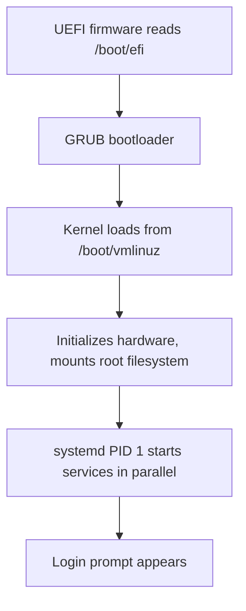
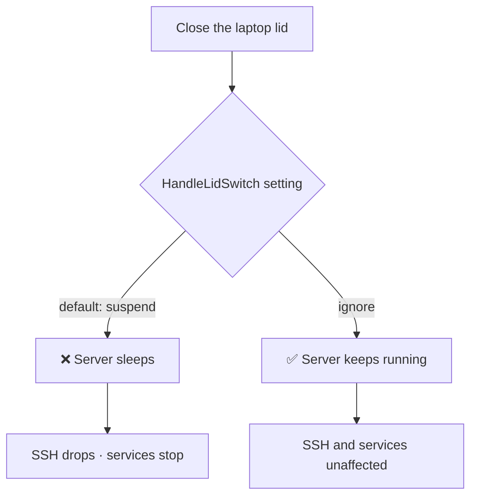

<ChapterMeta />

## TL;DR

- **The first boot walks a fixed chain:** UEFI → GRUB → kernel → systemd (PID 1) → login. Knowing it is how you debug a machine that won't come up.
- **Run `sudo apt update && sudo apt upgrade -y` first** — a fresh install is already behind on security patches.
- **Closing the laptop lid suspends a default Ubuntu install.** On a headless server that's fatal; set every `HandleLidSwitch*` to `ignore`.
- **Set the hostname and timezone now** — they leak into every log line, cron job, and database timestamp.
- After this chapter your server is patched, named, time-correct, and won't sleep when you shut the lid.

## Prerequisites

| Requirement | Why |
|-------------|-----|
| Ubuntu Server 24.04 installed | These are the first commands you run on the fresh system. |
| A terminal (console or SSH) | Every step is command-line. |
| Your install-time user account | You'll `sudo` for system changes. |

## What Happens When Linux Boots

Understanding the boot sequence helps you troubleshoot problems:

1. **UEFI firmware** reads `/boot/efi` → finds the GRUB bootloader
2. **GRUB** loads the Linux kernel from `/boot/vmlinuz`
3. **Kernel** initializes hardware, mounts root filesystem
4. **systemd** (PID 1) starts all services in parallel
5. **Login prompt** appears



<p class="ahl-diagram-caption"><strong>Figure 3.1</strong> — The Linux boot chain. Each stage hands off to the next; a failure at any step stops the boot before the login prompt.</p>

::: details Why this matters — where a failed boot stops
The boot chain is a diagnostic map. If you see the GRUB menu but nothing after, the problem is the kernel or root filesystem. If you reach a wall of systemd messages that never finishes, a unit is hanging. If you get a login prompt but no services work, systemd started but a unit failed — check `systemctl --failed`. Reading *where* the chain stops tells you *what* to investigate.
:::

## Step 1 — Log in

**Run** your username and password at the console prompt. **Expected:** a shell prompt `ahmed@homelab:~$`. The password is invisible as you type — this is normal in Linux, it is not broken.

```bash [first-login.sh]
homelab login: ahmed
Password:            # nothing appears — just type it and press Enter
Welcome to Ubuntu 24.04 LTS ...
ahmed@homelab:~$
```

<figure>
  <svg viewBox="0 0 720 210" role="img" aria-label="Terminal screenshot recreation showing the login prompt, the invisible password, and the resulting shell prompt" width="100%" style="max-width:720px;height:auto;border-radius:10px;border:1px solid #1e293b;background:#0f172a;box-sizing:border-box;font-family:'JetBrains Mono',ui-monospace,monospace;">
    <rect x="0" y="0" width="720" height="34" rx="10" fill="#1e293b"></rect>
    <circle cx="20" cy="17" r="5" fill="#ef4444"></circle>
    <circle cx="38" cy="17" r="5" fill="#f59e0b"></circle>
    <circle cx="56" cy="17" r="5" fill="#22c55e"></circle>
    <text x="76" y="22" font-size="12" fill="#cbd5e1">console — first boot</text>
    <g font-size="13.5" fill="#e2e8f0">
      <text x="24" y="70">homelab login: ahmed</text>
      <text x="24" y="98">Password:</text>
      <text x="24" y="150">Welcome to Ubuntu 24.04 LTS (GNU/Linux ...)</text>
      <text x="24" y="180" fill="#5cb39a">ahmed@homelab:~$</text>
    </g>
    <text x="200" y="98" font-size="11.5" fill="#64748b">← stays blank while you type (normal)</text>
    <text x="200" y="180" font-size="11.5" fill="#64748b">← you're in</text>
  </svg>
  <figcaption><strong>Figure 3.2</strong> — The first login: the password never echoes, and a `user@host:~$` prompt means success. (Recreated terminal.)</figcaption>
</figure>

## Step 2 — Update everything, then install the toolkit

**Run** the update. **Expected:** a list of upgradable packages, then `0 upgraded` or a completed install with no errors.

```bash [update.sh]
# Always do this first — update everything
sudo apt update && sudo apt upgrade -y
```

Why both commands? `apt update` refreshes the package list from Ubuntu's servers. `apt upgrade` actually downloads and installs the updates. They're separate because sometimes you want to check what's available before installing.

::: info
After an upgrade that touched the kernel or libc, a reboot may be pending — see the reboot check in [Chapter 1](/chapters/01-understanding-linux-as-a-server-os#common-pitfalls).
:::

**Run** the toolkit install. **Expected:** all packages install without errors.

```bash [install-tools.sh]
# Install essential tools
sudo apt install -y \
  curl wget git unzip zip \
  htop iotop nethogs \
  build-essential \
  net-tools \
  tree \
  jq \
  neofetch \
  nano vim
```

| Tool | What it does |
|------|--------------|
| `curl` `wget` | Download files from the internet (you'll use these constantly) |
| `git` | Version control (you know this one) |
| `htop` | Interactive process viewer (better than `top`) |
| `iotop` | Disk I/O monitor per process |
| `nethogs` | Network usage per process |
| `build-essential` | GCC compiler, make, etc. Required for building many packages from source |
| `net-tools` | `ifconfig`, `netstat` commands |
| `tree` | Display directory structure as a tree |
| `jq` | JSON processor for the command line (amazing for API responses) |
| `neofetch` | Shows system info beautifully |
| `nano` | Beginner-friendly text editor (vs `vim` which has a learning curve) |

## Step 3 — Prevent lid close sleep (critical for a laptop server)

This is the most important post-install step. By default, when you close the laptop lid, Ubuntu suspends the system. Your server goes offline. Everyone loses SSH access. Bad.

**Run** `sudo nano /etc/systemd/logind.conf`. Find these lines (use `Ctrl+W` to search in nano) and change them. **Expected:** each value reads `ignore` after you edit.

```ini [logind.conf]
# Change these from their defaults to 'ignore':
HandleLidSwitch=ignore
HandleLidSwitchExternalPower=ignore
HandleLidSwitchDocked=ignore
IdleAction=ignore
IdleActionSec=30min
```

Save with `Ctrl+O`, then `Enter`, then exit with `Ctrl+X`. Apply the changes:

```bash [apply-logind.sh]
sudo systemctl restart systemd-logind
```

::: info Why does this work?
`logind` is the service that manages user sessions and handles hardware events like lid switches, power buttons. By setting all lid actions to `ignore`, we tell it "do nothing when the lid closes". The `systemd-logind` restart applies the new config immediately without rebooting.
:::



<p class="ahl-diagram-caption"><strong>Figure 3.3</strong> — The lid-switch decision. On a laptop acting as a server, `ignore` is mandatory.</p>

## Step 4 — Set the hostname

**Run** the rename, then edit `/etc/hosts`. **Expected:** `hostnamectl` reports `Static hostname: homelab` and `sudo` no longer prints resolve warnings.

```bash [set-hostname.sh]
sudo hostnamectl set-hostname homelab
```

Then add it to `/etc/hosts`:

```bash [edit-hosts.sh]
sudo nano /etc/hosts
```

Add this line:

```text [/etc/hosts]
127.0.1.1    homelab
```

::: info Why?
Without this, some commands that try to resolve the hostname (like `sudo`) will produce warnings like "unable to resolve host homelab". It's a cosmetic issue but annoying.
:::

## Step 5 — Set the timezone

**Run** the commands below. **Expected:** `timedatectl` shows your chosen zone and the correct local time.

```bash [set-timezone.sh]
# List available timezones
timedatectl list-timezones | grep Africa

# Set yours (Morocco/Algeria area)
sudo timedatectl set-timezone Africa/Casablanca
# or
sudo timedatectl set-timezone Africa/Algiers

# Verify
timedatectl
```

::: info Why does timezone matter?
Log files, cron jobs, and database timestamps all use system time. If your timezone is wrong, `2026-05-19 02:00:00` in your logs might actually mean 1:00 AM or 3:00 AM. Debugging becomes a nightmare.
:::

## Step 6 — Make nano the default editor

**Run** the commands below. **Expected:** `echo $EDITOR` prints `nano` in a new shell.

```bash [default-editor.sh]
sudo update-alternatives --set editor /usr/bin/nano
echo 'export EDITOR=nano' >> ~/.bashrc
source ~/.bashrc
```

Many server tools open a text editor. Make sure nano is the default:

| Editor | Best for | Trade-off |
|--------|----------|-----------|
| **nano** | Quick edits on a server | Simple, always available, no modes |
| **vim** | Power users, speed | Steep learning curve, modal |

## Verification

Run these after all six steps:

| Check | Command | Expected |
|-------|---------|----------|
| Hostname set | `hostnamectl` | `Static hostname: homelab` |
| Timezone correct | `timedatectl` | `Time zone: Africa/Casablanca (...)` |
| Lid close ignored | `grep HandleLidSwitch /etc/systemd/logind.conf` | three `=ignore` lines |
| Default editor | `echo $EDITOR` | `nano` |
| System patched | `sudo apt update` | ends with `All packages are up to date.` |

```bash [verify.sh]
hostnamectl | grep hostname
timedatectl | grep "Time zone"
grep HandleLidSwitch /etc/systemd/logind.conf
echo "$EDITOR"
```

## Common pitfalls

::: warning Top 3 failure modes
1. **Skipping the lid-close config.** The server works perfectly — until you close the lid and it suspends. Set `HandleLidSwitch=ignore` before you rely on it.
2. **Leaving the timezone on UTC.** Logs, cron schedules, and DB timestamps will be offset from your wall clock, making debugging painful.
3. **Forgetting the `/etc/hosts` entry.** Every `sudo` prints "unable to resolve host homelab". Harmless but noisy.
:::

## Troubleshooting

| Symptom | Likely cause | Fix |
|---------|--------------|-----|
| `sudo: unable to resolve host homelab` | Hostname not in `/etc/hosts` | Add `127.0.1.1  homelab` to `/etc/hosts` |
| Server unreachable after closing lid | `HandleLidSwitch` still `suspend` | Set all `HandleLidSwitch*` to `ignore`, restart `systemd-logind` |
| Log timestamps look wrong | Timezone still UTC/default | `sudo timedatectl set-timezone <Area/City>` |
| Editor opens `vim` unexpectedly | `editor` alternative not set | `sudo update-alternatives --set editor /usr/bin/nano` |
| Package install fails mid-way | Stale index or interrupted dpkg | `sudo apt update`, then `sudo dpkg --configure -a` |

## Recap & next

Your server is patched, named `homelab`, set to your timezone, configured to ignore the lid switch, and defaults to nano. These are the one-time foundations every later chapter assumes.

Next: **[Chapter 4 — Understanding the Linux Filesystem](/chapters/04-understanding-the-linux-filesystem)** — where everything lives and how permissions work.

## References

- [`man logind.conf`](https://manpages.ubuntu.com/manpages/noble/en/man5/logind.conf.5.html) — every `HandleLidSwitch*` and `IdleAction` option.
- [`man hostnamectl`](https://manpages.ubuntu.com/manpages/noble/en/man1/hostnamectl.1.html) — set and inspect the static hostname.
- [`man timedatectl`](https://manpages.ubuntu.com/manpages/noble/en/man1/timedatectl.1.html) — timezone and clock management.
- [`man systemctl`](https://manpages.ubuntu.com/manpages/noble/en/man1/systemctl.1.html) — restarting services like `systemd-logind`.
- [`man hosts`](https://manpages.ubuntu.com/manpages/noble/en/man5/hosts.5.html) — the `/etc/hosts` format.
- [`man nano`](https://manpages.ubuntu.com/manpages/noble/en/man1/nano.1.html) — the editor you'll use throughout this guide.
- [Ubuntu Server documentation](https://documentation.ubuntu.com/server/) — upstream how-tos for all of the above.
