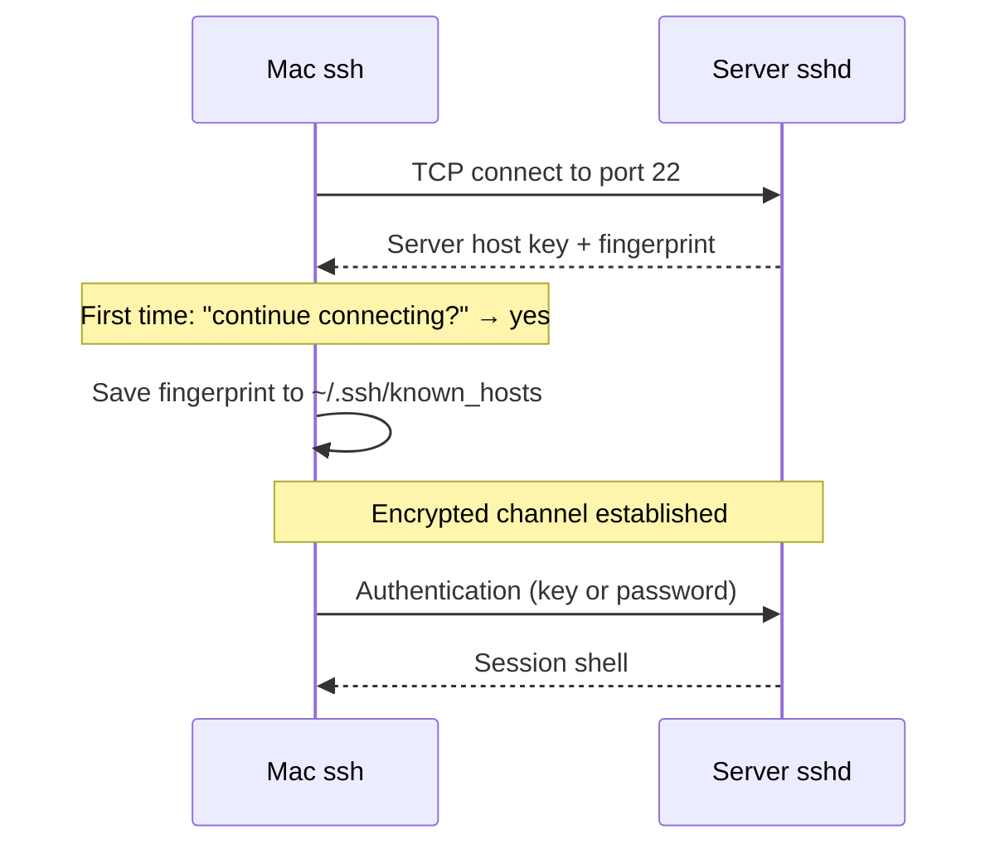
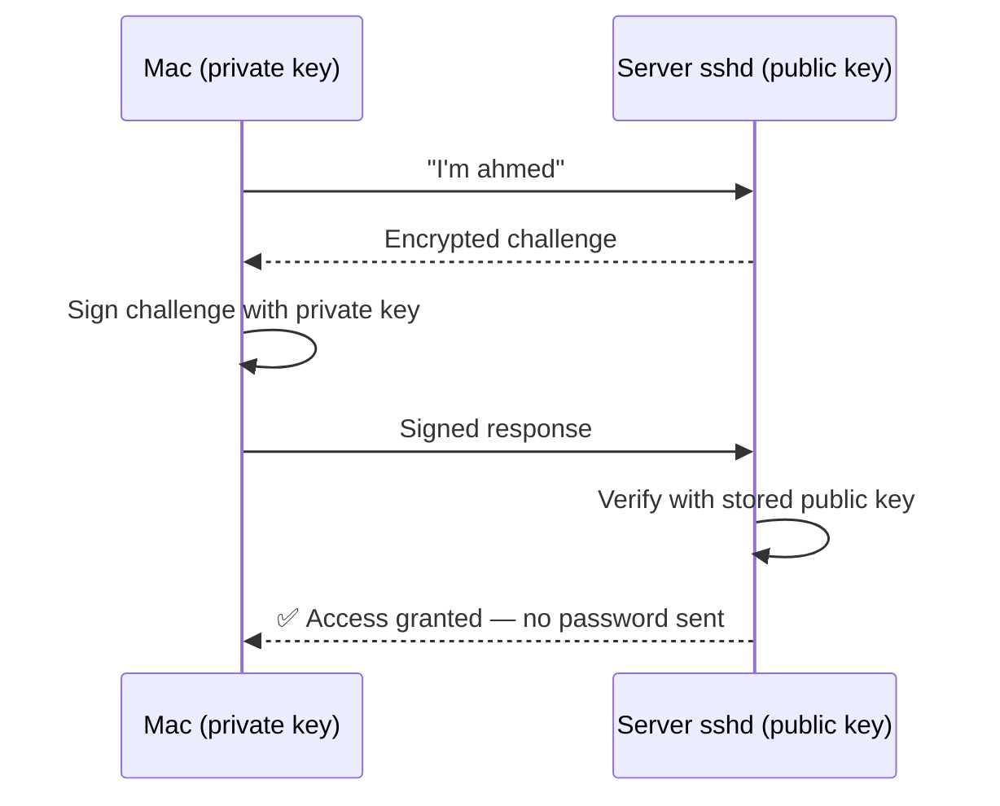

<ChapterMeta />

## TL;DR

- **SSH is an encrypted tunnel** from your Mac to `sshd` on the server (port 22). Everything you type is unreadable to anyone sniffing the network.
- **On first connect you verify the server's fingerprint** into `~/.ssh/known_hosts` — this is what stops man-in-the-middle attacks later.
- **Use key authentication, not passwords.** Your private key stays on the Mac; only the public key travels to the server.
- **`~/.ssh/config` turns `ssh ahmed@192.168.1.105` into `ssh homelab`** and keeps your session alive on flaky WiFi.
- **Harden `sshd` only after keys work** — disable password auth, forbid root, restrict users. Then use **port forwarding** to reach server services (Postgres, pgAdmin) as if they were local.

## Prerequisites

| Requirement | Why |
|-------------|-----|
| Server IP on the LAN | You need an address to connect to (made static in Chapter 6). |
| A Mac terminal | Keys are generated on your Mac. |
| Chapter 4 (permissions) | `~/.ssh` files must be `600` or SSH refuses them. |

## How SSH Works (The Concept)

SSH (Secure Shell) creates an encrypted tunnel between your Mac and your server. Think of it as a secure pipeline — everything you type travels through this encrypted channel, so even if someone intercepts your WiFi packets, they see only gibberish.

```
Your MacBook                    Your Server
┌──────────┐   Encrypted      ┌──────────┐
│ Terminal │ ◄───────────────► │  sshd    │
│          │   SSH Tunnel     │ (daemon) │
└──────────┘   Port 22        └──────────┘
```

`sshd` (SSH daemon) is the server-side process that listens on port 22 and accepts connections. You enabled this during installation when you checked "Install OpenSSH".



<p class="ahl-diagram-caption"><strong>Figure 5.1</strong> — The SSH handshake. The fingerprint check happens once per host and is what protects every later connection.</p>

::: details Why this matters — trust on first use
SSH has no central authority; trust is established the first time you connect. That's why the "authenticity of host … can't be established" prompt matters: accepting the fingerprint pins the server's identity. If a *different* fingerprint appears later (after a reinstall or a real attack), SSH refuses to connect — treat that warning seriously rather than blindly clearing `known_hosts`.
:::

## Step 1 — Find your server's IP

**Run** on the server. **Expected:** a LAN address like `192.168.1.105`.

```bash [find-ip.sh]
ip addr show
# or simpler:
hostname -I
```

Look for something like `192.168.1.105` — this is your server's current IP on your home network. We'll make this permanent in [Chapter 6](/chapters/06-networking-static-ip).

## Step 2 — First SSH connection

**Run** on your **MacBook**. **Expected:** a fingerprint prompt, then a password prompt (the first time only).

```bash [first-ssh.sh]
ssh ahmed@192.168.1.105
```

First time, you'll see:

```text [fingerprint-prompt]
The authenticity of host '192.168.1.105' can't be established.
ED25519 key fingerprint is SHA256:abc123...
Are you sure you want to continue connecting (yes/no)?
```

Type `yes`. This saves the server's **fingerprint** to `~/.ssh/known_hosts` on your Mac. Next time, SSH verifies the server is the same machine (prevents man-in-the-middle attacks).

## Step 3 — SSH key authentication (no more passwords)

Password authentication is less secure and annoying. SSH keys use **asymmetric cryptography**:

- You have a **private key** (stays on your Mac, NEVER share this)
- You have a **public key** (goes on the server, safe to share)
- The server challenges you with something only the private key can answer

**Run** on your **MacBook**. **Expected:** two files created under `~/.ssh/`.

```bash [ssh-keygen.sh]
# On your MacBook — generate a key pair
ssh-keygen -t ed25519 -C "macbook-homelab-$(date +%Y)"
# -t ed25519: modern elliptic curve algorithm (better than RSA)
# -C: comment to identify the key
# Accept defaults (saves to ~/.ssh/id_ed25519)
# Set a passphrase for extra security (optional but recommended)
```

This creates two files:

- `~/.ssh/id_ed25519` — Your private key (guard this like a password)
- `~/.ssh/id_ed25519.pub` — Your public key (copy this to server)

```bash [ssh-copy-id.sh]
# Copy public key to server
ssh-copy-id ahmed@192.168.1.105
# This appends your public key to ~/.ssh/authorized_keys on the server
```

Now test — it should connect without asking for a password:

```bash [test-key-auth.sh]
ssh ahmed@192.168.1.105
```



<p class="ahl-diagram-caption"><strong>Figure 5.2</strong> — Key authentication: the private key never leaves your Mac; the server verifies a signature against the public key in `authorized_keys`.</p>

| Method | Security | Convenience |
|--------|----------|-------------|
| Password | Weak — guessable, brute-forceable, sent to the server | Works everywhere |
| **Key (ed25519)** | Strong — private key never leaves your Mac | Passwordless once set up |

## Step 4 — SSH config: shortcuts and options

Create/edit `~/.ssh/config` on your **MacBook**:

```text [~/.ssh/config]
# ~/.ssh/config

Host homelab
    HostName 192.168.1.100      # Will be your static IP from Chapter 6
    User ahmed
    IdentityFile ~/.ssh/id_ed25519
    ServerAliveInterval 60      # Send keepalive every 60 seconds
    ServerAliveCountMax 3       # Disconnect after 3 missed keepalives
    Compression yes             # Compress data (faster on WiFi)
    ForwardAgent no             # Don't forward SSH agent (security)
```

Now you can connect with just:

```bash [connect.sh]
ssh homelab
```

## Step 5 — Harden SSH on the server

**Run** `sudo nano /etc/ssh/sshd_config`. Change these settings:

```ini [sshd_config]
# Disable password authentication (once keys work!)
PasswordAuthentication no

# Don't allow root login
PermitRootLogin no

# Only allow your user
AllowUsers ahmed

# Use only modern key types
PubkeyAuthentication yes

# Change default port (optional but reduces bot spam)
# Port 2222   ← uncomment to use non-standard port

# Disable unused features
X11Forwarding no
AllowTcpForwarding yes   # Keep yes — needed for port forwarding

# Timeout idle sessions
ClientAliveInterval 300
ClientAliveCountMax 2
```

| Setting | Value | Why |
|---------|-------|-----|
| `PasswordAuthentication` | `no` | Removes brute-force surface entirely |
| `PermitRootLogin` | `no` | Root can't log in directly, even with a key |
| `AllowUsers` | `ahmed` | Only your account may connect |
| `PubkeyAuthentication` | `yes` | Enables key auth |
| `X11Forwarding` | `no` | No GUI forwarding needed on a server |
| `AllowTcpForwarding` | `yes` | Required for the port forwarding below |

Apply changes:

```bash [restart-sshd.sh]
sudo systemctl restart sshd
```

::: danger Do NOT close your current session
Do NOT close your current SSH session until you verify a new session works. Open a **second** terminal and test `ssh homelab`. If it works, you're safe. If not, you still have your old session to fix things.
:::

## SSH port forwarding — reach server services from your Mac

This lets you access any port on your server as if it was on your Mac:

```bash [port-forward.sh]
# Access server's PostgreSQL (port 5432) locally on Mac
ssh -L 5432:localhost:5432 homelab

# Now on your Mac, connect to localhost:5432 with TablePlus/DBeaver
# It actually connects to the server's Postgres through the SSH tunnel

# Access pgAdmin (port 5050) locally
ssh -L 5050:localhost:5050 homelab
# Open http://localhost:5050 in your Mac browser

# Forward multiple ports at once
ssh -L 5432:localhost:5432 -L 5050:localhost:5050 -L 3000:localhost:3000 homelab
```

<figure>
  <svg viewBox="0 0 720 240" role="img" aria-label="Port forwarding diagram: Mac localhost ports 5432 and 5050 tunnel over SSH to the server's Postgres and pgAdmin" width="100%" style="max-width:720px;height:auto;border-radius:10px;border:1px solid var(--vp-c-divider);background:var(--vp-c-bg-soft);padding:1rem;box-sizing:border-box;font-family:Inter,system-ui,sans-serif;">
    <rect x="20" y="70" width="220" height="120" rx="10" fill="var(--vp-c-bg)" stroke="var(--vp-c-divider)"></rect>
    <text x="130" y="94" text-anchor="middle" font-size="13" font-weight="700" fill="var(--vp-c-text-1)">MacBook</text>
    <text x="36" y="128" font-size="12" fill="var(--vp-c-text-2)">localhost:5432</text>
    <text x="36" y="152" font-size="12" fill="var(--vp-c-text-2)">localhost:5050</text>
    <text x="36" y="176" font-size="11" fill="var(--vp-c-text-3)">TablePlus / browser</text>
    <rect x="480" y="70" width="220" height="120" rx="10" fill="var(--vp-c-bg)" stroke="var(--vp-c-divider)"></rect>
    <text x="590" y="94" text-anchor="middle" font-size="13" font-weight="700" fill="var(--vp-c-text-1)">Server</text>
    <text x="496" y="128" font-size="12" fill="var(--vp-c-text-2)">Postgres :5432</text>
    <text x="496" y="152" font-size="12" fill="var(--vp-c-text-2)">pgAdmin :5050</text>
    <text x="496" y="176" font-size="11" fill="var(--vp-c-text-3)">bound to localhost</text>
    <line x1="240" y1="130" x2="480" y2="130" stroke="var(--vp-c-brand-1)" stroke-width="2"></line>
    <path d="M470 130 l-12 -6 l0 12 z" fill="var(--vp-c-brand-1)"></path>
    <path d="M250 130 l12 -6 l0 12 z" fill="var(--vp-c-brand-1)"></path>
    <text x="360" y="120" text-anchor="middle" font-size="12" fill="var(--vp-c-brand-1)">SSH tunnel (-L)</text>
    <text x="360" y="152" text-anchor="middle" font-size="11" fill="var(--vp-c-text-3)">encrypted · port 22</text>
    <text x="20" y="222" font-size="11.5" fill="var(--vp-c-text-3)">Server services stay bound to 127.0.0.1 and are never exposed to the LAN or internet.</text>
  </svg>
  <figcaption><strong>Figure 5.3</strong> — Local port forwarding: Mac ports are bridged over the encrypted SSH tunnel to the server's loopback ports.</figcaption>
</figure>

## VS Code Remote SSH — full IDE on the server

Install the **Remote - SSH** extension in VS Code on your Mac:

1. `Cmd+Shift+P` → "Remote-SSH: Connect to Host"
2. Select `homelab`
3. VS Code opens a new window connected to your server
4. You can open `/srv/myapp`, edit files, use the integrated terminal, debug

This is the most productive way to develop on a remote server. Everything works exactly like local development.

## Verification

| Check | Command (on Mac) | Expected |
|-------|------------------|----------|
| Key auth, no password | `ssh -o BatchMode=yes homelab true && echo OK` | prints `OK` |
| Password auth is off | `ssh -o PreferredAuthentications=password homelab` | `Permission denied (publickey)` |
| Port forward works | `ssh -L 5432:localhost:5432 homelab` then connect locally | local client reaches Postgres |

```bash [verify.sh]
# On the server — confirm effective sshd settings:
sudo sshd -T | grep -E 'passwordauthentication|permitrootlogin|allowusers'
# → passwordauthentication no
# → permitrootlogin no
# → allowusers ahmed
sudo sshd -t && echo "config OK"   # syntax check, prints nothing if valid
```

## Common pitfalls

::: warning Top 3 failure modes
1. **Disabling passwords before keys work.** `PasswordAuthentication no` with a broken key locks you out. Verify key login in a *second* terminal first.
2. **A typo that breaks `sshd`.** A bad `sshd_config` can fail to restart. Always `sudo sshd -t` to validate, and keep the working session open.
3. **Loose key permissions.** If `~/.ssh` or the key is group/world-readable, SSH silently refuses the key. Fix with `chmod 700 ~/.ssh` and `chmod 600 ~/.ssh/id_ed25519`.
:::

## Troubleshooting

| Symptom | Likely cause | Fix |
|---------|--------------|-----|
| `Permission denied (publickey)` | Key not in `authorized_keys`, or wrong key | Re-run `ssh-copy-id`; check `IdentityFile` in `~/.ssh/config` |
| `WARNING: UNPROTECTED PRIVATE KEY FILE` | Key readable by others | `chmod 600 ~/.ssh/id_ed25519` |
| `Host key verification failed` | Server reinstalled / IP reused | Remove the old entry: `ssh-keygen -R <host>` |
| Connection hangs then drops | Idle timeout / flaky WiFi | Set `ServerAliveInterval 60` in `~/.ssh/config` |
| `sshd: no hostkeys available` | Host keys missing | `sudo ssh-keygen -A` then restart sshd |

## Recap & next

You can now log in from your Mac with keys only, reach `homelab` with a short alias, and tunnel server services to your laptop. Your SSH surface is hardened and auditable.

Next: **[Chapter 6 — Networking & Static IP](/chapters/06-networking-static-ip)** — make that IP permanent so `homelab` always resolves.

## References

- [RFC 4251 — SSH Protocol Architecture](https://www.rfc-editor.org/rfc/rfc4251) — the protocol's design.
- [RFC 4252 — SSH Authentication Protocol](https://www.rfc-editor.org/rfc/rfc4252) — how public-key auth works.
- [RFC 4253 — SSH Transport Layer](https://www.rfc-editor.org/rfc/rfc4253) — host keys and the encrypted channel.
- [RFC 4254 — SSH Connection Protocol](https://www.rfc-editor.org/rfc/rfc4254) — channels, including port forwarding.
- [`man sshd_config`](https://manpages.ubuntu.com/manpages/noble/en/man5/sshd_config.5.html) — every hardening directive.
- [`man ssh`](https://manpages.ubuntu.com/manpages/noble/en/man1/ssh.1.html) and [`man ssh_config`](https://manpages.ubuntu.com/manpages/noble/en/man5/ssh_config.5.html) — client options incl. `-L`.
- [`man ssh-keygen`](https://manpages.ubuntu.com/manpages/noble/en/man1/ssh-keygen.1.html) — key generation and `-R`.
- [VS Code Remote — SSH](https://code.visualstudio.com/docs/remote/ssh) — official setup for remote development.
