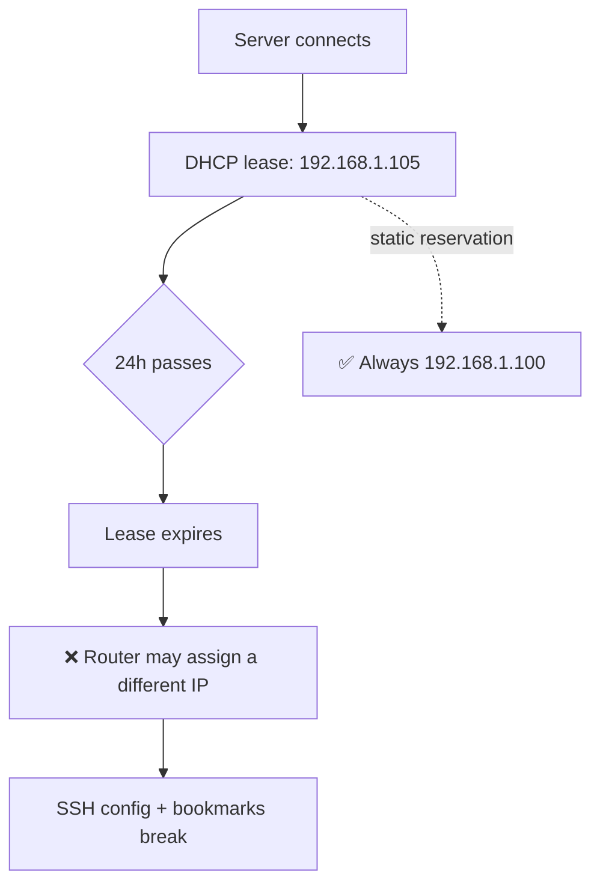
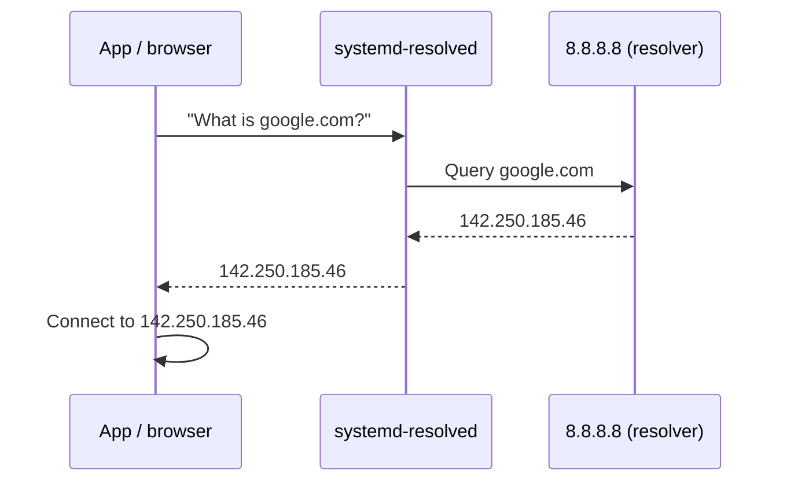

<ChapterMeta />

## TL;DR

- **DHCP hands out temporary leases** (~24 h), so your server's IP can change overnight — breaking your SSH config and bookmarks.
- **Set a static IP two ways, and use both:** a router **DHCP reservation** (keyed to the server's MAC) *and* a **Netplan** static address on the server.
- **Test Netplan with `sudo netplan try`** — it auto-reverts after 2 minutes if you lose connectivity. Never apply blind over SSH/WiFi.
- **DNS turns names into IPs.** We set several resolvers (`8.8.8.8`, `1.1.1.1`, `9.9.9.9`) for redundancy.
- **`/etc/hosts` on your Mac** gives you `homelab.local` and `ssh homelab` without any DNS server.

## Prerequisites

| Requirement | Why |
|-------------|-----|
| SSH access (Chapter 5) | You'll configure networking remotely — carefully. |
| Router admin access | For the DHCP reservation. |
| Interface name | Netplan needs the exact interface (e.g. `wlp2s0`). |

::: danger Don't cut your own connection
You are changing the network you're connected over. If you're on WiFi and apply a broken config, you lose SSH. `netplan try` is your safety net — it reverts automatically.
:::

## How Home Network IPs Work

Your router assigns IP addresses using **DHCP** (Dynamic Host Configuration Protocol). When a device connects, the router says "here's your IP: 192.168.1.105, valid for 24 hours". After 24 hours, the device might get a different IP.

This is a problem for a server — your SSH config has `HostName 192.168.1.105`, but tomorrow the server might be `192.168.1.107`. You need a **static IP** that never changes.



<p class="ahl-diagram-caption"><strong>Figure 6.1</strong> — A dynamic lease can move; a static address (router or Netplan) never does.</p>

## Method 1 — Router DHCP reservation (do this first)

Every home router has a "DHCP reservation" feature. You tell it: "When you see the MAC address `f8:94:c2:6a:5e:50` (your server's WiFi adapter), always assign it `192.168.1.100`."

1. Open your router admin page (usually `192.168.1.1` in browser)
2. Look for "DHCP" → "Static Leases" or "Address Reservation"
3. Add your server's MAC address → assign `192.168.1.100`

Find your server's MAC address:

```bash [mac-address.sh]
ip link show wlp2s0   # your WiFi interface
# shows: link/ether f8:94:c2:6a:5e:50
```

## Method 2 — Netplan static IP (server-side configuration)

Ubuntu uses **Netplan** to manage network interfaces. Config files live in `/etc/netplan/`.

```bash [netplan-config.sh]
# Find your config file
ls /etc/netplan/
# Usually: 00-installer-config.yaml

sudo nano /etc/netplan/00-installer-config.yaml
```

For WiFi (your case):

```yaml [00-installer-config.yaml]
network:
  version: 2
  wifis:
    wlp2s0:                          # your WiFi interface name
      dhcp4: no                      # disable automatic IP assignment
      addresses:
        - 192.168.1.100/24           # your desired static IP + subnet mask
      routes:
        - to: default
          via: 192.168.1.1           # your router's IP (gateway)
      nameservers:
        addresses:
          - 8.8.8.8                  # Google DNS
          - 1.1.1.1                  # Cloudflare DNS
          - 9.9.9.9                  # Quad9 DNS (privacy-focused)
      access-points:
        "YourWiFiName":              # your WiFi network name (SSID)
          password: "yourpassword"
```

What does `/24` mean? It's the **subnet mask** in CIDR notation. `/24` = `255.255.255.0`, meaning your network is `192.168.1.0` to `192.168.1.255`. All devices in your home share this range.

<figure>
  <svg viewBox="0 0 720 210" role="img" aria-label="Home network topology: the internet connects to the router at 192.168.1.1, which connects to the server at 192.168.1.100 and the MacBook" width="100%" style="max-width:720px;height:auto;border-radius:10px;border:1px solid var(--vp-c-divider);background:var(--vp-c-bg-soft);padding:1rem;box-sizing:border-box;font-family:Inter,system-ui,sans-serif;">
    <rect x="20" y="80" width="130" height="56" rx="10" fill="var(--vp-c-bg)" stroke="var(--vp-c-divider)"></rect>
    <text x="85" y="114" text-anchor="middle" font-size="12.5" fill="var(--vp-c-text-1)">Internet</text>
    <rect x="220" y="80" width="170" height="56" rx="10" fill="var(--vp-c-bg)" stroke="var(--vp-c-divider)"></rect>
    <text x="305" y="106" text-anchor="middle" font-size="12.5" font-weight="700" fill="var(--vp-c-text-1)">Router</text>
    <text x="305" y="124" text-anchor="middle" font-size="11.5" fill="var(--vp-c-brand-1)">192.168.1.1</text>
    <rect x="470" y="40" width="230" height="52" rx="10" fill="var(--vp-c-bg)" stroke="var(--vp-c-brand-1)" stroke-width="1.5"></rect>
    <text x="585" y="64" text-anchor="middle" font-size="12.5" font-weight="700" fill="var(--vp-c-text-1)">Server</text>
    <text x="585" y="82" text-anchor="middle" font-size="11.5" fill="var(--vp-c-brand-1)">192.168.1.100 (static)</text>
    <rect x="470" y="124" width="230" height="52" rx="10" fill="var(--vp-c-bg)" stroke="var(--vp-c-divider)"></rect>
    <text x="585" y="148" text-anchor="middle" font-size="12.5" font-weight="700" fill="var(--vp-c-text-1)">MacBook</text>
    <text x="585" y="166" text-anchor="middle" font-size="11.5" fill="var(--vp-c-text-3)">192.168.1.x (DHCP)</text>
    <line x1="150" y1="108" x2="220" y2="108" stroke="var(--vp-c-text-3)"></line>
    <line x1="390" y1="100" x2="470" y2="66" stroke="var(--vp-c-brand-1)" stroke-width="2"></line>
    <line x1="390" y1="118" x2="470" y2="150" stroke="var(--vp-c-text-3)"></line>
    <text x="20" y="190" font-size="11.5" fill="var(--vp-c-text-3)">The reservation on the router and the Netplan config point to the same address: 192.168.1.100.</text>
  </svg>
  <figcaption><strong>Figure 6.2</strong> — Your LAN topology: the router is the gateway; the server holds a fixed `.100`.</figcaption>
</figure>

Test before applying (auto-reverts after 2 minutes if broken):

```bash [netplan-try.sh]
sudo netplan try
# If it works, type 'yes' to keep it
# If it breaks networking, just wait 2 minutes — it reverts automatically
```

Apply permanently:

```bash [netplan-apply.sh]
sudo netplan apply
```

Verify:

```bash [verify-net.sh]
ip addr show wlp2s0    # should show 192.168.1.100
ping 8.8.8.8           # test internet connectivity
ping google.com        # test DNS resolution
```

## Understanding DNS

When you type `google.com`, your computer asks a DNS (Domain Name System) server: "What IP address is google.com?" The DNS server responds with `142.250.185.46`. This is why we set `nameservers` in the Netplan config.



<p class="ahl-diagram-caption"><strong>Figure 6.3</strong> — DNS resolution: names are looked up once, then cached, so subsequent connections skip the round-trip.</p>

We use multiple DNS servers as fallback:

| Resolver | Provider | Why |
|----------|----------|-----|
| `8.8.8.8` | Google | Fast, reliable |
| `1.1.1.1` | Cloudflare | Privacy-focused, fast |
| `9.9.9.9` | Quad9 | Blocks malicious domains |

## Local DNS — access the server by name

Add this to `/etc/hosts` on your **MacBook** for easy access:

```text [/etc/hosts (Mac)]
192.168.1.100    homelab homelab.local api.homelab.local
```

Now on your Mac you can access:

- `http://homelab.local` → your server's web UI
- `http://api.homelab.local` → your NestJS API
- `ssh homelab` → SSH shortcut

## Verification

| Check | Command | Expected |
|-------|---------|----------|
| Static IP applied | `ip addr show wlp2s0` | `inet 192.168.1.100/24` |
| Gateway set | `ip route` | `default via 192.168.1.1` |
| Internet works | `ping -c3 8.8.8.8` | replies, 0% loss |
| DNS resolves | `ping -c1 google.com` | resolves to an IP |
| Resolvers active | `resolvectl status` | the three nameservers listed |

```bash [verify-all.sh]
ip -4 addr show wlp2s0 | grep inet
ip route | grep default
ping -c3 8.8.8.8
resolvectl status | grep -A3 "Current DNS"
```

## Common pitfalls

::: warning Top 3 failure modes
1. **`netplan apply` with a broken config.** Over SSH/WiFi this drops you. Always use `netplan try` first.
2. **Static IP inside the DHCP pool.** If the router later leases `.100` to another device, you get an IP conflict. Reserve `.100` on the router too, or pick an address outside the pool.
3. **Omitting `nameservers`.** You'll have an IP but no name resolution — `ping 8.8.8.8` works while `ping google.com` fails.
:::

## Troubleshooting

| Symptom | Likely cause | Fix |
|---------|--------------|-----|
| Lost SSH after `netplan apply` | Bad YAML or wrong interface | Wait for `netplan try` revert, or use the console; fix indentation |
| `ping 8.8.8.8` works, `ping google.com` fails | No/broken DNS | Add `nameservers.addresses` and re-apply |
| IP conflicts on the LAN | Static IP inside DHCP range | Reserve the IP on the router or move it out of the pool |
| Interface name wrong | Typo (e.g. `wlan0` vs `wlp2s0`) | Check with `ip link` and match Netplan exactly |
| Netplan warns about permissions | World-readable config | `sudo chmod 600 /etc/netplan/*.yaml` |

## Recap & next

Your server now holds a stable `192.168.1.100`, resolves DNS through redundant resolvers, and is reachable from your Mac as `homelab.local`. No more "the IP changed" surprises.

Next: **[Chapter 7 — Disk Management: HDD Setup](/chapters/07-disk-management-hdd-setup)** — add and auto-mount the 500 GB HDD.

## References

- [Netplan documentation](https://netplan.readthedocs.io/en/stable/) — the config format used above.
- [`man netplan`](https://manpages.ubuntu.com/manpages/noble/en/man5/netplan.5.html) — Netplan reference.
- [Ubuntu Server — Networking](https://documentation.ubuntu.com/server/explanation/networking/) — upstream networking overview.
- [`man ip-address`](https://manpages.ubuntu.com/manpages/noble/en/man8/ip-address.8.html) — inspecting addresses and routes.
- [`man ping`](https://manpages.ubuntu.com/manpages/noble/en/man1/ping.1.html) — connectivity testing.
- [`man resolvectl`](https://manpages.ubuntu.com/manpages/noble/en/man1/resolvectl.1.html) — DNS resolver status.
- [`man hosts`](https://manpages.ubuntu.com/manpages/noble/en/man5/hosts.5.html) — local name overrides.
