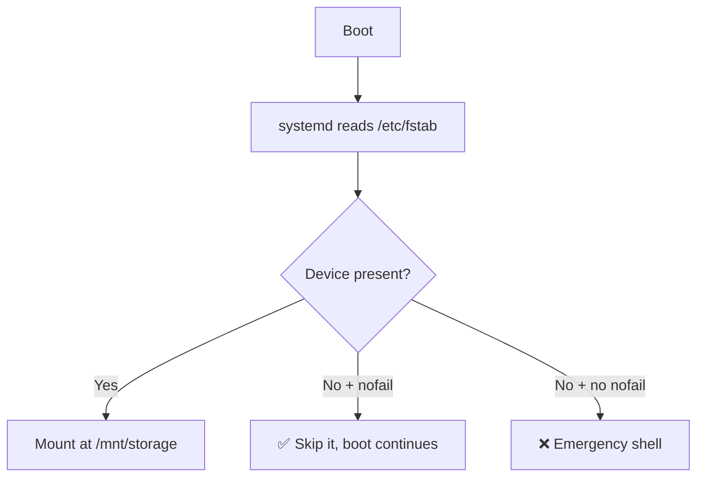

<ChapterMeta />

## TL;DR

- **Linux has no drive letters** — you *mount* a disk at a directory, and writes to that directory land on the disk.
- **Partition with `fdisk` (GPT), format with `mkfs.ext4`, mount under `/mnt/storage`.**
- **`/etc/fstab` auto-mounts at boot — and `nofail` is critical:** without it, a missing HDD stops the machine from booting.
- **Reference partitions by UUID, not `/dev/sda1`**, because device names can change between boots.
- **Monitor with `df -h` and `du -sh`** so a full disk never surprises you.

## Prerequisites

| Requirement | Why |
|-------------|-----|
| WD 500 GB HDD installed | This is the disk we partition. |
| `sudo` access | Partitioning/formatting/mounting are privileged. |
| Chapter 4 (device files) | You'll work directly with `/dev/sda`. |

::: danger This erases the HDD
`fdisk` + `mkfs` wipe the target disk completely. Confirm the device name (`lsblk`) and back up anything on it first.
:::

## Understanding Mount Points

In Linux, you don't have drive letters (C:, D:). Instead, you "mount" a disk at a directory. After mounting, everything you write to that directory goes to that disk.

```bash [mount-demo.sh]
# After mounting /dev/sda1 at /mnt/storage:
echo "hello" > /mnt/storage/test.txt   # This physically writes to the HDD
echo "hello" > /home/ahmed/test.txt    # This writes to the NVMe
```

<figure>
  <svg viewBox="0 0 720 200" role="img" aria-label="Chain diagram: the WD HDD /dev/sda is partitioned into /dev/sda1, formatted ext4, and mounted at /mnt/storage" width="100%" style="max-width:720px;height:auto;border-radius:10px;border:1px solid var(--vp-c-divider);background:var(--vp-c-bg-soft);padding:1rem;box-sizing:border-box;font-family:Inter,system-ui,sans-serif;">
    <g font-size="12.5" fill="var(--vp-c-text-1)">
      <rect x="16" y="60" width="150" height="70" rx="10" fill="var(--vp-c-bg)" stroke="var(--vp-c-divider)"></rect>
      <text x="91" y="90" text-anchor="middle" font-weight="700">WD HDD 500 GB</text>
      <text x="91" y="110" text-anchor="middle" font-size="11.5" fill="var(--vp-c-text-3)">/dev/sda</text>
      <rect x="206" y="60" width="150" height="70" rx="10" fill="var(--vp-c-bg)" stroke="var(--vp-c-divider)"></rect>
      <text x="281" y="90" text-anchor="middle" font-weight="700">Partition 1</text>
      <text x="281" y="110" text-anchor="middle" font-size="11.5" fill="var(--vp-c-text-3)">/dev/sda1</text>
      <rect x="396" y="60" width="150" height="70" rx="10" fill="var(--vp-c-bg)" stroke="var(--vp-c-brand-1)"></rect>
      <text x="471" y="90" text-anchor="middle" font-weight="700">ext4 + label</text>
      <text x="471" y="110" text-anchor="middle" font-size="11.5" fill="var(--vp-c-brand-1)">LABEL=storage</text>
      <rect x="586" y="60" width="118" height="70" rx="10" fill="var(--vp-c-bg)" stroke="var(--vp-c-brand-1)"></rect>
      <text x="645" y="90" text-anchor="middle" font-weight="700">Mount</text>
      <text x="645" y="110" text-anchor="middle" font-size="11.5" fill="var(--vp-c-brand-1)">/mnt/storage</text>
    </g>
    <g stroke="var(--vp-c-text-3)" stroke-width="2">
      <line x1="166" y1="95" x2="206" y2="95"></line>
      <line x1="356" y1="95" x2="396" y2="95"></line>
      <line x1="546" y1="95" x2="586" y2="95"></line>
    </g>
    <g font-size="10.5" fill="var(--vp-c-text-3)" text-anchor="middle">
      <text x="186" y="150">fdisk</text>
      <text x="376" y="150">mkfs.ext4</text>
      <text x="566" y="150">fstab</text>
    </g>
  </svg>
  <figcaption><strong>Figure 7.1</strong> — From raw disk to mounted directory: partition, format, then mount (and make it permanent with fstab).</figcaption>
</figure>

## Step 1 — Partition the HDD

**Run** `lsblk`. **Expected:** the ~500 GB disk that is *not* the NVMe — usually `/dev/sda`.

```bash [lsblk.sh]
lsblk
# Look for the ~500GB disk that's NOT the NVMe
# Usually /dev/sda
```

Create a partition table and single partition:

```bash [fdisk.sh]
sudo fdisk /dev/sda
```

Inside `fdisk`:

```text [fdisk-keys]
g    → Create new GPT partition table (erases everything on this disk)
n    → New partition
1    → Partition number 1
     → (press Enter) First sector: default (start of disk)
     → (press Enter) Last sector: default (end of disk, use all space)
w    → Write changes and exit
```

```mermaid
flowchart TD
  A[sudo fdisk /dev/sda] --> B[g — new GPT table]
  B --> C[n — new partition]
  C --> D[1 — partition number]
  D --> E[Enter — first sector default]
  E --> F[Enter — last sector = all space]
  F --> G[w — write & exit]
  G --> H[/dev/sda1 created]
```

<p class="ahl-diagram-caption"><strong>Figure 7.2</strong> — The `fdisk` sequence. Nothing is written until you press `w`; `q` aborts safely.</p>

::: info Why GPT instead of MBR?
GPT (GUID Partition Table) is the modern standard. It supports disks larger than 2TB, allows more than 4 primary partitions, and is more resilient to corruption. MBR is legacy from the 1980s.
:::

## Step 2 — Format the partition

**Run** the format. **Expected:** `mkfs` reports the filesystem was created with the label `storage`.

```bash [mkfs.sh]
sudo mkfs.ext4 -L storage /dev/sda1
# -L storage: give it a label for easy identification
```

This creates an ext4 filesystem on the partition. The `-L` label means you can reference it as `LABEL=storage` instead of `/dev/sda1` (partition names can change, labels don't).

## Step 3 — Create the directory structure

**Run** the `mkdir`/`chown` block. **Expected:** `ls /mnt/storage` shows the four subdirectories.

```bash [dirs.sh]
sudo mkdir -p /mnt/storage
sudo mkdir -p /mnt/storage/datasets
sudo mkdir -p /mnt/storage/backups
sudo mkdir -p /mnt/storage/models
sudo mkdir -p /mnt/storage/exports

# Give your user ownership
sudo chown -R ahmed:ahmed /mnt/storage
```

## Step 4 — Auto-mount at boot with fstab

`/etc/fstab` (filesystem table) tells Linux what to mount at boot. Without an entry here, you'd have to manually mount the HDD every time you reboot.

**Run** `blkid`. **Expected:** a `UUID=` value you'll paste into fstab.

```bash [blkid.sh]
# Get the UUID of your partition
sudo blkid /dev/sda1
# Output: /dev/sda1: LABEL="storage" UUID="a1b2c3d4-e5f6-..." TYPE="ext4"
# Copy the UUID value
```

Edit fstab:

```bash [edit-fstab.sh]
sudo nano /etc/fstab
```

Add at the bottom:

```text [/etc/fstab]
# HDD Storage - /dev/sda1
UUID=a1b2c3d4-e5f6-7890-abcd-ef1234567890  /mnt/storage  ext4  defaults,nofail  0  2
```

| Field | Value | Meaning |
|-------|-------|---------|
| Device | `UUID=…` | The partition, by stable UUID (not `/dev/sda1`) |
| Mount point | `/mnt/storage` | Where it appears in the tree |
| Type | `ext4` | Filesystem |
| Options | `defaults,nofail` | Standard options **+ continue boot if disk is missing** |
| Dump | `0` | Don't back up with dump (obsolete tool, always 0) |
| Pass | `2` | Check with `fsck` at boot (1 is reserved for root) |

::: warning `nofail` is not optional
Without `nofail`, a missing or failed HDD makes the machine **fail to boot** — it drops to an emergency shell waiting for a disk that isn't there. `nofail` tells systemd to continue booting regardless.
:::



<p class="ahl-diagram-caption"><strong>Figure 7.3</strong> — Why `nofail` matters: it's the difference between a warning and an unbootable server.</p>

Test without rebooting:

```bash [test-mount.sh]
sudo mount -a          # Mount everything in fstab
df -h /mnt/storage     # Verify it mounted
ls /mnt/storage        # Should show your subdirectories
```

## Monitoring disk space

```bash [monitor.sh]
df -h                  # All mounted filesystems
df -h /mnt/storage     # Specific partition
du -sh /mnt/storage/*  # Usage by subdirectory
du -sh /* 2>/dev/null  # Usage by top-level directory (ignore errors)

# Find what's eating disk space
du -h /mnt/storage | sort -rh | head -20
```

## Verification

| Check | Command | Expected |
|-------|---------|----------|
| Partition exists | `lsblk -f` | `sda1` with `ext4` and label `storage` |
| UUID known | `sudo blkid /dev/sda1` | prints `UUID=…` |
| Mounted now | `findmnt /mnt/storage` | shows `/dev/sda1` as source |
| fstab is valid | `sudo mount -a` | no output = success |
| Space visible | `df -h /mnt/storage` | ~500 G size, low `Use%` |

```bash [verify.sh]
lsblk -f | grep sda1
sudo findmnt /mnt/storage
sudo mount -a && echo "fstab OK"
df -h /mnt/storage
```

## Common pitfalls

::: warning Top 3 failure modes
1. **Missing `nofail` in fstab.** Unplug the HDD and the server won't boot. Always add `nofail` for non-essential disks.
2. **Using `/dev/sda1` instead of a UUID.** Device names can shuffle between boots; the UUID won't. Use `UUID=`.
3. **Formatting the wrong disk.** `lsblk` first — running `mkfs` on the NVMe erases your OS.
:::

## Troubleshooting

| Symptom | Likely cause | Fix |
|---------|--------------|-----|
| `mount: wrong fs type` | Partition not formatted, or wrong type | `sudo mkfs.ext4 -L storage /dev/sda1` |
| `mount: can't find UUID=…` | Typo'd UUID or disk removed | Re-check `blkid`; verify with `sudo blkid` |
| Boot drops to emergency shell | fstab entry without `nofail` and disk missing | Add `nofail`; `Ctrl+D` to continue boot |
| `findmnt` shows nothing | Not mounted yet | `sudo mount -a` (or check fstab syntax) |
| Directory writes go to the NVMe | Disk not mounted; writing to the mountpoint dir | Confirm with `findmnt /mnt/storage` |

## Recap & next

Your HDD is partitioned (GPT), formatted (ext4, labelled `storage`), and auto-mounts at boot via fstab — safely, thanks to `nofail`. You can see exactly where space goes with `df`/`du`.

Next: **[Chapter 8 — Users, Permissions & Security Basics](/chapters/08-users-permissions-security-basics)** — give services their own low-privilege identities.

## References

- [`man fdisk`](https://manpages.ubuntu.com/manpages/noble/en/man8/fdisk.8.html) — the interactive partitioner used here.
- [`man mkfs.ext4`](https://manpages.ubuntu.com/manpages/noble/en/man8/mkfs.ext4.8.html) — formatting and labels.
- [`man fstab`](https://manpages.ubuntu.com/manpages/noble/en/man5/fstab.5.html) — every field and option, including `nofail`.
- [`man mount`](https://manpages.ubuntu.com/manpages/noble/en/man8/mount.8.html) — mounting and `-a`.
- [`man lsblk`](https://manpages.ubuntu.com/manpages/noble/en/man8/lsblk.8.html) — listing block devices.
- [`man blkid`](https://manpages.ubuntu.com/manpages/noble/en/man8/blkid.8.html) — reading UUIDs and types.
- [`man df`](https://manpages.ubuntu.com/manpages/noble/en/man1/df.1.html) and [`man du`](https://manpages.ubuntu.com/manpages/noble/en/man1/du.1.html) — disk usage.
