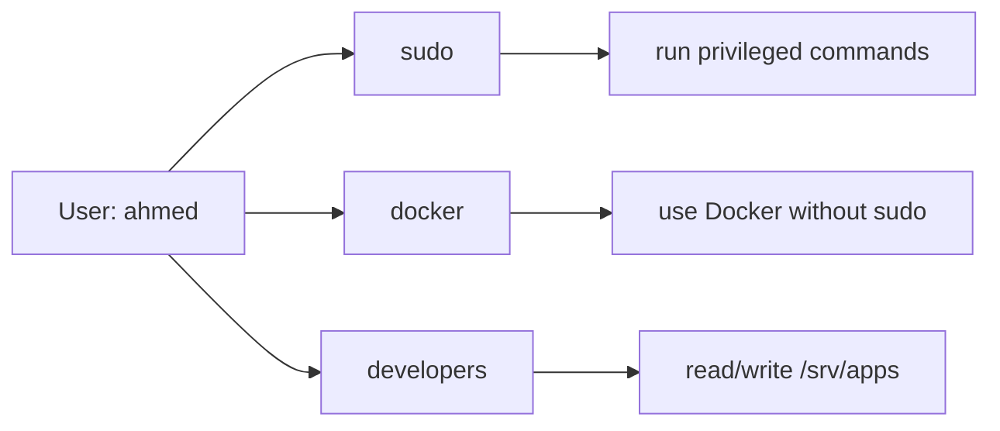

<ChapterMeta />

## TL;DR

- **Every process runs as some user.** Give it the least privilege it needs, never root.
- **`usermod -aG` adds** a user to a group — the `-a` is essential, or you'll *replace* their groups.
- **Groups are how you share access** (`docker`, `sudo`, `www-data`, or your own `developers`).
- **Service users have no login shell** (`/usr/sbin/nologin`) — perfect for running a NestJS app.
- After this chapter you can create users, assign group rights, and run services under low-privilege identities.

## Prerequisites

| Requirement | Why |
|-------------|-----|
| `sudo` access | Managing users is privileged. |
| Chapter 4 (permissions) | Groups only make sense with the rwx model. |

## User management

**Run** `sudo adduser deployuser`. **Expected:** an interactive prompt for a password, then `Adding user 'deployuser'`.

```bash [user-mgmt.sh]
# Add a new user (useful if you want a deploy user)
sudo adduser deployuser

# Add user to sudo group (admin privileges)
sudo usermod -aG sudo deployuser

# Add user to docker group (can run docker without sudo)
sudo usermod -aG docker ahmed

# Apply group changes without logout
newgrp docker

# See all users
cat /etc/passwd | grep -v nologin

# See groups a user belongs to
groups ahmed

# Switch to another user
su - deployuser

# Delete a user
sudo deluser deployuser
sudo deluser --remove-home deployuser  # also remove home directory
```

| Command | Purpose |
|---------|---------|
| `adduser <user>` | Create a user (interactive, sets password) |
| `usermod -aG <group> <user>` | Add user to a group (keep existing groups) |
| `groups <user>` | Show a user's groups |
| `su - <user>` | Switch to another user |
| `deluser <user>` | Remove a user (`--remove-home` also deletes their files) |



<p class="ahl-diagram-caption"><strong>Figure 8.1</strong> — Permissions flow through groups: a user inherits the rights of every group they belong to.</p>

::: warning `-a` in `usermod -aG` is not optional
`usermod -G docker ahmed` (no `-a`) *replaces* all of ahmed's supplementary groups with just `docker` — silently removing them from `sudo` and everything else. Always use `usermod -aG`.
:::

## Understanding groups

Groups allow multiple users to share access to files. For example:

- `docker` group — can run Docker commands
- `sudo` group — can use sudo
- `www-data` group — Nginx runs as this user

```bash [groups.sh]
# Create a group
sudo groupadd developers

# Add user to group
sudo usermod -aG developers ahmed

# Set a directory to be accessible by a group
sudo chgrp -R developers /srv/apps
sudo chmod -R g+rwx /srv/apps
```

## The principle of least privilege

Every process and user should have only the minimum permissions needed. This limits damage if something goes wrong.

Examples:

- Nginx runs as `www-data` user (not root) — if hacked, attacker can't access root files
- Your NestJS app doesn't need root — run it as a regular user
- Docker containers run as non-root users (configure this in Dockerfiles)

```bash [least-privilege.sh]
# Run a process as a specific user
sudo -u www-data nginx

# Create a service user with no login shell (for running services)
sudo useradd --system --no-create-home --shell /usr/sbin/nologin nestapp
```

<figure>
  <svg viewBox="0 0 720 220" role="img" aria-label="Comparison of blast radius: a process running as root can damage the whole system, while a service user is confined to its own files" width="100%" style="max-width:720px;height:auto;border-radius:10px;border:1px solid var(--vp-c-divider);background:var(--vp-c-bg-soft);padding:1rem;box-sizing:border-box;font-family:Inter,system-ui,sans-serif;">
    <rect x="20" y="40" width="320" height="150" rx="10" fill="var(--vp-c-bg)" stroke="var(--vp-c-red-1, #dc2626)"></rect>
    <text x="180" y="66" text-anchor="middle" font-size="13" font-weight="700" fill="var(--vp-c-red-1, #dc2626)">Running as root</text>
    <rect x="50" y="84" width="260" height="86" rx="8" fill="rgba(220,50,50,0.12)"></rect>
    <text x="180" y="130" text-anchor="middle" font-size="12" fill="var(--vp-c-text-2)">Full system access</text>
    <text x="180" y="152" text-anchor="middle" font-size="11.5" fill="var(--vp-c-text-3)">a bug can wipe /etc, /home, everything</text>
    <rect x="380" y="40" width="320" height="150" rx="10" fill="var(--vp-c-bg)" stroke="var(--vp-c-brand-1)"></rect>
    <text x="540" y="66" text-anchor="middle" font-size="13" font-weight="700" fill="var(--vp-c-brand-1)">Running as a service user</text>
    <rect x="410" y="84" width="120" height="86" rx="8" fill="var(--vp-c-brand-soft)"></rect>
    <text x="470" y="130" text-anchor="middle" font-size="12" fill="var(--vp-c-text-2)">its own files</text>
    <text x="470" y="152" text-anchor="middle" font-size="11" fill="var(--vp-c-text-3)">e.g. /srv/myapp</text>
    <text x="600" y="130" text-anchor="middle" font-size="12" fill="var(--vp-c-text-3)">everything else</text>
    <text x="600" y="152" text-anchor="middle" font-size="11" fill="var(--vp-c-text-3)">read-only / denied</text>
  </svg>
  <figcaption><strong>Figure 8.2</strong> — Least privilege shrinks the blast radius: a compromised service user can only touch its own data.</figcaption>
</figure>

| | Admin user (in `sudo`) | Service user (`nologin`) |
|--|------------------------|--------------------------|
| Can log in | Yes | No |
| Can `sudo` | Yes | No |
| Home directory | Yes | Typically none |
| Used for | You, deployments | Running daemons/apps |

## Verification

| Check | Command | Expected |
|-------|---------|----------|
| User's groups | `id deployuser` | lists `sudo`, etc. |
| Your groups | `groups ahmed` | includes `sudo`, `docker` |
| Service user has no shell | `getent passwd nestapp` | ends with `/usr/sbin/nologin` |
| Service user is a system account | `id -u nestapp` | a low UID (< 1000) |
| Group owns a directory | `ls -ld /srv/apps` | group `developers` |

```bash [verify.sh]
id deployuser
groups ahmed
getent passwd nestapp          # → nestapp:x:...:/usr/sbin/nologin
ls -ld /srv/apps               # → drwxrwxr-x ... developers
```

## Common pitfalls

::: warning Top 3 failure modes
1. **`usermod -G` without `-a`.** Replaces all groups, often removing the user from `sudo`. Always `-aG`.
2. **Running services as root.** One bug becomes a full compromise. Use a dedicated `nologin` service user.
3. **Group changes "not taking effect".** New group membership applies to *new* sessions. Use `newgrp <group>` or log out and back in.
:::

## Troubleshooting

| Symptom | Likely cause | Fix |
|---------|--------------|-----|
| `docker: permission denied` after adding to group | Session predates the group change | `newgrp docker` or re-login |
| User suddenly lost `sudo` | `usermod -G` without `-a` | `sudo usermod -aG sudo <user>` |
| `su - nestapp` fails | Service user has `nologin` shell | Expected — use `sudo -u nestapp <cmd>` |
| Service can't write its dir | Wrong owner/group | `sudo chown -R nestapp:nestapp /srv/app` |
| `useradd: group exists` | Group already present | Use `-g`/`-G` or `--system` appropriately |

## Recap & next

You can create users, place them in groups, and run services under least-privilege `nologin` accounts. That habit is what keeps a single bug from becoming a system-wide breach.

Next: **[Chapter 9 — Firewall & Network Security](/chapters/09-firewall-network-security)** — lock down what can reach the server at all.

## References

- [`man adduser`](https://manpages.ubuntu.com/manpages/noble/en/man8/adduser.8.html) — the friendly user-creation tool.
- [`man usermod`](https://manpages.ubuntu.com/manpages/noble/en/man8/usermod.8.html) — group membership (`-aG`) semantics.
- [`man useradd`](https://manpages.ubuntu.com/manpages/noble/en/man8/useradd.8.html) — low-level account creation (used for service users).
- [`man groupadd`](https://manpages.ubuntu.com/manpages/noble/en/man8/groupadd.8.html) — creating groups.
- [`man groups`](https://manpages.ubuntu.com/manpages/noble/en/man1/groups.1.html) — listing a user's groups.
- [`man newgrp`](https://manpages.ubuntu.com/manpages/noble/en/man1/newgrp.1.html) — applying group changes without logout.
- [`man sudo`](https://manpages.ubuntu.com/manpages/noble/en/man8/sudo.8.html) — running commands as another user.
- [`man deluser`](https://manpages.ubuntu.com/manpages/noble/en/man8/deluser.8.html) — removing users and homes.
