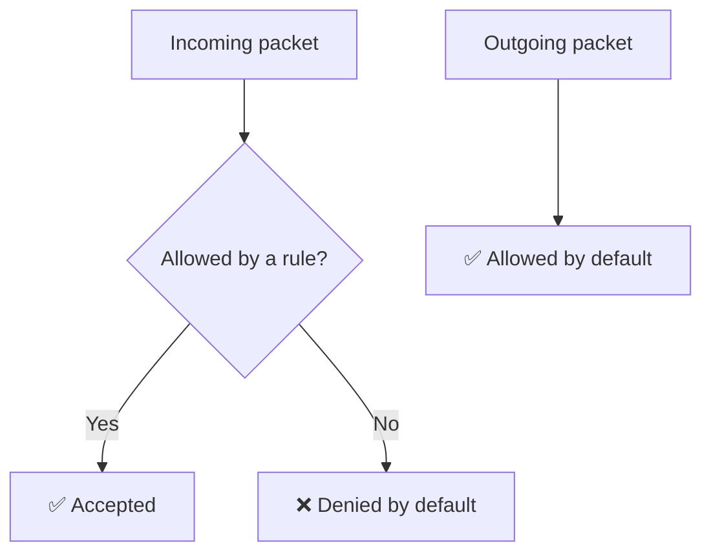
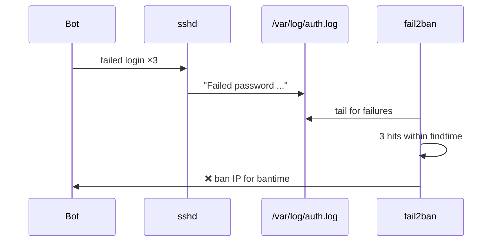

<ChapterMeta />

## TL;DR

- **UFW is a friendly front-end to `iptables`.** Default policy: **deny incoming, allow outgoing**.
- **Allow SSH *before* enabling UFW** — otherwise you lock yourself out of the box.
- **Expose only 80/443 to the world;** bind everything else (Postgres, Redis, Ollama) to the LAN only.
- **Fail2ban bans brute-force IPs** by watching `auth.log` — essential since bots hammer port 22 constantly.
- **Unattended-upgrades** patches security holes automatically, so you're not the bottleneck.

## Prerequisites

| Requirement | Why |
|-------------|-----|
| Working SSH (Chapter 5) | You must not lock yourself out. |
| LAN subnet | Needed to scope dev-port rules. |
| `sudo` | Firewall and services are privileged. |

::: danger Order matters
Enable the firewall only **after** allowing SSH. `ufw enable` with no SSH rule instantly severs your session.
:::

## How UFW works

UFW (Uncomplicated Firewall) is a frontend for `iptables` (the kernel's packet filtering system). Think of it as a bouncer at the door of your server — it decides which network connections are allowed in and out.

By default, we want:

- **Incoming**: DENY everything except what we explicitly allow
- **Outgoing**: ALLOW everything (your server needs to download packages, etc.)



<p class="ahl-diagram-caption"><strong>Figure 9.1</strong> — UFW's default posture: nothing gets in unless you opened the door; everything can get out.</p>

## Step 1 — Initial firewall setup

**Run** the block below **in order**. **Expected:** `ufw status verbose` shows the policies and the SSH/HTTP/HTTPS rules.

```bash [ufw-setup.sh]
sudo apt install -y ufw

# Set default policies
sudo ufw default deny incoming
sudo ufw default allow outgoing

# Allow SSH FIRST — if you forget this, you lock yourself out!
sudo ufw allow ssh   # allows port 22

# Allow web traffic
sudo ufw allow 80/tcp    # HTTP
sudo ufw allow 443/tcp   # HTTPS

# Enable the firewall
sudo ufw enable

# Verify status
sudo ufw status verbose
```

## Step 2 — Restrict dev ports to the local network only

Your development services (Postgres, Redis, NestJS) should only be accessible from your home network, not the whole internet:

```bash [ufw-lan.sh]
# Allow Postgres only from home network
sudo ufw allow from 192.168.1.0/24 to any port 5432 proto tcp

# Allow Redis only from home network
sudo ufw allow from 192.168.1.0/24 to any port 6379 proto tcp

# Allow NestJS dev server from home network
sudo ufw allow from 192.168.1.0/24 to any port 3000 proto tcp

# Allow pgAdmin from home network
sudo ufw allow from 192.168.1.0/24 to any port 5050 proto tcp

# Allow Ollama AI from home network
sudo ufw allow from 192.168.1.0/24 to any port 11434 proto tcp
```

<figure>
  <svg viewBox="0 0 720 230" role="img" aria-label="Exposure diagram: ports 80 and 443 are open to the internet, while database and dev ports are limited to the home LAN" width="100%" style="max-width:720px;height:auto;border-radius:10px;border:1px solid var(--vp-c-divider);background:var(--vp-c-bg-soft);padding:1rem;box-sizing:border-box;font-family:Inter,system-ui,sans-serif;">
    <rect x="16" y="30" width="688" height="60" rx="10" fill="var(--vp-c-bg)" stroke="var(--vp-c-red-1, #dc2626)"></rect>
    <text x="32" y="56" font-size="12.5" font-weight="700" fill="var(--vp-c-red-1, #dc2626)">Open to the world</text>
    <text x="32" y="76" font-size="12" fill="var(--vp-c-text-2)">80/tcp (HTTP) · 443/tcp (HTTPS) · 22/tcp (SSH, key-only)</text>
    <rect x="16" y="106" width="688" height="100" rx="10" fill="var(--vp-c-bg)" stroke="var(--vp-c-brand-1)"></rect>
    <text x="32" y="132" font-size="12.5" font-weight="700" fill="var(--vp-c-brand-1)">Home LAN only — from 192.168.1.0/24</text>
    <text x="32" y="154" font-size="12" fill="var(--vp-c-text-2)">5432 Postgres · 6379 Redis · 3000 NestJS</text>
    <text x="32" y="174" font-size="12" fill="var(--vp-c-text-2)">5050 pgAdmin · 11434 Ollama</text>
    <text x="32" y="196" font-size="11" fill="var(--vp-c-text-3)">Not reachable from the internet — no public attack surface.</text>
  </svg>
  <figcaption><strong>Figure 9.2</strong> — Two exposure tiers: a tiny public surface (web + SSH) and a LAN-only tier for dev services.</figcaption>
</figure>

## Step 3 — Fail2ban (automatic IP banning)

Fail2ban monitors log files for repeated failed login attempts and automatically bans the offending IP. Bots constantly try to brute-force SSH passwords — Fail2ban stops them.

**Run** `sudo apt install -y fail2ban`, then create a **local** config (never edit the main config — it gets overwritten on updates):

```bash [fail2ban-install.sh]
sudo apt install -y fail2ban
sudo nano /etc/fail2ban/jail.local
```

```ini [jail.local]
[DEFAULT]
# Ban duration: 1 hour
bantime = 3600
# Window to count failures: 10 minutes
findtime = 600
# Number of failures before ban
maxretry = 5
# Email for notifications (optional)
# destemail = you@email.com

[sshd]
enabled = true
port = ssh
logpath = %(sshd_log)s
backend = %(sshd_backend)s
maxretry = 3        # SSH gets stricter limit
bantime = 86400     # Ban for 24 hours for SSH
```

```bash [fail2ban-control.sh]
sudo systemctl enable fail2ban
sudo systemctl start fail2ban

# Check status
sudo fail2ban-client status
sudo fail2ban-client status sshd

# Manually ban an IP
sudo fail2ban-client set sshd banip 1.2.3.4

# Manually unban an IP (if you accidentally ban yourself)
sudo fail2ban-client set sshd unbanip 1.2.3.4

# View banned IPs
sudo fail2ban-client status sshd | grep "Banned IP"
```



<p class="ahl-diagram-caption"><strong>Figure 9.3</strong> — Fail2ban watches the auth log and drops an IP at the firewall once the retry threshold is hit.</p>

| Setting | Default | SSH override | Meaning |
|---------|---------|--------------|---------|
| `bantime` | `3600` | `86400` | How long a banned IP stays blocked (seconds) |
| `findtime` | `600` | `600` | Window in which failures are counted |
| `maxretry` | `5` | `3` | Failures allowed before a ban |

## Step 4 — Automatic security updates

**Run** the install and reconfigure. **Expected:** selecting "Yes" enables the `unattended-upgrades` timer.

```bash [unattended.sh]
sudo apt install -y unattended-upgrades

# Configure it
sudo dpkg-reconfigure --priority=low unattended-upgrades
# Select "Yes"

# Edit the config to also update non-security packages (optional)
sudo nano /etc/apt/apt.conf.d/50unattended-upgrades
```

In that file, uncomment:

```text [50unattended-upgrades]
"${distro_id}:${distro_codename}-updates";
```

Enable automatic reboots for kernel updates (be careful if you have services):

```text [50unattended-upgrades]
Unattended-Upgrade::Automatic-Reboot "true";
Unattended-Upgrade::Automatic-Reboot-Time "03:00";
```

## Verification

| Check | Command | Expected |
|-------|---------|----------|
| Firewall active | `sudo ufw status verbose` | `Status: active`, default deny incoming |
| Rules present | `sudo ufw status numbered` | SSH + 80/443 + LAN rules |
| Fail2ban running | `sudo fail2ban-client status sshd` | a jail with `Currently banned` count |
| Updates scheduled | `systemctl status unattended-upgrades` | active (running) |

```bash [verify.sh]
sudo ufw status verbose
sudo fail2ban-client status sshd
systemctl is-enabled unattended-upgrades
```

## Common pitfalls

::: warning Top 3 failure modes
1. **Enabling UFW before allowing SSH.** Instant lockout. `sudo ufw allow ssh` must come first.
2. **`ufw allow 5432` (world-open).** That exposes Postgres to the internet. Scope it: `from 192.168.1.0/24 to any port 5432`.
3. **Editing `jail.conf` instead of `jail.local`.** Package updates overwrite `jail.conf`; your changes vanish. Always use `jail.local`.
:::

## Troubleshooting

| Symptom | Likely cause | Fix |
|---------|--------------|-----|
| Locked out after `ufw enable` | No SSH rule | Use the console: `sudo ufw allow ssh && sudo ufw reload` |
| Service unreachable from Mac | Rule missing or wrong scope | `sudo ufw status numbered`; add `from 192.168.1.0/24` rule |
| Fail2ban banned you | Too many typos / wrong key | `sudo fail2ban-client set sshd unbanip <your-ip>` |
| `ufw` rules ignored | Another firewall active | Check `sudo iptables -L`; disable conflicts |
| Updates never run | `unattended-upgrades` not enabled | `sudo dpkg-reconfigure unattended-upgrades` |

## Recap & next

Your server now rejects everything inbound by default, exposes only web + SSH, keeps dev services on the LAN, auto-bans brute-forcers, and patches itself. That's a hardened edge.

Next: **[Chapter 10 — Docker: Containers Explained](/chapters/10-docker-containers-explained)** — start deploying your stack in isolation.

## References

- [`man ufw`](https://manpages.ubuntu.com/manpages/noble/en/man8/ufw.8.html) — every rule syntax, including `from … to any port`.
- [Ubuntu UFW community docs](https://help.ubuntu.com/community/UFW) — practical rule recipes.
- [Fail2ban wiki](https://github.com/fail2ban/fail2ban/wiki) — configuration and jails.
- [`man jail.conf`](https://manpages.ubuntu.com/manpages/noble/en/man5/jail.conf.5.html) — every jail option.
- [`man fail2ban-client`](https://manpages.ubuntu.com/manpages/noble/en/man1/fail2ban-client.1.html) — status, ban/unban.
- [Ubuntu AutomaticSecurityUpdates](https://help.ubuntu.com/community/AutomaticSecurityUpdates) — unattended-upgrades setup.
- [`man unattended-upgrade`](https://manpages.ubuntu.com/manpages/noble/en/man8/unattended-upgrade.8.html) — how the auto-updater works.
