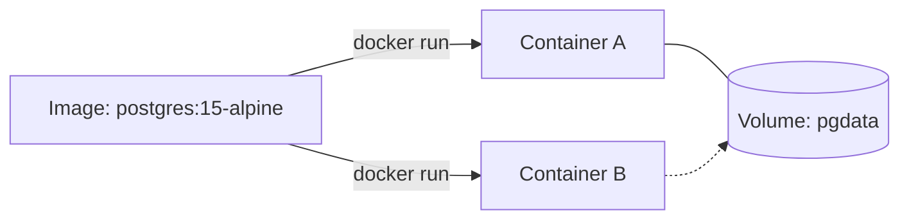
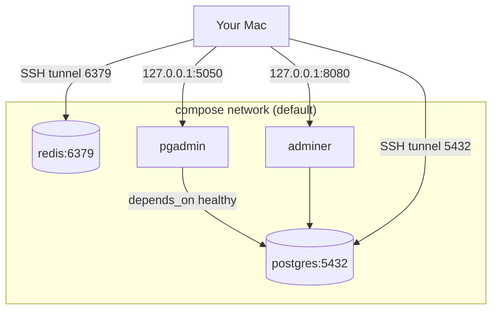

<ChapterMeta />

## TL;DR

- **A container is an isolated process** with its own filesystem and dependencies, sharing the host kernel — a lightweight VM without the overhead.
- **Image = template, container = running instance, volume = persistent data, network = container-to-container wiring.**
- **Install Docker from the official repo**, add yourself to the `docker` group, then verify with `docker run hello-world`.
- **Cap container logs in `daemon.json`** — otherwise a chatty container fills `/var` and takes the server down.
- **`docker compose up -d` starts your whole stack** (Postgres, Redis, pgAdmin, Adminer) with one command.

## Prerequisites

| Requirement | Why |
|-------------|-----|
| Patched, firewalled server | The stack will bind ports you've scoped in Chapter 9. |
| `/var` partition (Chapter 2) | Docker stores images/volumes in `/var/lib/docker`. |
| `sudo` | Installing Docker and editing the daemon config. |

## What is Docker and why use it?

Without Docker, installing a Node.js app with Postgres on a server means:

1. Install Node.js (conflicts with system Node?)
2. Install Postgres (configure it, set passwords, create users)
3. Handle environment differences (dev vs prod)
4. App works on your Mac but not the server due to different OS versions

With Docker:

- Each service runs in its own **container** — isolated, with its own dependencies
- A container is like a lightweight VM but shares the kernel
- "It works on my machine" becomes "it works in the container, everywhere"
- Start your entire stack with one command: `docker compose up`

## Core Docker concepts

**Image** — A read-only template. `postgres:15` is an image. Like a class in OOP.

**Container** — A running instance of an image. Like an object instantiated from a class. Containers are ephemeral — destroying one doesn't affect the image.

**Volume** — Persistent storage attached to a container. When a container is deleted, data in volumes survives.

**Network** — Docker creates virtual networks so containers can communicate. By default, containers in the same `docker-compose.yml` can reach each other by service name.



<p class="ahl-diagram-caption"><strong>Figure 10.1</strong> — One immutable image, many disposable containers; volumes outlive the containers that use them.</p>

| Concept | Analogy | Lifetime |
|---------|---------|----------|
| Image | Class | Permanent (until pruned) |
| Container | Object / instance | Ephemeral |
| Volume | External drive | Until deleted |
| Network | Private LAN | Until removed |

## Step 1 — Install Docker

**Run** the block below. **Expected:** `docker run hello-world` prints "Hello from Docker!".

```bash [install-docker.sh]
# Remove old/conflicting packages
sudo apt remove -y docker docker-engine docker.io containerd runc 2>/dev/null

# Install dependencies
sudo apt install -y ca-certificates curl gnupg lsb-release

# Add Docker's official GPG key (verify packages are authentic)
sudo install -m 0755 -d /etc/apt/keyrings
curl -fsSL https://download.docker.com/linux/ubuntu/gpg | \
  sudo gpg --dearmor -o /etc/apt/keyrings/docker.gpg
sudo chmod a+r /etc/apt/keyrings/docker.gpg

# Add Docker repository
echo \
  "deb [arch=$(dpkg --print-architecture) signed-by=/etc/apt/keyrings/docker.gpg] \
  https://download.docker.com/linux/ubuntu \
  $(lsb_release -cs) stable" | \
  sudo tee /etc/apt/sources.list.d/docker.list > /dev/null

# Install Docker
sudo apt update
sudo apt install -y docker-ce docker-ce-cli containerd.io \
  docker-buildx-plugin docker-compose-plugin

# Run without sudo
sudo usermod -aG docker $USER
newgrp docker

# Verify
docker run hello-world
docker --version
docker compose version
```

## Step 2 — Configure Docker storage and logs

By default, Docker stores everything in `/var/lib/docker`. Since we gave `/var` its own 50GB partition, this is good — Docker data won't overflow into your root partition.

Configure Docker daemon with best practices:

```bash [daemon-config.sh]
sudo nano /etc/docker/daemon.json
```

```json [daemon.json]
{
  "log-driver": "json-file",
  "log-opts": {
    "max-size": "10m",
    "max-file": "3"
  },
  "storage-driver": "overlay2"
}
```

::: info Why log limits?
Without limits, Docker container logs can grow indefinitely and fill your disk. `max-size: 10m` means each log file is max 10MB, and `max-file: 3` means only 3 rotated files are kept. Max 30MB per container.
:::

```bash [restart-docker.sh]
sudo systemctl restart docker
```

## Step 3 — Your development stack with Docker Compose

**Run** the commands to create the directory, then paste the compose file. **Expected:** `docker compose ps` lists four running services.

```bash [stack-dir.sh]
mkdir -p ~/docker/stack
nano ~/docker/stack/docker-compose.yml
```

```yaml [docker-compose.yml]
version: '3.9'

services:
  # ─── PostgreSQL Database ────────────────────────────────────
  postgres:
    image: postgres:15-alpine          # alpine = smaller image
    container_name: postgres
    restart: unless-stopped            # restart on crash, not on manual stop
    environment:
      POSTGRES_USER: devuser
      POSTGRES_PASSWORD: devpass
      POSTGRES_DB: devdb
    ports:
      - "127.0.0.1:5432:5432"          # bind to localhost only (safer)
    volumes:
      - pgdata:/var/lib/postgresql/data
      - ./init.sql:/docker-entrypoint-initdb.d/init.sql  # run SQL on first start
    healthcheck:
      test: ["CMD-SHELL", "pg_isready -U devuser -d devdb"]
      interval: 10s
      timeout: 5s
      retries: 5

  # ─── Redis Cache ─────────────────────────────────────────────
  redis:
    image: redis:7-alpine
    container_name: redis
    restart: unless-stopped
    command: redis-server --requirepass redispass --appendonly yes
    ports:
      - "127.0.0.1:6379:6379"
    volumes:
      - redisdata:/data

  # ─── pgAdmin — Database GUI ──────────────────────────────────
  pgadmin:
    image: dpage/pgadmin4:latest
    container_name: pgadmin
    restart: unless-stopped
    environment:
      PGADMIN_DEFAULT_EMAIL: admin@homelab.local
      PGADMIN_DEFAULT_PASSWORD: adminpass
      PGADMIN_CONFIG_SERVER_MODE: 'False'   # single-user mode
    ports:
      - "5050:80"
    volumes:
      - pgadmindata:/var/lib/pgadmin
    depends_on:
      postgres:
        condition: service_healthy        # wait for postgres to be ready

  # ─── Adminer — Lightweight DB GUI ────────────────────────────
  adminer:
    image: adminer:latest
    container_name: adminer
    restart: unless-stopped
    ports:
      - "8080:8080"

volumes:
  pgdata:
  redisdata:
  pgadmindata:
```



<p class="ahl-diagram-caption"><strong>Figure 10.2</strong> — The stack: containers talk to each other by service name; you reach them from your Mac via localhost (or an SSH tunnel).</p>

```bash [compose-control.sh]
cd ~/docker/stack

# Start everything
docker compose up -d

# Check status
docker compose ps

# View logs
docker compose logs -f postgres

# Stop everything
docker compose down

# Stop and DELETE volumes (destroys data!)
docker compose down -v
```

## Useful Docker commands

```bash [docker-commands.sh]
# List running containers
docker ps

# List all containers (including stopped)
docker ps -a

# Enter a running container (like SSH into it)
docker exec -it postgres bash
docker exec -it postgres psql -U devuser devdb

# View container logs
docker logs postgres
docker logs -f postgres    # follow mode (like tail -f)
docker logs --tail 50 postgres   # last 50 lines

# Copy file from container to host
docker cp postgres:/etc/postgresql/postgresql.conf ./

# Check container resource usage
docker stats

# Remove stopped containers
docker container prune

# Remove unused images
docker image prune

# Full cleanup (careful! removes everything unused)
docker system prune -a
```

## Verification

| Check | Command | Expected |
|-------|---------|----------|
| Docker works without sudo | `docker ps` | a header row, no permission error |
| Compose installed | `docker compose version` | `Docker Compose version v2.x` |
| Stack is up | `docker compose ps` | 4 services `Up`/`running` |
| Storage driver | `docker info \| grep "Storage Driver"` | `overlay2` |
| Log limits applied | `docker inspect postgres \| grep -i max-size` | shows `"max-size": "10m"` |

```bash [verify.sh]
docker run --rm hello-world
cd ~/docker/stack && docker compose ps
docker info | grep -E "Storage Driver|Logging Driver"
```

## Common pitfalls

::: warning Top 3 failure modes
1. **`docker: permission denied`.** You added yourself to the `docker` group but your session predates it. Run `newgrp docker` or log out and back in.
2. **Publishing ports as `"5432:5432"`.** That binds `0.0.0.0` and exposes the DB to the LAN. Use `"127.0.0.1:5432:5432"`.
3. **No log limits.** A crash-looping container writes gigabytes of logs and fills `/var`. Always set `max-size`/`max-file`.
:::

## Troubleshooting

| Symptom | Likely cause | Fix |
|---------|--------------|-----|
| `Cannot connect to the Docker daemon` | Service stopped, or not in `docker` group | `sudo systemctl start docker`; `newgrp docker` |
| Port already in use | Another service holds the port | `ss -tlnp \| grep <port>`; change the host port mapping |
| Container exits immediately | Bad command/env in compose | `docker compose logs <svc>` |
| Data lost after `down` | Used `down -v` | Volumes are deleted by `-v`; use plain `down` |
| Pulls are slow / fail | Registry rate limit or DNS | Check `resolvectl status`; retry |

## Recap & next

You can install Docker, cap its footprint, and bring up a four-service stack with one command. Containers now isolate every dependency, and volumes keep your data across restarts.

Next: **[Chapter 11 — Nginx: Reverse Proxy & SSL](/chapters/11-nginx-reverse-proxy-ssl)** — put a single, TLS-terminating front door in front of these services.

## References

- [Install Docker Engine on Ubuntu](https://docs.docker.com/engine/install/ubuntu/) — the official install steps.
- [Docker Compose overview](https://docs.docker.com/compose/) — the file format and commands.
- [What is a container?](https://docs.docker.com/get-started/docker-concepts/the-basics/what-is-a-container/) — concepts refresher.
- [dockerd daemon configuration](https://docs.docker.com/reference/cli/dockerd/) — `daemon.json` options.
- [Configure logging drivers](https://docs.docker.com/engine/logging/configure/) — log rotation with `max-size`/`max-file`.
- [Dockerfile reference](https://docs.docker.com/engine/reference/builder/) — for when you build your own images.
- [PostgreSQL on Docker Hub](https://hub.docker.com/_/postgres) — image tags and environment variables.
