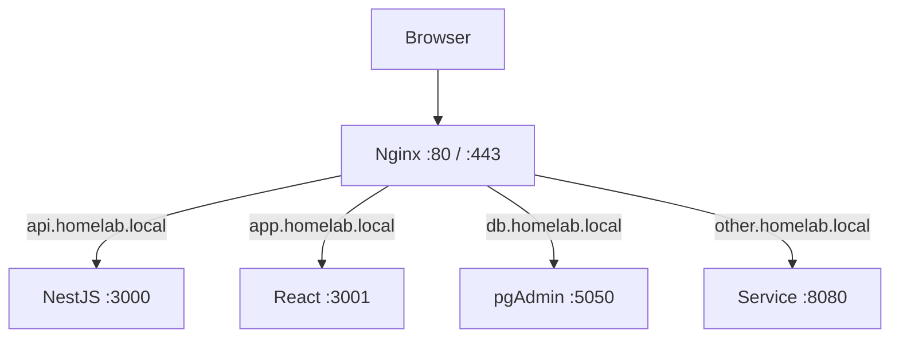
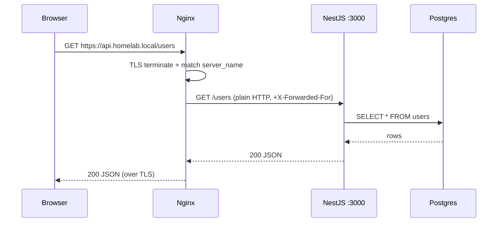

<ChapterMeta />

## TL;DR

- **A reverse proxy is one front door for many services.** Users hit `api.homelab.local` and Nginx routes to the right port by domain name.
- **Nginx terminates TLS**, so your apps keep speaking plain HTTP on localhost.
- **Each site is a file in `/etc/nginx/sites-available/`, symlinked into `sites-enabled/`.**
- **Always run `sudo nginx -t` before reloading** — a typo otherwise takes the whole front door down.
- **WebSockets need explicit headers** (`Upgrade`/`Connection`), or NestJS real-time features break.

## Prerequisites

| Requirement | Why |
|-------------|-----|
| A backend service | There's nothing to proxy without one. |
| Local DNS names | `server_name` matches on the hostname. |
| UFW allows 80/443 | Otherwise the front door is unreachable. |

## What is a reverse proxy and why?

Imagine you have:

- NestJS API on port 3000
- React frontend on port 3001
- pgAdmin on port 5050
- Another service on port 8080

Without Nginx, users need to type `http://192.168.1.100:3000` for the API, `:3001` for frontend, etc.

With Nginx as a reverse proxy:

- `http://api.homelab.local` → forwards to port 3000
- `http://app.homelab.local` → forwards to port 3001
- `http://db.homelab.local` → forwards to port 5050

Nginx sits in front of all services and routes requests based on domain name. Users only ever talk to Nginx (port 80/443). It's like a receptionist who directs visitors to the right department.



<p class="ahl-diagram-caption"><strong>Figure 11.1</strong> — Domain-based routing: one public port, many backends, chosen by the `Host` header.</p>

Additional benefits:

| Benefit | What it buys you |
|---------|------------------|
| SSL termination | Nginx handles HTTPS, your apps run plain HTTP internally |
| Load balancing | Distribute traffic across multiple app instances |
| Caching | Cache static files at Nginx level |
| Rate limiting | Protect against DDoS |
| Compression | Gzip responses to reduce bandwidth |

## Step 1 — Install and enable Nginx

**Run** the block below. **Expected:** `systemctl status nginx` shows `active (running)`.

```bash [install-nginx.sh]
sudo apt install -y nginx
sudo systemctl enable nginx
sudo systemctl start nginx
sudo ufw allow 'Nginx Full'
```

## Step 2 — Configure a virtual host

Each service gets its own config file in `/etc/nginx/sites-available/`:

```bash [create-site.sh]
sudo nano /etc/nginx/sites-available/nestjs-api
```

```nginx [nestjs-api]
server {
    listen 80;
    server_name api.homelab.local;

    # Security headers
    add_header X-Frame-Options "SAMEORIGIN";
    add_header X-Content-Type-Options "nosniff";
    add_header X-XSS-Protection "1; mode=block";

    location / {
        proxy_pass http://localhost:3000;
        proxy_http_version 1.1;

        # Required for WebSocket support (NestJS often uses this)
        proxy_set_header Upgrade $http_upgrade;
        proxy_set_header Connection 'upgrade';

        # Pass real client info to NestJS
        proxy_set_header Host $host;
        proxy_set_header X-Real-IP $remote_addr;
        proxy_set_header X-Forwarded-For $proxy_add_x_forwarded_for;
        proxy_set_header X-Forwarded-Proto $scheme;

        # Timeouts
        proxy_connect_timeout 60s;
        proxy_send_timeout 60s;
        proxy_read_timeout 60s;
    }

    # Serve large file uploads (for your data pipeline)
    client_max_body_size 500M;
}
```

Enable the site:

```bash [enable-site.sh]
sudo ln -s /etc/nginx/sites-available/nestjs-api /etc/nginx/sites-enabled/
sudo nginx -t          # Test config syntax (always do this!)
sudo systemctl reload nginx
```

::: warning Always `nginx -t` before reload
`nginx -t` parses the config and reports errors *without* touching the running server. Skip it and a single missing semicolon can fail the reload — leaving you debugging a broken front door.
:::

## Step 3 — The request flow

Once the proxy is in place, a request to your API travels a clear path:



<p class="ahl-diagram-caption"><strong>Figure 11.2</strong> — End-to-end request flow: TLS ends at Nginx; the app and database stay on the private side.</p>

## Step 4 — Local HTTPS with mkcert

For local development with HTTPS (some browser APIs require it):

```bash [install-mkcert.sh]
sudo apt install -y libnss3-tools
curl -JLO "https://dl.filippo.io/mkcert/latest?for=linux/amd64"
chmod +x mkcert-v*-linux-amd64
sudo mv mkcert-v*-linux-amd64 /usr/local/bin/mkcert

# Create and install local CA
mkcert -install

# Create certificate for your local domains
mkcert homelab.local "*.homelab.local" localhost 127.0.0.1 192.168.1.100
```

Update nginx config to use HTTPS:

```nginx [nestjs-api-ssl]
server {
    listen 443 ssl;
    server_name api.homelab.local;

    ssl_certificate /home/ahmed/homelab.local+3.pem;
    ssl_certificate_key /home/ahmed/homelab.local+3-key.pem;

    # Modern SSL settings
    ssl_protocols TLSv1.2 TLSv1.3;
    ssl_ciphers ECDHE-RSA-AES256-GCM-SHA512:DHE-RSA-AES256-GCM-SHA512;
    ssl_prefer_server_ciphers off;

    location / {
        proxy_pass http://localhost:3000;
        # ... other proxy settings
    }
}

# Redirect HTTP to HTTPS
server {
    listen 80;
    server_name api.homelab.local;
    return 301 https://$server_name$request_uri;
}
```

<figure>
  <svg viewBox="0 0 720 200" role="img" aria-label="SSL termination diagram: the browser talks HTTPS to Nginx, which forwards plain HTTP to the internal NestJS app" width="100%" style="max-width:720px;height:auto;border-radius:10px;border:1px solid var(--vp-c-divider);background:var(--vp-c-bg-soft);padding:1rem;box-sizing:border-box;font-family:Inter,system-ui,sans-serif;">
    <rect x="16" y="60" width="180" height="70" rx="10" fill="var(--vp-c-bg)" stroke="var(--vp-c-divider)"></rect>
    <text x="106" y="90" text-anchor="middle" font-size="12.5" font-weight="700" fill="var(--vp-c-text-1)">Browser</text>
    <text x="106" y="110" text-anchor="middle" font-size="11" fill="var(--vp-c-text-3)">https://…</text>
    <rect x="270" y="60" width="180" height="70" rx="10" fill="var(--vp-c-bg)" stroke="var(--vp-c-brand-1)" stroke-width="1.5"></rect>
    <text x="360" y="90" text-anchor="middle" font-size="12.5" font-weight="700" fill="var(--vp-c-brand-1)">Nginx</text>
    <text x="360" y="110" text-anchor="middle" font-size="11" fill="var(--vp-c-brand-1)">TLS terminates here</text>
    <rect x="524" y="60" width="180" height="70" rx="10" fill="var(--vp-c-bg)" stroke="var(--vp-c-divider)"></rect>
    <text x="614" y="90" text-anchor="middle" font-size="12.5" font-weight="700" fill="var(--vp-c-text-1)">NestJS :3000</text>
    <text x="614" y="110" text-anchor="middle" font-size="11" fill="var(--vp-c-text-3)">plain HTTP</text>
    <line x1="196" y1="95" x2="270" y2="95" stroke="var(--vp-c-brand-1)" stroke-width="2"></line>
    <text x="233" y="86" text-anchor="middle" font-size="10.5" fill="var(--vp-c-brand-1)">TLS</text>
    <line x1="450" y1="95" x2="524" y2="95" stroke="var(--vp-c-text-3)" stroke-width="2"></line>
    <text x="487" y="86" text-anchor="middle" font-size="10.5" fill="var(--vp-c-text-3)">HTTP</text>
    <text x="16" y="170" font-size="11.5" fill="var(--vp-c-text-3)">Only Nginx holds the certificate; backends never see encrypted traffic.</text>
  </svg>
  <figcaption><strong>Figure 11.3</strong> — SSL termination: the encrypted leg stops at Nginx, and internal traffic stays on the loopback.</figcaption>
</figure>

## Verification

| Check | Command | Expected |
|-------|---------|----------|
| Config is valid | `sudo nginx -t` | `syntax is ok` / `test is successful` |
| Service running | `systemctl is-active nginx` | `active` |
| Site enabled | `ls -l /etc/nginx/sites-enabled/` | symlink to `nestjs-api` |
| Proxy responds | `curl -I http://api.homelab.local` | HTTP response from the backend |
| HTTPS works | `curl -kI https://api.homelab.local` | HTTP 200 over TLS |

```bash [verify.sh]
sudo nginx -t
systemctl is-active nginx
curl -sI http://api.homelab.local | head -1
mkcert -CAROOT      # where the local CA lives
```

## Common pitfalls

::: warning Top 3 failure modes
1. **Forgetting the `sites-enabled` symlink.** The file exists but Nginx never loads it. Symlink it, then `nginx -t`.
2. **Reloading without `nginx -t`.** A syntax error fails the reload and you lose the whole front door.
3. **Missing WebSocket headers.** HTTP works, but Socket.IO/`ws` connections fail. Keep `Upgrade` + `Connection 'upgrade'`.
:::

## Troubleshooting

| Symptom | Likely cause | Fix |
|---------|--------------|-----|
| `502 Bad Gateway` | Backend not running / wrong port | Check `proxy_pass` target; `ss -tlnp \| grep 3000` |
| `404` for the domain | `server_name` mismatch or default site wins | Match the `Host` header; check `sites-enabled` |
| `413 Request Entity Too Large` | Upload exceeds `client_max_body_size` | Raise it (e.g. `500M`) |
| Nginx won't reload | Config syntax error | Read `sudo nginx -t` output and fix the file |
| WebSocket won't connect | Missing `Upgrade`/`Connection` headers | Add both `proxy_set_header` lines |

## Recap & next

You now have a single, TLS-terminating front door that routes by hostname and forwards WebSocket-capable traffic to your backends — the standard shape of a production web edge.

Next: **[Chapter 12 — NVIDIA GPU Setup for AI Workloads](/chapters/12-nvidia-gpu-setup-for-ai-workloads)** — put the GTX 1050 Ti to work.

## References

- [Nginx documentation](https://nginx.org/en/docs/) — core reference.
- [Nginx reverse proxy guide](https://docs.nginx.com/nginx/admin-guide/web-server/reverse-proxy/) — official `proxy_pass` patterns.
- [`ngx_http_proxy_module`](https://nginx.org/en/docs/http/ngx_http_proxy_module.html) — every `proxy_*` directive.
- [WebSocket proxying](https://nginx.org/en/docs/http/websocket.html) — the `Upgrade`/`Connection` requirement.
- [`man nginx`](https://manpages.ubuntu.com/manpages/noble/en/man8/nginx.8.html) — server binary and `-t`.
- [mkcert](https://github.com/FiloSottile/mkcert) — local certificate authority.
- [Mozilla SSL Configuration Generator](https://ssl-config.mozilla.org/) — modern cipher/TLS presets.
