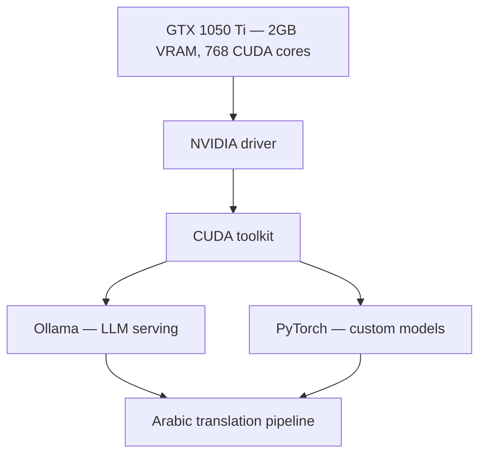

<ChapterMeta />

## TL;DR

- **Install the NVIDIA driver first** (`ubuntu-drivers`), reboot, and confirm with `nvidia-smi` — that's your GPU health check.
- **CUDA sits on top of the driver**, and **Ollama / PyTorch sit on top of CUDA.** Get the layering right.
- **2 GB VRAM is the hard constraint.** Small models (opus-mt, sentence-transformers, Q4 LLMs) fit; 7B+ mostly don't.
- **Ollama runs as a service on port 11434** — pull `aya`/`mistral` for Arabic translation work.
- **Manage VRAM deliberately:** half precision, small batches, `torch.no_grad()`, and `empty_cache()`.

## Prerequisites

| Requirement | Why |
|-------------|-----|
| GTX 1050 Ti installed | The whole chapter targets this card. |
| Patched server | Driver install pulls kernel modules. |
| `sudo` | Driver/CUDA installs are privileged. |

::: warning A reboot is required
The NVIDIA kernel module only loads after a reboot. Plan for it — you can't finish setup without one.
:::

## Understanding your GPU for server work

Your **GTX 1050 Ti** has:

- 2GB GDDR5 VRAM
- 768 CUDA cores
- CUDA Compute Capability: 6.1
- Max supported CUDA version: ~12.x



<p class="ahl-diagram-caption"><strong>Figure 12.1</strong> — The GPU stack: each layer depends on the one below; a mismatch at any level breaks the app above.</p>

For your use case (data cleaning, Arabic translation of OpenFoodFacts):

| Model / workload | Size | Fits in 2 GB? |
|------------------|------|----------------|
| Helsinki-NLP opus-mt (translation) | ~300 MB | ✅ |
| sentence-transformers (embeddings) | ~200 MB | ✅ |
| Quantized models Q4 via Ollama | varies | ✅ |
| Mistral 7B Q4 | ~4 GB | ⚠️ needs CPU fallback |
| Llama 13B+ | >8 GB | ❌ too large |

<figure>
  <svg viewBox="0 0 720 250" role="img" aria-label="VRAM budget diagram: the 2048 MiB card holds small models easily while a 4096 MiB Mistral 7B Q4 does not fit" width="100%" style="max-width:720px;height:auto;border-radius:10px;border:1px solid var(--vp-c-divider);background:var(--vp-c-bg-soft);padding:1rem;box-sizing:border-box;font-family:Inter,system-ui,sans-serif;">
    <text x="16" y="30" font-size="13" font-weight="700" fill="var(--vp-c-text-1)">GTX 1050 Ti VRAM — 2048 MiB</text>
    <rect x="16" y="46" width="664" height="34" rx="8" fill="var(--vp-c-bg)" stroke="var(--vp-c-divider)"></rect>
    <rect x="16" y="46" width="97" height="34" rx="8" fill="var(--vp-c-brand-1)"></rect>
    <rect x="113" y="46" width="65" height="34" fill="var(--vp-c-brand-3)"></rect>
    <text x="30" y="68" font-size="10.5" fill="#ffffff">opus-mt 300M</text>
    <text x="122" y="68" font-size="10.5" fill="#ffffff">s-t 200M</text>
    <text x="360" y="68" font-size="11" fill="var(--vp-c-text-3)">free VRAM</text>
    <text x="16" y="118" font-size="12" fill="var(--vp-c-text-2)">Small models load comfortably; keep batches small.</text>
    <text x="16" y="160" font-size="13" font-weight="700" fill="var(--vp-c-red-1, #dc2626)">Mistral 7B Q4 ≈ 4096 MiB</text>
    <rect x="16" y="176" width="664" height="34" rx="8" fill="rgba(220,50,50,0.12)" stroke="var(--vp-c-red-1, #dc2626)" stroke-dasharray="6 4"></rect>
    <rect x="16" y="176" width="332" height="34" rx="8" fill="var(--vp-c-red-1, #dc2626)" opacity="0.75"></rect>
    <text x="30" y="198" font-size="10.5" fill="#ffffff">2048 MiB (limit)</text>
    <text x="360" y="198" font-size="10.5" fill="var(--vp-c-red-1, #dc2626)">overflows → CPU fallback</text>
    <text x="16" y="236" font-size="11.5" fill="var(--vp-c-text-3)">Sizes are approximate; actual usage depends on quantization and batch size.</text>
  </svg>
  <figcaption><strong>Figure 12.2</strong> — The 2 GB budget: small models fit, 7B Q4 overflows and spills to CPU.</figcaption>
</figure>

## Step 1 — Install NVIDIA drivers

**Run** the block, then **reboot**. **Expected:** after reboot, `nvidia-smi` prints your GPU.

```bash [install-driver.sh]
# See what's available
ubuntu-drivers devices

# Install recommended driver automatically
sudo ubuntu-drivers autoinstall

# Or install specific version (535 is stable as of 2026)
sudo apt install -y nvidia-driver-535

# REBOOT REQUIRED
sudo reboot
```

After reboot:

```bash [nvidia-smi.sh]
nvidia-smi
```

You should see your GPU info. This command is your health check for the GPU.

```text [nvidia-smi output]
+-----------------------------------------------------------------------------+
| NVIDIA-SMI 535.x       Driver Version: 535.x     CUDA Version: 12.2        |
|-------------------------------+--------------------+------------------------+
| GPU  Name        Persistence-M| Bus-Id       Disp.A | Volatile Uncorr. ECC |
| Fan  Temp  Perf  Pwr:Usage/Cap|       Memory-Usage  | GPU-Util  Compute M. |
|   0  NVIDIA GTX 1050 Ti   Off |  00000000:01:00.0 Off|                  N/A |
| 30%   35C    P8    N/A /  75W |   0MiB / 2048MiB    |      0%      Default |
+-----------------------------------------------------------------------------+
```

## Step 2 — Install the CUDA toolkit

**Run** the block. **Expected:** `nvcc --version` prints the compiler version.

```bash [install-cuda.sh]
sudo apt install -y nvidia-cuda-toolkit

# Verify
nvcc --version
# nvcc: NVIDIA (R) Cuda compiler driver

# Add CUDA to PATH
echo 'export PATH=/usr/local/cuda/bin:$PATH' >> ~/.bashrc
echo 'export LD_LIBRARY_PATH=/usr/local/cuda/lib64:$LD_LIBRARY_PATH' >> ~/.bashrc
source ~/.bashrc
```

## Step 3 — Install Ollama for local LLMs

**Run** the installer. **Expected:** `ollama list` shows pulled models; `nvidia-smi` shows GPU memory used while generating.

```bash [install-ollama.sh]
curl -fsSL https://ollama.com/install.sh | sh

# Verify it uses GPU
ollama run mistral "test"
# In another terminal: nvidia-smi (should show GPU memory being used)

# Models for Arabic translation:
ollama pull aya          # Multilingual model with Arabic support
ollama pull mistral      # General purpose, handles Arabic with prompting

# List downloaded models
ollama list

# Remove a model (free up space)
ollama rm mistral
```

Ollama runs as a service on port 11434:

```bash [ollama-service.sh]
sudo systemctl status ollama
curl http://localhost:11434/api/tags   # list models via API
```

## Step 4 — Python GPU environment

**Run** the block. **Expected:** the verification prints `CUDA available: True` and your GPU name.

```bash [python-env.sh]
sudo apt install -y python3 python3-pip python3-venv

# Create isolated environment for AI work
python3 -m venv ~/aienv
source ~/aienv/bin/activate

# Install PyTorch with CUDA support (for CUDA 11.8 compatible with GTX 1050 Ti)
pip install torch torchvision torchaudio --index-url https://download.pytorch.org/whl/cu118

# Verify GPU is available
python3 -c "
import torch
print(f'PyTorch version: {torch.__version__}')
print(f'CUDA available: {torch.cuda.is_available()}')
print(f'GPU: {torch.cuda.get_device_name(0)}')
print(f'VRAM: {torch.cuda.get_device_properties(0).total_memory / 1024**3:.1f} GB')
"

# Install NLP and data tools
pip install \
  pandas numpy \
  transformers \
  sentence-transformers \
  datasets \
  pyarrow fastparquet \
  tqdm \
  requests
```

## Managing VRAM with 2 GB

2GB VRAM requires careful management:

```python [vram.py]
import torch

# Always clear GPU cache between tasks
torch.cuda.empty_cache()

# Check current VRAM usage
print(f"Allocated: {torch.cuda.memory_allocated(0) / 1024**2:.0f} MB")
print(f"Cached: {torch.cuda.memory_reserved(0) / 1024**2:.0f} MB")

# Use half precision to save VRAM (model uses 2x less memory)
model = model.half()  # float16 instead of float32

# Process in small batches
BATCH_SIZE = 8   # adjust down if you get CUDA out of memory errors

# Context manager to automatically free memory
with torch.no_grad():   # don't track gradients (saves memory)
    outputs = model(inputs)
```

## Verification

| Check | Command | Expected |
|-------|---------|----------|
| Driver loaded | `nvidia-smi` | GPU + driver + CUDA version |
| CUDA compiler | `nvcc --version` | `release 12.x` |
| Ollama running | `systemctl is-active ollama` | `active` |
| Models present | `ollama list` | `aya`, `mistral` |
| PyTorch sees GPU | python snippet above | `CUDA available: True` |

```bash [verify.sh]
nvidia-smi --query-gpu=name,memory.total --format=csv
nvcc --version | tail -2
systemctl is-active ollama
curl -s http://localhost:11434/api/tags | head -c 200
```

## Common pitfalls

::: warning Top 3 failure modes
1. **Secure Boot blocks the driver.** The module won't load and `nvidia-smi` fails. Either disable Secure Boot or sign the module (MOK enrollment).
2. **Skipping the reboot.** The driver only activates after a restart; until then, `nvidia-smi` reports "command not found".
3. **CUDA OOM on 2 GB.** Batch too big or full-precision model. Use `model.half()`, lower `BATCH_SIZE`, and `torch.no_grad()`.
:::

## Troubleshooting

| Symptom | Likely cause | Fix |
|---------|--------------|-----|
| `nvidia-smi: command not found` | Driver not installed or not rebooted | Reinstall driver, then `sudo reboot` |
| `NVIDIA-SMI has failed … couldn't communicate` | Secure Boot / module not loaded | Check `dmesg \| grep -i nvidia`; disable Secure Boot or sign the module |
| `CUDA out of memory` | Model/batch exceeds 2 GB | Half precision, smaller batches, `empty_cache()` |
| Ollama runs on CPU | Driver/CUDA mismatch | Verify `nvidia-smi`; reinstall Ollama after the driver is working |
| PyTorch `cuda.is_available()` is False | CPU-only wheel installed | Reinstall with the `cu118` index URL |

## Recap & next

Your GPU is online: driver + CUDA installed, Ollama serving models on 11434, and a PyTorch venv that reports CUDA availability. You also know how to stay inside the 2 GB budget.

Next: **[Chapter 13 — Node.js & NestJS Deployment](/chapters/13-nodejs-nestjs-deployment)** — deploy the application that will use all this.

## References

- [NVIDIA drivers](https://www.nvidia.com/en-us/drivers/) — official driver downloads.
- [Ubuntu NVIDIA driver installation](https://help.ubuntu.com/community/NvidiaDriversInstallation) — `ubuntu-drivers` guidance.
- [CUDA Toolkit](https://developer.nvidia.com/cuda-toolkit) — the compute platform.
- [CUDA GPU compute capability](https://developer.nvidia.com/cuda-gpus) — the 1050 Ti is compute 6.1.
- [Ollama](https://ollama.com/) and [Ollama on GitHub](https://github.com/ollama/ollama) — local LLM serving.
- [PyTorch — get started locally](https://pytorch.org/get-started/locally/) — correct wheel/index URL for your CUDA version.
