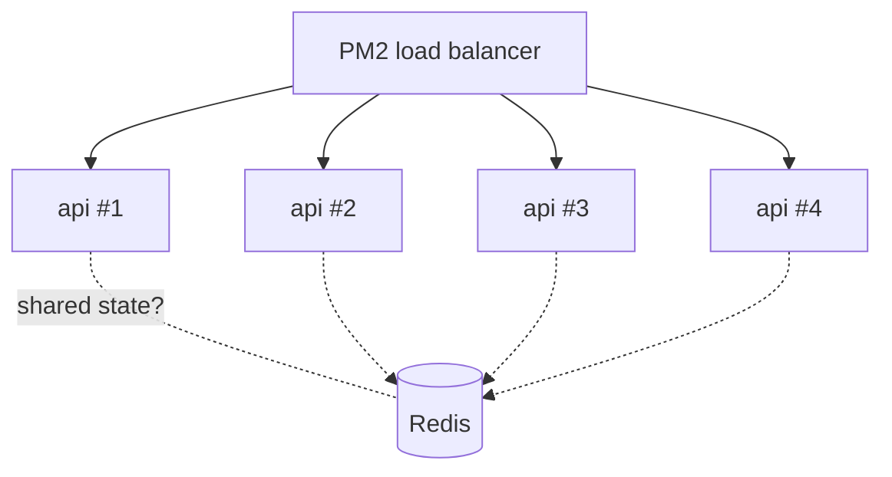

<ChapterMeta />

## TL;DR

- **PM2 decouples your app from the terminal** — close SSH and it keeps running.
- **Cluster mode uses all 4 cores** (`instances: 'max'`) and load-balances across workers.
- **Cluster mode breaks in-memory state** (WebSocket maps, sessions) — move shared state to Redis.
- **`pm2 reload` is graceful and zero-downtime; `pm2 restart` is not.**
- **`pm2 save` + `pm2 startup`** make processes survive a reboot.

## Prerequisites

| Requirement | Why |
|-------------|-----|
| PM2 installed | The tool this chapter is about. |
| A built app | Something to supervise. |

## Understanding why PM2 is essential

When you run `node dist/main.js` in a terminal and close the terminal, the process dies. PM2 decouples your process from the terminal session.

```bash [pm2-basics.sh]
# Install PM2 globally
npm install -g pm2

# Basic usage
pm2 start dist/main.js --name "api"
pm2 list
pm2 logs api
pm2 stop api
pm2 restart api
pm2 delete api
```

## Step 1 — Cluster mode for multi-core

Your i5 7th gen has 4 cores. Use them all:

```javascript [ecosystem.config.js]
// ecosystem.config.js
module.exports = {
  apps: [{
    name: 'api',
    script: 'dist/main.js',
    instances: 'max',     // use all available CPUs
    exec_mode: 'cluster', // Node.js cluster mode
    // PM2 load balances requests across instances
  }]
}
```



<p class="ahl-diagram-caption"><strong>Figure 16.1</strong> — Cluster mode spreads requests across one worker per core; shared state must live outside the processes (e.g. Redis).</p>

::: warning Cluster mode + in-memory state = broken
If your app keeps state in memory (like a WebSocket map), cluster mode will break it because instances don't share memory. Use Redis for shared state.
:::

## Step 2 — Zero-downtime deployment

**Run** `pm2 reload` for deploys. **Expected:** no dropped requests (workers are replaced one at a time).

```bash [reload-vs-restart.sh]
# Instead of restart (which causes downtime):
pm2 restart api

# Use reload (graceful — waits for current requests to finish):
pm2 reload api
```

<figure>
  <svg viewBox="0 0 720 210" role="img" aria-label="Timeline comparing pm2 restart, which has a downtime gap, with pm2 reload, which replaces workers without any gap" width="100%" style="max-width:720px;height:auto;border-radius:10px;border:1px solid var(--vp-c-divider);background:var(--vp-c-bg-soft);padding:1rem;box-sizing:border-box;font-family:Inter,system-ui,sans-serif;">
    <text x="16" y="34" font-size="12.5" font-weight="700" fill="var(--vp-c-text-1)">pm2 restart</text>
    <rect x="16" y="46" width="220" height="24" rx="6" fill="var(--vp-c-brand-soft)"></rect>
    <rect x="236" y="46" width="90" height="24" rx="6" fill="var(--vp-c-red-1, #dc2626)"></rect>
    <rect x="326" y="46" width="220" height="24" rx="6" fill="var(--vp-c-brand-soft)"></rect>
    <text x="281" y="63" text-anchor="middle" font-size="10.5" fill="#ffffff">downtime</text>
    <text x="16" y="120" font-size="12.5" font-weight="700" fill="var(--vp-c-text-1)">pm2 reload</text>
    <rect x="16" y="132" width="530" height="24" rx="6" fill="var(--vp-c-brand-1)"></rect>
    <text x="281" y="149" text-anchor="middle" font-size="10.5" fill="#ffffff">no gap — workers replaced one by one</text>
    <text x="16" y="192" font-size="11.5" fill="var(--vp-c-text-3)">reload drains and swaps workers gracefully; restart kills them all at once.</text>
  </svg>
  <figcaption><strong>Figure 16.2</strong> — Restart drops a request window; reload doesn't.</figcaption>
</figure>

| Mode | Instances | Use when |
|------|-----------|----------|
| `fork` | 1 | Simple apps, or stateful in-memory apps |
| `cluster` | `'max'` | Stateless apps that should use all cores |

## Verification

| Check | Command | Expected |
|-------|---------|----------|
| App online | `pm2 list` | `api` status `online` |
| Cluster count | `pm2 list` | one process per core |
| Boot persistence | `pm2 list` after reboot | `api` back online |
| No downtime on deploy | loop `curl` during `pm2 reload` | all requests succeed |

```bash [verify.sh]
pm2 list
pm2 show api | grep -E "exec mode|instances"
# Zero-downtime check (run in another shell while reloading):
# while true; do curl -s -o /dev/null -w "%{http_code}\n" localhost:3000; done
```

## Common pitfalls

::: warning Top 3 failure modes
1. **Cluster mode with in-memory state.** Sessions/WebSockets break across workers. Move state to Redis.
2. **Deploying with `pm2 restart`.** Causes a request gap. Use `pm2 reload`.
3. **No `pm2 save`.** `pm2 startup` alone won't restore processes after reboot without a saved list.
:::

## Troubleshooting

| Symptom | Likely cause | Fix |
|---------|--------------|-----|
| Only 1 instance with `instances: 'max'` | `exec_mode` not `cluster` | Set `exec_mode: 'cluster'` |
| WebSocket clients disconnect randomly | Cluster workers don't share state | Use Redis adapter or switch to `fork` |
| Requests fail during deploy | Used `restart` | Use `reload` |
| App gone after reboot | `pm2 save` not run | `pm2 save` after `pm2 startup` |

## Recap & next

You can run your app across all cores with cluster mode, deploy without downtime via `reload`, and keep it alive across reboots — while knowing exactly when cluster mode is the wrong choice.

Next: **[Chapter 17 — Monitoring & Observability](/chapters/17-monitoring-observability)** — see what your server is doing before it breaks.

## References

- [PM2 quick start](https://pm2.keymetrics.io/docs/usage/quick-start/) — core commands.
- [PM2 cluster mode](https://pm2.keymetrics.io/docs/usage/cluster-mode/) — `instances`/`exec_mode`.
- [PM2 graceful reload](https://pm2.keymetrics.io/docs/usage/signals-clean-restart/) — how `reload` avoids downtime.
- [PM2 memory limit](https://pm2.keymetrics.io/docs/usage/memory-limit/) — `max_memory_restart`.
