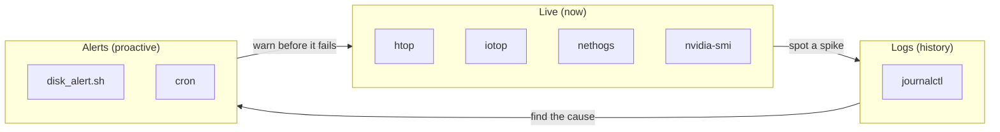
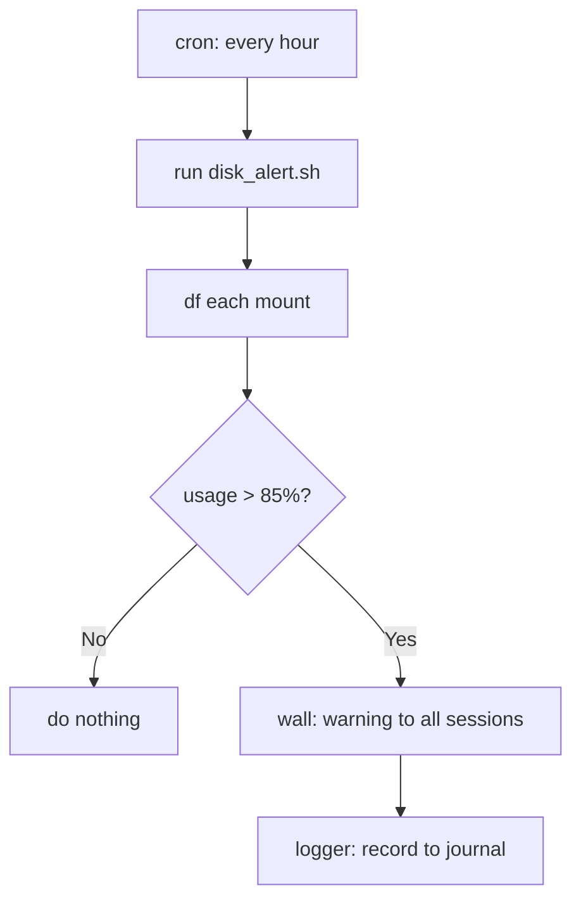

<ChapterMeta />

## TL;DR

- **Three layers of visibility:** live tools (`htop`, `iotop`, `nvidia-smi`), logs (`journalctl`), and proactive alerts.
- **`journalctl` is the single window into systemd logs** — filter by unit, priority, boot, or time.
- **A disk alert script catches the #1 home-lab outage** (a full filesystem) before it takes you down.
- **Schedule it with cron** and alert via `wall` + `logger`.
- Watch the tools that map to your risks: `/var` (Docker), RAM (models), GPU (VRAM).

## Prerequisites

| Requirement | Why |
|-------------|-----|
| Running services | There's nothing to observe otherwise. |
| `sudo` | `iotop`, `nethogs`, and full `journalctl` need it. |

## Real-time system monitoring

```bash [monitoring.sh]
# htop — interactive process viewer
htop
# Keys: F5=tree view, F6=sort, k=kill process, q=quit

# Disk I/O monitor
sudo iotop -o     # -o = only show processes doing I/O

# Network traffic per process
sudo nethogs wlp2s0   # replace with your interface

# Watch GPU continuously
watch -n 1 nvidia-smi

# Watch disk space
watch -n 5 'df -h'

# System overview
vmstat 1           # virtual memory stats every 1 second
iostat 1           # I/O stats every 1 second
free -h            # RAM usage

# Quick system summary
neofetch
```

| Tool | Answers the question… |
|------|-----------------------|
| `htop` | What's eating CPU/RAM? |
| `iotop` | Which process is hammering the disk? |
| `nethogs` | Which process is using the network? |
| `nvidia-smi` | Is the GPU busy / is VRAM full? |
| `vmstat` / `iostat` | Is the system I/O-bound? |
| `free -h` | How much RAM is left? |



<p class="ahl-diagram-caption"><strong>Figure 17.1</strong> — Observability layers: live tools to spot problems, logs to explain them, alerts to get ahead of them.</p>

## System logs with journalctl

Systemd logs everything. `journalctl` is your window into it:

```bash [journalctl.sh]
# All logs (most recent first)
journalctl -r

# Follow live logs
journalctl -f

# Logs for a specific service
journalctl -u nginx -f
journalctl -u docker
journalctl -u sshd

# Logs since last boot
journalctl -b

# Last 100 lines of everything
journalctl -n 100

# Logs with errors only
journalctl -p err

# Logs for a time range
journalctl --since "2026-05-19 10:00:00" --until "2026-05-19 11:00:00"

# Kernel messages
journalctl -k
dmesg | tail -20
```

| Flag | Effect |
|------|--------|
| `-f` | Follow (like `tail -f`) |
| `-u <unit>` | Filter to one service |
| `-b` | Since the last boot |
| `-p err` | Only errors and above |
| `-n N` | Last N lines |
| `--since/--until` | Time range |

::: info Bound your journal size
`journalctl` data grows in `/var/log/journal`. Cap it so it can't fill `/var`:
`sudo journalctl --vacuum-size=500M` (Chapter 24 covers persistent limits).
:::

## Disk alert script

**Run** to create and schedule the script. **Expected:** an alert fires only when a mount exceeds 85%.

```bash [create-script.sh]
mkdir -p ~/scripts
nano ~/scripts/disk_alert.sh
```

```bash [disk_alert.sh]
#!/bin/bash
# Disk space alert - sends wall message if usage exceeds threshold

THRESHOLD=85

check_disk() {
    local mount=$1
    local usage=$(df "$mount" | tail -1 | awk '{print $5}' | tr -d '%')
    if [ "$usage" -gt "$THRESHOLD" ]; then
        wall "⚠️  WARNING: $mount is ${usage}% full on $(hostname)!"
        logger "DISK ALERT: $mount is ${usage}% full"
    fi
}

check_disk /
check_disk /var
check_disk /home
check_disk /srv
check_disk /data
check_disk /mnt/storage
```

```bash [schedule.sh]
chmod +x ~/scripts/disk_alert.sh

# Schedule hourly
crontab -e
# Add: 0 * * * * /home/ahmed/scripts/disk_alert.sh
```



<p class="ahl-diagram-caption"><strong>Figure 17.2</strong> — The alert loop: cron runs the check, and only a threshold breach produces a notification.</p>

## Verification

| Check | Command | Expected |
|-------|---------|----------|
| Live tools work | `htop` | interactive UI opens |
| Logs readable | `journalctl -p err -b` | error entries (or none) |
| Script runs | `bash ~/scripts/disk_alert.sh` | no errors |
| Scheduled | `crontab -l` | the hourly job listed |
| Journal bounded | `journalctl --disk-usage` | a sane size |

```bash [verify.sh]
crontab -l | grep disk_alert
bash ~/scripts/disk_alert.sh && echo "script OK"
journalctl --disk-usage
```

## Common pitfalls

::: warning Top 3 failure modes
1. **Ignoring journal growth.** Unbounded systemd logs can fill `/var`. Vacuum or cap them.
2. **Alerting only via `wall`.** If nobody's logged in, you miss it. Add `logger` (journal) or email.
3. **Not watching `/var`.** Docker images/logs live there and are the usual culprit for a full disk.
:::

## Troubleshooting

| Symptom | Likely cause | Fix |
|---------|--------------|-----|
| `journalctl: no persistent journal` | Journal not persistent | `sudo mkdir -p /var/log/journal && sudo systemctl restart systemd-journald` |
| `iotop: command not found` | Not installed | `sudo apt install iotop` |
| No alert ever fires | Threshold too high / wrong mounts | Lower `THRESHOLD`; verify mounts with `df -h` |
| `wall` output not seen | No active TTY sessions | Rely on `logger`/email too |
| Journal eats disk | No size cap | `journalctl --vacuum-size=500M`; set limits in Chapter 24 |

## Recap & next

You can watch the system live, dig through its history in `journalctl`, and get warned automatically before a disk fills. That's a full observability loop for a home lab.

Next: **[Chapter 18 — Backup Strategy & Disaster Recovery](/chapters/18-backup-strategy-disaster-recovery)** — make sure none of this is lost.

## References

- [`man htop`](https://manpages.ubuntu.com/manpages/noble/en/man1/htop.1.html) — interactive process viewer.
- [`man journalctl`](https://manpages.ubuntu.com/manpages/noble/en/man1/journalctl.1.html) — every filter and output option.
- [`man vmstat`](https://manpages.ubuntu.com/manpages/noble/en/man8/vmstat.8.html) — virtual memory and I/O stats.
- [`man free`](https://manpages.ubuntu.com/manpages/noble/en/man1/free.1.html) — RAM reporting.
- [`man df`](https://manpages.ubuntu.com/manpages/noble/en/man1/df.1.html) — filesystem usage.
- [`man nethogs`](https://manpages.ubuntu.com/manpages/noble/en/man8/nethogs.8.html) — per-process network usage.
- [`man iostat`](https://manpages.ubuntu.com/manpages/noble/en/man1/iostat.1.html) — I/O statistics.
