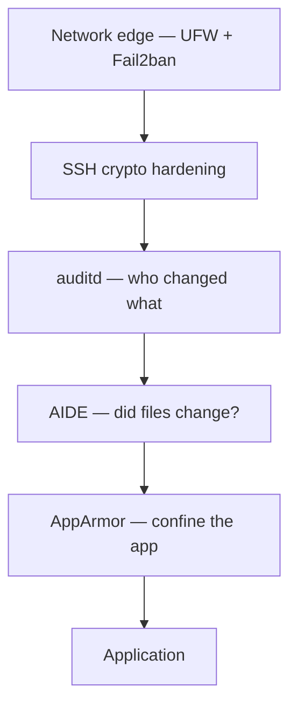

<ChapterMeta />

## TL;DR

- **Defense in depth:** each layer assumes the one before it failed.
- **Harden SSH algorithms** (strong KEX/ciphers/MACs), limit auth attempts, and disable unused features.
- **AIDE** records a baseline of system files and flags any change — your tripwire.
- **auditd** logs *who changed what* for sensitive files like `sudoers` and `sshd_config`.
- **AppArmor** confines apps to what they're allowed to do; start in `complain` mode before `enforce`.

## Prerequisites

| Requirement | Why |
|-------------|-----|
| Key-based SSH | You'll restrict algorithms and auth. |
| Firewall + Fail2ban | Network edge first, then host hardening. |
| `sudo` | All steps are privileged. |

::: danger Keep a session open
Changing SSH crypto or AppArmor profiles can cut access. Keep your current session open and test a **new** one before you close anything.
:::

## Defense in depth



<p class="ahl-diagram-caption"><strong>Figure 19.1</strong> — Layered defenses: even if one is bypassed, the next still constrains the attacker.</p>

## Step 1 — SSH hardening

**Run** `sudo nano /etc/ssh/sshd_config.d/hardening.conf`, then validate with `sshd -t`.

```ini [hardening.conf]
# Use only strong algorithms
KexAlgorithms curve25519-sha256@libssh.org,diffie-hellman-group16-sha512
Ciphers chacha20-poly1305@openssh.com,aes256-gcm@openssh.com
MACs hmac-sha2-512-etm@openssh.com,hmac-sha2-256-etm@openssh.com

# Limit authentication attempts
MaxAuthTries 3
MaxSessions 5

# Disable unused features
AllowAgentForwarding no
PermitTunnel no
GatewayPorts no

# Login grace time (disconnect if not authenticated in 20s)
LoginGraceTime 20
```

```bash [apply-ssh.sh]
sudo sshd -t && sudo systemctl reload sshd   # validate first, then reload
```

## Step 2 — File integrity monitoring (AIDE)

AIDE tracks changes to system files and alerts when something unauthorized changes:

**Run** the block. **Expected:** `aideinit` builds a database, and `aide --check` reports differences.

```bash [aide.sh]
sudo apt install -y aide

# Initialize database (takes ~5 minutes)
sudo aideinit
sudo cp /var/lib/aide/aide.db.new /var/lib/aide/aide.db

# Check for changes
sudo aide --check

# Automate daily check
echo "0 4 * * * root aide --check | mail -s 'AIDE Report' root" | \
  sudo tee -a /etc/cron.d/aide
```

<figure>
  <svg viewBox="0 0 720 200" role="img" aria-label="AIDE workflow: a baseline database is created, then later checks compare current files against it and report differences" width="100%" style="max-width:720px;height:auto;border-radius:10px;border:1px solid var(--vp-c-divider);background:var(--vp-c-bg-soft);padding:1rem;box-sizing:border-box;font-family:Inter,system-ui,sans-serif;">
    <rect x="16" y="50" width="200" height="80" rx="10" fill="var(--vp-c-bg)" stroke="var(--vp-c-brand-1)"></rect>
    <text x="116" y="82" text-anchor="middle" font-size="12.5" font-weight="700" fill="var(--vp-c-brand-1)">Baseline</text>
    <text x="116" y="104" text-anchor="middle" font-size="11" fill="var(--vp-c-text-3)">aideinit → aide.db</text>
    <rect x="260" y="50" width="200" height="80" rx="10" fill="var(--vp-c-bg)" stroke="var(--vp-c-divider)"></rect>
    <text x="360" y="82" text-anchor="middle" font-size="12.5" font-weight="700" fill="var(--vp-c-text-1)">Later check</text>
    <text x="360" y="104" text-anchor="middle" font-size="11" fill="var(--vp-c-text-3)">aide --check</text>
    <rect x="504" y="50" width="200" height="80" rx="10" fill="var(--vp-c-bg)" stroke="var(--vp-c-red-1, #dc2626)"></rect>
    <text x="604" y="82" text-anchor="middle" font-size="12.5" font-weight="700" fill="var(--vp-c-red-1, #dc2626)">Diff report</text>
    <text x="604" y="104" text-anchor="middle" font-size="11" fill="var(--vp-c-text-3)">added / changed / removed</text>
    <line x1="216" y1="90" x2="260" y2="90" stroke="var(--vp-c-text-3)"></line>
    <line x1="460" y1="90" x2="504" y2="90" stroke="var(--vp-c-text-3)"></line>
    <text x="16" y="176" font-size="11.5" fill="var(--vp-c-text-3)">Update the baseline after legitimate changes, or you'll chase false positives forever.</text>
  </svg>
  <figcaption><strong>Figure 19.2</strong> — AIDE compares today's files against a trusted baseline and reports any drift.</figcaption>
</figure>

## Step 3 — Audit log with auditd

**Run** the block. **Expected:** `ausearch` returns entries for your watched keys.

```bash [auditd.sh]
sudo apt install -y auditd

# Monitor sudo usage
sudo auditctl -w /etc/sudoers -p wa -k sudoers_changes

# Monitor SSH config changes
sudo auditctl -w /etc/ssh/sshd_config -p wa -k ssh_config_changes

# View audit logs
sudo ausearch -k sudoers_changes
sudo ausearch -k ssh_config_changes
```

## Step 4 — AppArmor application sandboxing

AppArmor restricts what applications can do. It's already enabled on Ubuntu:

```bash [apparmor.sh]
sudo aa-status           # show AppArmor status
sudo apparmor_status     # detailed status

# Nginx profile (comes pre-installed)
sudo aa-enforce nginx     # enforce strict mode
sudo aa-complain nginx    # log violations but don't block
```

| Layer | Question it answers |
|-------|---------------------|
| SSH hardening | What crypto/auth is even allowed? |
| auditd | Who changed this sensitive file, and when? |
| AIDE | Did any tracked file change at all? |
| AppArmor | What is this app permitted to do? |

## Verification

| Check | Command | Expected |
|-------|---------|----------|
| SSH config valid | `sudo sshd -t` | no output = OK |
| Strong crypto applied | `sudo sshd -T \| grep -E 'ciphers\|macs'` | only modern algorithms |
| AIDE baseline exists | `ls -l /var/lib/aide/aide.db` | the database file |
| Audit rules loaded | `sudo auditctl -l` | your `-k` keys |
| AppArmor active | `sudo aa-status` | profiles loaded/enforced |

```bash [verify.sh]
sudo sshd -t && echo "sshd OK"
sudo sshd -T | grep -Ei "maxauthtries|ciphers"
sudo auditctl -l
sudo aa-status | head -5
```

## Common pitfalls

::: warning Top 3 failure modes
1. **Over-restricting SSH algorithms.** Very old clients can't connect. Test from a second session before logging out.
2. **Stale AIDE baseline.** Every legitimate change (apt upgrades) trips a false positive. Re-baseline after planned changes.
3. **`enforce` AppArmor before `complain`.** A wrong profile can break an app. Run `complain` first, read the logs, then enforce.
:::

## Troubleshooting

| Symptom | Likely cause | Fix |
|---------|--------------|-----|
| Can't reconnect after SSH change | Algorithm too strict / config error | Use the open session; `sudo sshd -t`; revert |
| AIDE floods with changes | Baseline outdated | Re-run `aideinit`, copy to `aide.db` |
| `auditctl` rule gone after reboot | Rules not persistent | Add them to `/etc/audit/rules.d/` |
| App breaks under AppArmor | Profile too strict | `sudo aa-complain <profile>`, review `dmesg` |
| `ausearch: no matches` | No activity yet or wrong key | Trigger the action, or check `auditctl -l` |

## Recap & next

You've layered host hardening on top of the network edge: hardened SSH, a file-integrity tripwire, an audit trail, and app sandboxing. Each assumes the others can fail.

Next: **[Chapter 20 — Automation & Cron Jobs](/chapters/20-automation-cron-jobs)** — schedule all this reliably.

## References

- [OpenSSH](https://www.openssh.com/) — upstream project and release notes.
- [`man sshd_config`](https://manpages.ubuntu.com/manpages/noble/en/man5/sshd_config.5.html) — `KexAlgorithms`, `Ciphers`, `MACs`, and more.
- [AIDE](https://aide.github.io/) — file integrity monitoring.
- [`man aide`](https://manpages.ubuntu.com/manpages/noble/en/man1/aide.1.html) — init and check.
- [`man auditd`](https://manpages.ubuntu.com/manpages/noble/en/man8/auditd.8.html) and [`man auditctl`](https://manpages.ubuntu.com/manpages/noble/en/man8/auditctl.8.html) — the audit subsystem.
- [Ubuntu AppArmor how-to](https://documentation.ubuntu.com/server/how-to/security/apparmor/) — profiles and modes.
- [`man aa-status`](https://manpages.ubuntu.com/manpages/noble/en/man8/aa-status.8.html) — AppArmor status.
