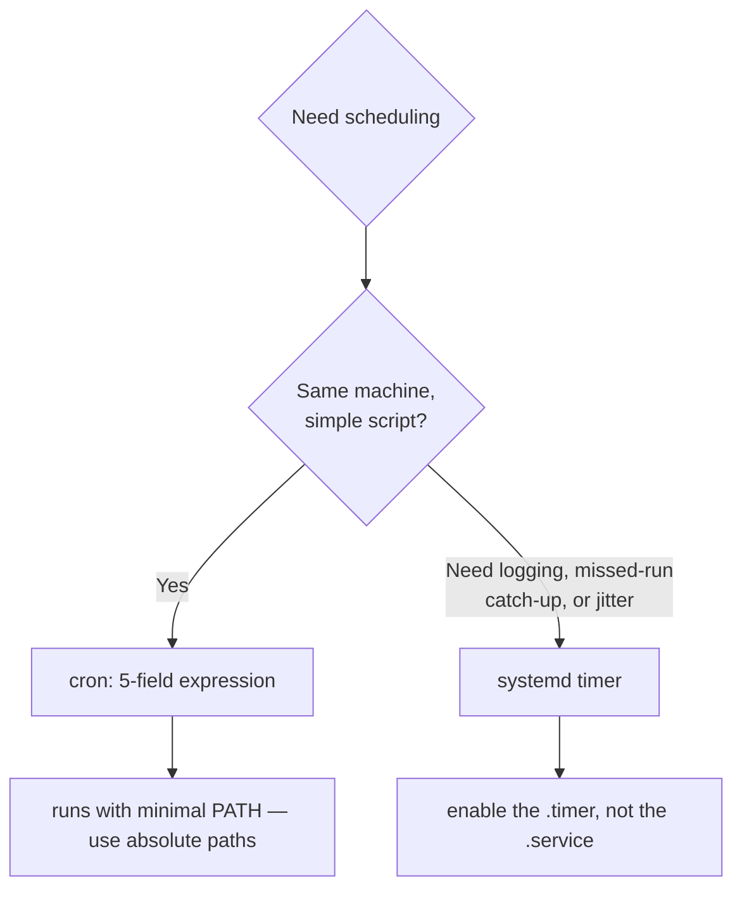

<ChapterMeta />

## TL;DR

- **Cron has five time fields** then a command: minute, hour, day-of-month, month, day-of-week.
- **Cron runs with a minimal PATH** — always use absolute paths in jobs.
- **systemd timers are the modern alternative:** they log to journald, survive missed runs, and can add jitter.
- **Enable the `.timer`, not the `.service`** — the service is triggered by the timer.
- After this chapter your backups, alerts, and updates run themselves.

## Prerequisites

| Requirement | Why |
|-------------|-----|
| Runnable scripts | There's nothing to schedule otherwise. |
| `sudo` | For systemd units. |

## Understanding cron syntax

```
┌─────────── minute (0-59)
│  ┌──────── hour (0-23)
│  │  ┌───── day of month (1-31)
│  │  │  ┌── month (1-12)
│  │  │  │  ┌─ day of week (0-6, Sun=0)
│  │  │  │  │
*  *  *  *  *  command
```

<figure>
  <svg viewBox="0 0 720 200" role="img" aria-label="Cron field breakdown showing five fields minute hour day-of-month month day-of-week followed by a command, with the example 30 2 star star 1" width="100%" style="max-width:720px;height:auto;border-radius:10px;border:1px solid var(--vp-c-divider);background:var(--vp-c-bg-soft);padding:1rem;box-sizing:border-box;font-family:Inter,system-ui,sans-serif;">
    <g font-family="'JetBrains Mono',ui-monospace,monospace" font-size="20" fill="var(--vp-c-text-1)">
      <text x="40" y="70">30</text>
      <text x="130" y="70">2</text>
      <text x="220" y="70">*</text>
      <text x="310" y="70">*</text>
      <text x="400" y="70">1</text>
      <text x="470" y="70" fill="var(--vp-c-brand-1)">command</text>
    </g>
    <g font-size="10.5" fill="var(--vp-c-text-3)" font-family="Inter,system-ui,sans-serif">
      <text x="24" y="94">minute</text>
      <text x="118" y="94">hour</text>
      <text x="196" y="94">day</text>
      <text x="286" y="94">month</text>
      <text x="376" y="94">weekday</text>
    </g>
    <g stroke="var(--vp-c-divider)">
      <line x1="16" y1="112" x2="704" y2="112"></line>
    </g>
    <text x="24" y="140" font-size="12" fill="var(--vp-c-text-2)" font-family="Inter,system-ui,sans-serif">30 2 * * 1  →  at 02:30 every Monday</text>
    <text x="24" y="166" font-size="11.5" fill="var(--vp-c-text-3)" font-family="Inter,system-ui,sans-serif">* = every · */5 = every 5 · 0 = Sunday · ranges like 1-5 = Mon–Fri</text>
  </svg>
  <figcaption><strong>Figure 20.1</strong> — Reading a cron line: five fields, then the command. The example runs Monday at 02:30.</figcaption>
</figure>

## Step 1 — Write cron jobs

**Run** `crontab -e`. **Expected:** `crontab -l` lists your jobs.

```bash [crontab-examples.sh]
# Edit your cron jobs
crontab -e

# Examples:
0 3 * * *     ~/scripts/backup.sh           # Daily at 3 AM
0 * * * *     ~/scripts/disk_alert.sh       # Every hour
*/5 * * * *   ~/scripts/health_check.sh     # Every 5 minutes
0 0 * * 0     docker system prune -f        # Weekly Sunday midnight cleanup
30 2 * * 1    sudo apt update && sudo apt upgrade -y   # Weekly Monday updates
```

```bash [inspect-cron.sh]
# View current cron jobs
crontab -l

# System-wide cron jobs
ls /etc/cron.d/
ls /etc/cron.daily/
ls /etc/cron.weekly/
```

| Expression | When |
|------------|------|
| `0 3 * * *` | Daily at 03:00 |
| `0 * * * *` | Every hour |
| `*/5 * * * *` | Every 5 minutes |
| `0 0 * * 0` | Sundays at midnight |
| `30 2 * * 1` | Mondays at 02:30 |

## Step 2 — Systemd timers (better than cron)

Systemd timers are more reliable than cron — they log to journald and can handle system wakeup:

**Run** to create both units. **Expected:** `systemctl list-timers` shows `backup.timer`.

```bash [backup-service.sh]
sudo nano /etc/systemd/system/backup.service
```

```ini [backup.service]
[Unit]
Description=Daily Backup
After=network.target

[Service]
Type=oneshot
User=ahmed
ExecStart=/home/ahmed/scripts/backup.sh
```

```bash [backup-timer.sh]
sudo nano /etc/systemd/system/backup.timer
```

```ini [backup.timer]
[Unit]
Description=Daily Backup Timer

[Timer]
OnCalendar=daily
Persistent=true    # run if missed (e.g., server was off)
RandomizedDelaySec=30m   # add random delay to avoid all timers running at once

[Install]
WantedBy=timers.target
```

```bash [enable-timer.sh]
sudo systemctl enable backup.timer
sudo systemctl start backup.timer
sudo systemctl list-timers    # show all active timers
```



<p class="ahl-diagram-caption"><strong>Figure 20.2</strong> — Choosing a scheduler: cron for simple jobs, systemd timers when you need robustness.</p>

| | cron | systemd timer |
|--|------|---------------|
| Logging | Email only | journald |
| Missed run catch-up | No | `Persistent=true` |
| Random jitter | Manual | `RandomizedDelaySec` |
| Dependencies | None | Full systemd ordering |

## Verification

| Check | Command | Expected |
|-------|---------|----------|
| Cron jobs listed | `crontab -l` | your entries |
| Timer active | `systemctl list-timers` | `backup.timer` with next run |
| Timer status | `systemctl status backup.timer` | `active (waiting)` |
| Service runs on demand | `sudo systemctl start backup.service` | completes; `backup.sh` ran |

```bash [verify.sh]
crontab -l
systemctl list-timers | grep backup
sudo systemctl start backup.service && systemctl status backup.service --no-pager | head -5
```

## Common pitfalls

::: warning Top 3 failure modes
1. **Relying on cron's PATH.** It's minimal — `~/scripts/backup.sh` may not resolve. Use absolute paths (`/home/ahmed/scripts/backup.sh`).
2. **Unescaped `%` in crontab.** Cron treats `%` as a newline; escape it as `\%`.
3. **Enabling the `.service` instead of the `.timer`.** The service is a one-shot; the timer is what schedules it.
:::

## Troubleshooting

| Symptom | Likely cause | Fix |
|---------|--------------|-----|
| Job never runs | PATH or permission | Absolute paths; `chmod +x` the script |
| Job runs but does nothing | Command error | Capture output: `>> /tmp/job.log 2>&1` |
| Timer not firing | `.service` enabled, not `.timer` | `systemctl enable --now backup.timer` |
| `OnCalendar` invalid | Syntax error | `systemd-analyze calendar "daily"` to test |
| Duplicate runs | Both cron and timer scheduled | Keep one source of truth |

## Recap & next

You can schedule work two ways — simple cron lines or robust systemd timers — and you know which to reach for. Your backups, alerts, and updates now run unattended.

Next: **[Chapter 21 — Tmux Terminal Multiplexer](/chapters/21-tmux-terminal-multiplexer)** — keep long jobs alive across disconnects.

## References

- [`man cron(8)`](https://manpages.ubuntu.com/manpages/noble/en/man8/cron.8.html) — the cron daemon.
- [`man crontab(5)`](https://manpages.ubuntu.com/manpages/noble/en/man5/crontab.5.html) — the five-field syntax.
- [crontab.guru](https://crontab.guru/) — interactive expression tester.
- [`man systemd.timer`](https://manpages.ubuntu.com/manpages/noble/en/man5/systemd.timer.5.html) — timers, `Persistent`, `RandomizedDelaySec`.
- [`man systemd.time`](https://manpages.ubuntu.com/manpages/noble/en/man7/systemd.time.7.html) — `OnCalendar` time/date syntax.
- [`man systemd.service`](https://manpages.ubuntu.com/manpages/noble/en/man5/systemd.service.5.html) — the unit the timer triggers.
