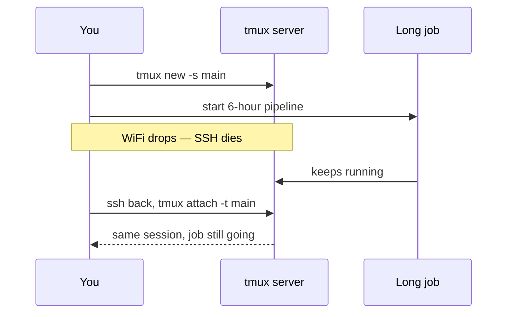

<ChapterMeta />

## TL;DR

- **When SSH drops, processes started in a plain shell die.** tmux keeps them alive on the server.
- **One server, many sessions; a session has windows; a window has panes.**
- **Detach with `Ctrl+B, D`; reattach with `tmux attach`.**
- **Run every long job inside tmux** — data pipelines, builds, migrations.
- A small `~/.tmux.conf` (mouse on, `Ctrl+A` prefix) makes it pleasant.

## Prerequisites

| Requirement | Why |
|-------------|-----|
| A shell | tmux runs there. |
| Long jobs | The thing tmux protects. |

## Why tmux?

When your SSH connection drops, every terminal process you had running dies. If you were running a 6-hour data cleaning job, it's gone.

Tmux runs a persistent terminal server on your server. Your sessions survive disconnects. You can detach and reattach from any device.

```bash [tmux-basics.sh]
sudo apt install -y tmux

# Create a new session
tmux new -s main

# Detach (session keeps running)
Ctrl+B, D

# List sessions
tmux ls

# Reattach
tmux attach -t main
# or just
tmux a     # attach to most recent
```

<figure>
  <svg viewBox="0 0 720 220" role="img" aria-label="tmux hierarchy: one session containing windows, and a window split into panes" width="100%" style="max-width:720px;height:auto;border-radius:10px;border:1px solid var(--vp-c-divider);background:var(--vp-c-bg-soft);padding:1rem;box-sizing:border-box;font-family:Inter,system-ui,sans-serif;">
    <rect x="16" y="40" width="688" height="150" rx="10" fill="var(--vp-c-bg)" stroke="var(--vp-c-brand-1)"></rect>
    <text x="32" y="64" font-size="12.5" font-weight="700" fill="var(--vp-c-brand-1)">Session: main</text>
    <rect x="32" y="78" width="320" height="96" rx="8" fill="var(--vp-c-bg-alt)" stroke="var(--vp-c-divider)"></rect>
    <text x="48" y="102" font-size="12" fill="var(--vp-c-text-1)">Window 1 — shell</text>
    <rect x="368" y="78" width="320" height="96" rx="8" fill="var(--vp-c-bg-alt)" stroke="var(--vp-c-divider)"></rect>
    <text x="384" y="102" font-size="12" fill="var(--vp-c-text-1)">Window 2 — split</text>
    <rect x="384" y="114" width="140" height="48" rx="6" fill="var(--vp-c-brand-soft)" stroke="var(--vp-c-brand-1)"></rect>
    <text x="454" y="142" text-anchor="middle" font-size="11" fill="var(--vp-c-text-2)">pane 1</text>
    <rect x="532" y="114" width="140" height="48" rx="6" fill="var(--vp-c-brand-soft)" stroke="var(--vp-c-brand-1)"></rect>
    <text x="602" y="142" text-anchor="middle" font-size="11" fill="var(--vp-c-text-2)">pane 2</text>
    <text x="16" y="212" font-size="11.5" fill="var(--vp-c-text-3)">Detach the whole session and it all keeps running server-side.</text>
  </svg>
  <figcaption><strong>Figure 21.1</strong> — tmux's structure: a session holds windows; a window can be split into panes.</figcaption>
</figure>



<p class="ahl-diagram-caption"><strong>Figure 21.2</strong> — Why it matters: the SSH link can die, but the tmux server and your job don't.</p>

## Tmux cheatsheet

All tmux commands start with the **prefix**: `Ctrl+B`

```
# Sessions
Ctrl+B, D           Detach from session
Ctrl+B, $           Rename session
Ctrl+B, (           Switch to previous session
Ctrl+B, )           Switch to next session
Ctrl+B, s           List all sessions (interactive)

# Windows (like browser tabs)
Ctrl+B, c           Create new window
Ctrl+B, ,           Rename current window
Ctrl+B, n           Next window
Ctrl+B, p           Previous window
Ctrl+B, 0-9         Switch to window by number
Ctrl+B, w           List all windows

# Panes (split screen)
Ctrl+B, %           Split vertically (side by side)
Ctrl+B, "           Split horizontally (top/bottom)
Ctrl+B, Arrow       Move to pane
Ctrl+B, z           Zoom/unzoom current pane (fullscreen)
Ctrl+B, x           Close current pane
Ctrl+B, {           Move pane left
Ctrl+B, }           Move pane right

# Scrolling
Ctrl+B, [           Enter copy/scroll mode
Arrow keys / PgUp   Scroll
q                   Exit scroll mode
```

| Group | Common keys |
|-------|-------------|
| Sessions | `D` detach · `$` rename · `s` list |
| Windows | `c` create · `n`/`p` next/prev · `0-9` jump |
| Panes | `%` split V · `"` split H · `z` zoom · `x` close |
| Scrolling | `[` enter · `q` exit |

## Custom tmux config

**Run** to create `~/.tmux.conf`. **Expected:** after sourcing, the prefix is `Ctrl+A` and mouse works.

```bash [tmux-config.sh]
nano ~/.tmux.conf
```

```bash [.tmux.conf]
# Change prefix to Ctrl+A (easier to reach)
set -g prefix C-a
unbind C-b
bind C-a send-prefix

# Enable mouse support (click to switch panes, scroll)
set -g mouse on

# Start windows and panes at 1, not 0
set -g base-index 1
setw -g pane-base-index 1

# Status bar
set -g status-style bg=colour234,fg=colour255
set -g status-left '#[fg=colour82][#S] '
set -g status-right '#[fg=colour82]%H:%M #[fg=colour255]%Y-%m-%d'

# Increase history
set -g history-limit 50000
```

Apply: `tmux source ~/.tmux.conf`

## Verification

| Check | Command | Expected |
|-------|---------|----------|
| tmux installed | `tmux -V` | `tmux 3.x` |
| Session survives detach | create → detach → `tmux ls` | session still listed |
| Reattach works | `tmux attach -t main` | back in the same session |
| Config applied | `tmux show -g prefix` | `C-a` (if customized) |

```bash [verify.sh]
tmux -V
tmux new -d -s test && tmux ls
tmux kill-session -t test
tmux source ~/.tmux.conf && echo "config loaded"
```

## Common pitfalls

::: warning Top 3 failure modes
1. **Running long jobs outside tmux.** A dropped SSH kills them. Start with `tmux new -s <name>` first.
2. **Killing instead of detaching.** `Ctrl+B, D` keeps the session; exiting the shell ends it.
3. **Confusing the prefix.** After customizing to `Ctrl+A`, `Ctrl+B` no longer works — use the new prefix.
:::

## Troubleshooting

| Symptom | Likely cause | Fix |
|---------|--------------|-----|
| `sessions should be nested with care` | Already inside tmux | Detach first, or use `tmux new -s` from outside |
| `no server running` | No sessions exist | `tmux new -s main` |
| Job died with the session | Ran outside tmux | Always start inside a tmux session |
| Prefix doesn't work | Config not sourced | `tmux source ~/.tmux.conf` |
| Scroll not working | Mouse off / not in copy mode | `set -g mouse on`; or `Ctrl+B, [` |

## Recap & next

You can protect any long-running work with tmux: create a session, detach, reconnect from anywhere, and split panes to monitor several things at once.

Next: **[Chapter 22 — Git Workflow on the Server](/chapters/22-git-workflow-on-the-server)** — push-to-deploy.

## References

- [tmux wiki](https://github.com/tmux/tmux/wiki) — upstream guides.
- [`man tmux`](https://manpages.ubuntu.com/manpages/noble/en/man1/tmux.1.html) — every command and option.
- [tmux cheatsheet](https://tmuxcheatsheet.com/) — quick key reference.
