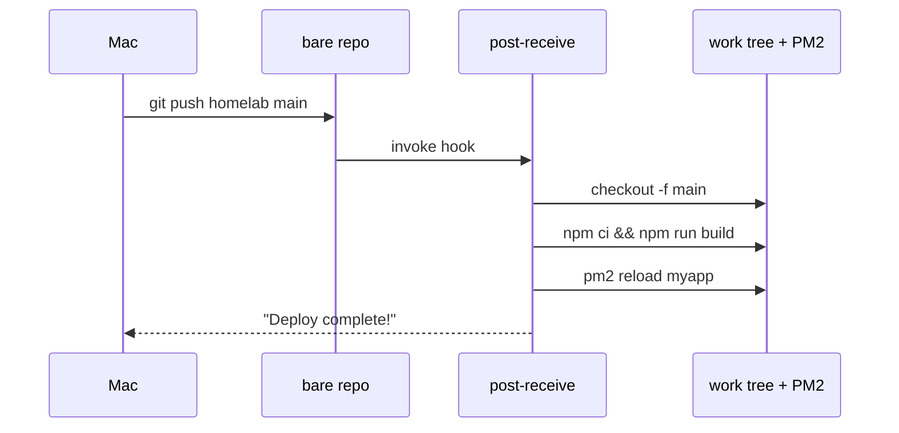

<ChapterMeta />

## TL;DR

- **Generate a dedicated SSH key** for the server and add it to GitHub — don't reuse your laptop's key.
- **Create a bare repo on the server** as the deploy target (`git init --bare`).
- **A `post-receive` hook** checks out the code, installs deps, builds, and reloads PM2.
- **Then `git push homelab main` deploys** — no manual SSH-and-pull.
- **Keep secrets out of the hook** — read them from the app's `.env`.

## Prerequisites

| Requirement | Why |
|-------------|-----|
| App under PM2 | The hook reloads it. |
| SSH key auth | For pushing to the server. |
| GitHub account | To host the repo. |

## Step 1 — SSH key for GitHub

Generate a dedicated key for your server:

```bash [server-key.sh]
ssh-keygen -t ed25519 -C "homelab-server-$(date +%Y)" -f ~/.ssh/github_homelab
```

Add to `~/.ssh/config`:

```text [~/.ssh/config]
Host github.com
    HostName github.com
    User git
    IdentityFile ~/.ssh/github_homelab
```

Add the public key to GitHub:

```bash [show-pubkey.sh]
cat ~/.ssh/github_homelab.pub
# Copy output → GitHub.com → Settings → SSH Keys → New SSH Key
```

Test:

```bash [test-github.sh]
ssh -T git@github.com
# Hi username! You've successfully authenticated
```

## Step 2 — Push-to-deploy with a bare repo + hook

Git hooks run scripts automatically on git events. Use `post-receive` for auto-deploy:

```bash [create-bare.sh]
# On server — create a bare repository
mkdir -p /srv/git/myapp.git
cd /srv/git/myapp.git
git init --bare

# Create post-receive hook
nano hooks/post-receive
```

```bash [hooks/post-receive]
#!/bin/bash
GIT_WORK_TREE=/srv/apps/myapp
GIT_DIR=/srv/git/myapp.git

echo "Deploying to $GIT_WORK_TREE..."
git --work-tree="$GIT_WORK_TREE" --git-dir="$GIT_DIR" checkout -f main

cd $GIT_WORK_TREE
npm ci --only=production
npm run build
pm2 reload myapp

echo "Deploy complete!"
```

```bash [chmod-hook.sh]
chmod +x hooks/post-receive
```

<figure>
  <svg viewBox="0 0 720 210" role="img" aria-label="Deploy topology: the Mac pushes to a bare repository on the server, whose post-receive hook checks out into the app work tree and reloads PM2" width="100%" style="max-width:720px;height:auto;border-radius:10px;border:1px solid var(--vp-c-divider);background:var(--vp-c-bg-soft);padding:1rem;box-sizing:border-box;font-family:Inter,system-ui,sans-serif;">
    <rect x="16" y="60" width="170" height="80" rx="10" fill="var(--vp-c-bg)" stroke="var(--vp-c-divider)"></rect>
    <text x="101" y="90" text-anchor="middle" font-size="12.5" font-weight="700" fill="var(--vp-c-text-1)">Mac (git)</text>
    <text x="101" y="112" text-anchor="middle" font-size="11" fill="var(--vp-c-text-3)">git push homelab main</text>
    <rect x="250" y="60" width="200" height="80" rx="10" fill="var(--vp-c-bg)" stroke="var(--vp-c-brand-1)"></rect>
    <text x="350" y="90" text-anchor="middle" font-size="12.5" font-weight="700" fill="var(--vp-c-brand-1)">bare repo</text>
    <text x="350" y="112" text-anchor="middle" font-size="11" fill="var(--vp-c-text-3)">/srv/git/myapp.git</text>
    <rect x="514" y="60" width="190" height="80" rx="10" fill="var(--vp-c-bg)" stroke="var(--vp-c-brand-1)"></rect>
    <text x="609" y="90" text-anchor="middle" font-size="12.5" font-weight="700" fill="var(--vp-c-brand-1)">work tree + PM2</text>
    <text x="609" y="112" text-anchor="middle" font-size="11" fill="var(--vp-c-text-3)">/srv/apps/myapp</text>
    <line x1="186" y1="100" x2="250" y2="100" stroke="var(--vp-c-text-3)"></line>
    <line x1="450" y1="100" x2="514" y2="100" stroke="var(--vp-c-brand-1)" stroke-width="2"></line>
    <text x="482" y="92" text-anchor="middle" font-size="10.5" fill="var(--vp-c-brand-1)">hook</text>
    <text x="16" y="186" font-size="11.5" fill="var(--vp-c-text-3)">The bare repo holds history only; the hook materializes it into the running app and reloads it.</text>
  </svg>
  <figcaption><strong>Figure 22.1</strong> — Push-to-deploy topology: push lands in the bare repo, the hook deploys to the work tree and reloads PM2.</figcaption>
</figure>

On your **Mac**, add the server as a git remote:

```bash [add-remote.sh]
git remote add homelab ahmed@homelab:/srv/git/myapp.git
git push homelab main
# This triggers the hook and deploys automatically!
```



<p class="ahl-diagram-caption"><strong>Figure 22.2</strong> — One `git push` runs the whole deploy: checkout, install, build, reload.</p>

## Verification

| Check | Command | Expected |
|-------|---------|----------|
| GitHub key works | `ssh -T git@github.com` | "successfully authenticated" |
| Remote configured (Mac) | `git remote -v` | `homelab` pointing at the bare repo |
| Push triggers deploy | `git push homelab main` | hook prints "Deploy complete!" |
| App reloaded | `pm2 list` | `myapp` online, recent restart |

```bash [verify.sh]
ssh -T git@github.com
# On the Mac:
git remote -v | grep homelab
# On the server, after a push:
pm2 list | grep myapp
```

## Common pitfalls

::: warning Top 3 failure modes
1. **Deploying into a non-bare repo.** You'll get "refusing to update checked out branch". The target must be a **bare** repo; the work tree is separate.
2. **Hook not executable.** `git push` succeeds but nothing deploys. `chmod +x hooks/post-receive`.
3. **Branch mismatch.** The hook checks out `main`; if you push `master`, nothing updates. Match the branch name.
:::

## Troubleshooting

| Symptom | Likely cause | Fix |
|---------|--------------|-----|
| `refusing to update checked out branch` | Target isn't bare | Use `git init --bare` for the deploy repo |
| Push works, no deploy | Hook not executable / wrong name | `chmod +x hooks/post-receive`; confirm path |
| `Host key verification failed` | Server key not accepted | Add the server's key / known_hosts |
| Build fails in hook | No PATH / missing deps | Source NVM in the hook; run `npm ci` |
| App not reloaded | Wrong PM2 name | Match `pm2 reload` to the process name |

## Recap & next

You now have a real push-to-deploy pipeline: a dedicated server key, a bare repo, and a hook that checks out, builds, and reloads PM2 — all triggered by `git push`.

Next: **[Chapter 23 — Environment Variables & Secrets Management](/chapters/23-environment-variables-secrets-management)** — keep credentials out of that pipeline.

## References

- [GitHub: connecting with SSH](https://docs.github.com/en/authentication/connecting-to-github-with-ssh) — generating and adding keys.
- [Adding a new SSH key to GitHub](https://docs.github.com/en/authentication/connecting-to-github-with-ssh/adding-a-new-ssh-key-to-your-github-account) — step-by-step.
- [Git hooks (Pro Git book)](https://git-scm.com/book/en/v2/Customizing-Git-Git-Hooks) — `post-receive` and others.
- [`git hooks` reference](https://git-scm.com/docs/githooks) — every hook and its arguments.
- [`man git`](https://manpages.ubuntu.com/manpages/noble/en/man1/git.1.html) — `--work-tree`, `--git-dir`.
