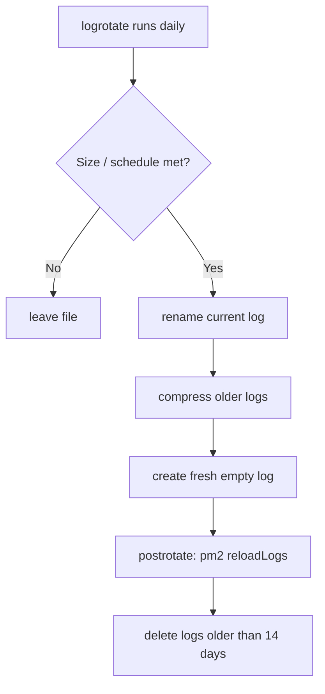

<ChapterMeta />

## TL;DR

- **Know where logs live:** `/var/log/syslog`, `auth.log`, `ufw.log`, `nginx/`, `apt/`.
- **`tail -f` to watch live, `grep` to search** — the two commands you'll use daily.
- **`logrotate` keeps logs from filling the disk** — rotate, compress, and prune.
- **Apps must reopen log files after rotation** (PM2: `pm2 reloadLogs`), or they keep writing to the old handle.
- **Bound the systemd journal too** — it also consumes `/var`.

## Prerequisites

| Requirement | Why |
|-------------|-----|
| Running services | Logs to read and rotate. |
| PM2 app | For the app-log rotation example. |

## Understanding log files

```bash [log-locations.sh]
# Important log locations
/var/log/syslog          # General system log
/var/log/auth.log        # Authentication, SSH logins
/var/log/ufw.log         # Firewall (UFW) events
/var/log/nginx/          # Nginx access + error logs
/var/log/apt/            # Package installation history

# View logs in real time
tail -f /var/log/syslog
tail -f /var/log/auth.log    # Watch for SSH attempts
tail -f /var/log/nginx/error.log

# Search logs
grep "Failed password" /var/log/auth.log
grep "DENY" /var/log/ufw.log | tail -20
```

<figure>
  <svg viewBox="0 0 720 220" role="img" aria-label="Map of the /var/log directory showing syslog, auth.log, ufw.log, nginx and apt subdirectories" width="100%" style="max-width:720px;height:auto;border-radius:10px;border:1px solid var(--vp-c-divider);background:var(--vp-c-bg-soft);padding:1rem;box-sizing:border-box;font-family:Inter,system-ui,sans-serif;">
    <rect x="16" y="30" width="200" height="44" rx="8" fill="var(--vp-c-bg)" stroke="var(--vp-c-brand-1)"></rect>
    <text x="116" y="58" text-anchor="middle" font-size="13" font-weight="700" fill="var(--vp-c-brand-1)">/var/log</text>
    <g font-size="12" fill="var(--vp-c-text-2)" font-family="'JetBrains Mono',monospace">
      <rect x="260" y="20" width="440" height="34" rx="8" fill="var(--vp-c-bg)" stroke="var(--vp-c-divider)"></rect>
      <text x="276" y="42">syslog</text>
      <text x="420" y="42" font-size="11" fill="var(--vp-c-text-3)" font-family="Inter,sans-serif">general system events</text>
      <rect x="260" y="62" width="440" height="34" rx="8" fill="var(--vp-c-bg)" stroke="var(--vp-c-divider)"></rect>
      <text x="276" y="84">auth.log</text>
      <text x="420" y="84" font-size="11" fill="var(--vp-c-text-3)" font-family="Inter,sans-serif">logins, sudo, SSH</text>
      <rect x="260" y="104" width="440" height="34" rx="8" fill="var(--vp-c-bg)" stroke="var(--vp-c-divider)"></rect>
      <text x="276" y="126">ufw.log</text>
      <text x="420" y="126" font-size="11" fill="var(--vp-c-text-3)" font-family="Inter,sans-serif">firewall allow/deny</text>
      <rect x="260" y="146" width="440" height="34" rx="8" fill="var(--vp-c-bg)" stroke="var(--vp-c-divider)"></rect>
      <text x="276" y="168">nginx/</text>
      <text x="420" y="168" font-size="11" fill="var(--vp-c-text-3)" font-family="Inter,sans-serif">access.log, error.log</text>
      <rect x="260" y="188" width="440" height="34" rx="8" fill="var(--vp-c-bg)" stroke="var(--vp-c-divider)"></rect>
      <text x="276" y="210">apt/</text>
      <text x="420" y="210" font-size="11" fill="var(--vp-c-text-3)" font-family="Inter,sans-serif">package history</text>
    </g>
  </svg>
  <figcaption><strong>Figure 24.1</strong> — The `/var/log` map: each file answers a different question (system, auth, firewall, web, packages).</figcaption>
</figure>

| File | Answers |
|------|---------|
| `/var/log/syslog` | What did the system just do? |
| `/var/log/auth.log` | Who logged in / failed to? |
| `/var/log/ufw.log` | What did the firewall block? |
| `/var/log/nginx/` | Web requests and errors |
| `/var/log/apt/` | What was installed, when? |

## Logrotate — prevent logs from filling the disk

`logrotate` is already installed and configured for most system logs. Check your app's logs:

**Run** `sudo nano /etc/logrotate.d/myapp`. **Expected:** `logrotate -d` reports no errors.

```bash [logrotate-config.sh]
sudo nano /etc/logrotate.d/myapp
```

```text [/etc/logrotate.d/myapp]
/var/log/myapp/*.log {
    daily
    rotate 14          # keep 14 days
    compress           # gzip old logs
    delaycompress      # don't compress the most recent
    missingok          # don't error if log doesn't exist
    notifempty         # skip rotation if log is empty
    create 0644 ahmed ahmed   # create new log with these permissions
    postrotate
        pm2 reloadLogs   # tell PM2 to reopen log files after rotation
    endscript
}
```



<p class="ahl-diagram-caption"><strong>Figure 24.2</strong> — The rotation cycle: rename, compress, recreate, tell the app to reopen, prune.</p>

::: warning Apps must reopen their log files
After rotation the app's file handle points at the renamed (old) file, so new writes vanish. `postrotate` + `pm2 reloadLogs` makes PM2 reopen the freshly created files.
:::

## Verification

| Check | Command | Expected |
|-------|---------|----------|
| Logs exist | `ls -l /var/log/` | syslog, auth.log, … |
| Config is valid | `sudo logrotate -d /etc/logrotate.d/myapp` | debug output, no errors |
| Force a rotation | `sudo logrotate -f /etc/logrotate.d/myapp` | rotated/compressed files appear |
| Journal bounded | `journalctl --disk-usage` | a sane size |

```bash [verify.sh]
ls -l /var/log/ | head
sudo logrotate -d /etc/logrotate.d/myapp
journalctl --disk-usage
```

## Common pitfalls

::: warning Top 3 failure modes
1. **No rotation on app logs.** An unbounded log file eventually fills `/var`. Add a logrotate config.
2. **Forgetting `postrotate`.** The app keeps writing to the rotated file and new logs disappear. Reload the app's log handles.
3. **Ignoring the journal.** `journalctl` data also fills `/var`. Cap it (`--vacuum-size`).
:::

## Troubleshooting

| Symptom | Likely cause | Fix |
|---------|--------------|-----|
| Log file huge, no `.1` files | Rotation not configured/scheduled | Add `/etc/logrotate.d/<app>` |
| New app logs missing after rotate | App didn't reopen files | Add `postrotate` with `pm2 reloadLogs` |
| `logrotate: bad config` | Syntax error | `sudo logrotate -d <file>` to debug |
| Disk still filling | Journal or Docker logs | `journalctl --vacuum-size`; cap Docker logs (Chapter 10) |
| `auth.log` missing | Not on rsyslog (journald-only) | Use `journalctl -u ssh` instead |

## Recap & next

You know where every important log lives, how to watch and search it, and how to rotate app logs so they never fill the disk — with the `postrotate` step that makes rotation actually stick.

Next: **[Chapter 25 — Performance Tuning](/chapters/25-performance-tuning)** — squeeze the most out of the hardware.

## References

- [`man logrotate`](https://manpages.ubuntu.com/manpages/noble/en/man8/logrotate.8.html) — rotation mechanics.
- [`man logrotate.conf`](https://manpages.ubuntu.com/manpages/noble/en/man5/logrotate.conf.5.html) — directives like `rotate`, `compress`, `postrotate`.
- [`man tail`](https://manpages.ubuntu.com/manpages/noble/en/man1/tail.1.html) — `-f` follow mode.
- [`man grep`](https://manpages.ubuntu.com/manpages/noble/en/man1/grep.1.html) — searching logs.
- [`man journalctl`](https://manpages.ubuntu.com/manpages/noble/en/man1/journalctl.1.html) — the systemd journal.
