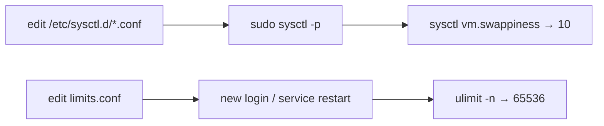

<ChapterMeta />

## TL;DR

- **Tune four areas:** file descriptors, network buffers, swap behaviour, and disk write-back.
- **`fs.file-max` and `nofile` raise the ceiling** on open files/connections.
- **`vm.swappiness = 10`** prefers RAM but keeps swap as a safety valve for AI spikes.
- **Put settings in `/etc/sysctl.d/*.conf`** so they survive reboots.
- **`limits.conf` covers interactive sessions; systemd services need their own `LimitNOFILE`.**

## Prerequisites

| Requirement | Why |
|-------------|-----|
| Services running | Tuning targets their behaviour. |
| `sudo` | Kernel params are privileged. |

## Kernel parameters for a server

**Run** `sudo nano /etc/sysctl.d/99-server-tuning.conf`, then apply. **Expected:** `sysctl -p` echoes each setting.

```bash [create-tuning.sh]
sudo nano /etc/sysctl.d/99-server-tuning.conf
```

```ini [99-server-tuning.conf]
# Increase file descriptor limits (needed for many connections)
fs.file-max = 2097152

# Network performance
net.core.somaxconn = 65535
net.core.netdev_max_backlog = 5000
net.ipv4.tcp_max_syn_backlog = 65535

# TCP keepalive (detect dead connections faster)
net.ipv4.tcp_keepalive_time = 600
net.ipv4.tcp_keepalive_intvl = 60
net.ipv4.tcp_keepalive_probes = 10

# Swap behavior (0=avoid swap, 100=use swap aggressively)
# For a server with AI workloads, prefer RAM but allow swap
vm.swappiness = 10

# Improve I/O throughput for NVMe
vm.dirty_ratio = 15
vm.dirty_background_ratio = 5
```

Apply:

```bash [apply-sysctl.sh]
sudo sysctl -p /etc/sysctl.d/99-server-tuning.conf
```

<figure>
  <svg viewBox="0 0 720 210" role="img" aria-label="Four tuning areas: file descriptors, network, swap and disk write-back" width="100%" style="max-width:720px;height:auto;border-radius:10px;border:1px solid var(--vp-c-divider);background:var(--vp-c-bg-soft);padding:1rem;box-sizing:border-box;font-family:Inter,system-ui,sans-serif;">
    <rect x="16" y="40" width="160" height="120" rx="10" fill="var(--vp-c-bg)" stroke="var(--vp-c-brand-1)"></rect>
    <text x="96" y="70" text-anchor="middle" font-size="12" font-weight="700" fill="var(--vp-c-brand-1)">File descriptors</text>
    <text x="96" y="96" text-anchor="middle" font-size="10.5" fill="var(--vp-c-text-3)" font-family="'JetBrains Mono',monospace">fs.file-max</text>
    <text x="96" y="118" text-anchor="middle" font-size="10.5" fill="var(--vp-c-text-3)" font-family="'JetBrains Mono',monospace">nofile</text>
    <text x="96" y="142" text-anchor="middle" font-size="10.5" fill="var(--vp-c-text-3)">more connections</text>
    <rect x="188" y="40" width="160" height="120" rx="10" fill="var(--vp-c-bg)" stroke="var(--vp-c-brand-1)"></rect>
    <text x="268" y="70" text-anchor="middle" font-size="12" font-weight="700" fill="var(--vp-c-brand-1)">Network</text>
    <text x="268" y="96" text-anchor="middle" font-size="10.5" fill="var(--vp-c-text-3)" font-family="'JetBrains Mono',monospace">somaxconn</text>
    <text x="268" y="118" text-anchor="middle" font-size="10.5" fill="var(--vp-c-text-3)" font-family="'JetBrains Mono',monospace">tcp_keepalive_*</text>
    <text x="268" y="142" text-anchor="middle" font-size="10.5" fill="var(--vp-c-text-3)">accept more, drop dead</text>
    <rect x="360" y="40" width="160" height="120" rx="10" fill="var(--vp-c-bg)" stroke="var(--vp-c-brand-1)"></rect>
    <text x="440" y="70" text-anchor="middle" font-size="12" font-weight="700" fill="var(--vp-c-brand-1)">Swap</text>
    <text x="440" y="96" text-anchor="middle" font-size="10.5" fill="var(--vp-c-text-3)" font-family="'JetBrains Mono',monospace">vm.swappiness</text>
    <text x="440" y="142" text-anchor="middle" font-size="10.5" fill="var(--vp-c-text-3)">prefer RAM, keep safety</text>
    <rect x="532" y="40" width="172" height="120" rx="10" fill="var(--vp-c-bg)" stroke="var(--vp-c-brand-1)"></rect>
    <text x="618" y="70" text-anchor="middle" font-size="12" font-weight="700" fill="var(--vp-c-brand-1)">Disk write-back</text>
    <text x="618" y="96" text-anchor="middle" font-size="10.5" fill="var(--vp-c-text-3)" font-family="'JetBrains Mono',monospace">dirty_ratio</text>
    <text x="618" y="142" text-anchor="middle" font-size="10.5" fill="var(--vp-c-text-3)">smoother NVMe I/O</text>
    <text x="16" y="190" font-size="11.5" fill="var(--vp-c-text-3)">Change these deliberately and measure the effect — don't cargo-cult values.</text>
  </svg>
  <figcaption><strong>Figure 25.1</strong> — The four tuning areas and the parameters that control them.</figcaption>
</figure>

| Parameter | Effect |
|-----------|--------|
| `fs.file-max` | System-wide open-file ceiling |
| `net.core.somaxconn` | Max pending connections per listener |
| `net.ipv4.tcp_keepalive_*` | How fast dead TCP connections are reaped |
| `vm.swappiness` | How eagerly the kernel swaps |
| `vm.dirty_ratio` | When dirty pages are flushed to disk |

## Step 1 — Increase file descriptor limits

**Run** `sudo nano /etc/security/limits.conf` and add the lines. **Expected:** `ulimit -n` reports `65536` in a new session.

```bash [limits-conf.sh]
sudo nano /etc/security/limits.conf
```

```text [/etc/security/limits.conf]
ahmed soft nofile 65536
ahmed hard nofile 65536
* soft nofile 65536
* hard nofile 65536
```



<p class="ahl-diagram-caption"><strong>Figure 25.2</strong> — Apply flow: sysctl takes effect immediately; `limits.conf` applies to new sessions/services.</p>

::: warning systemd services don't read `limits.conf`
`limits.conf` is applied by PAM for interactive logins. A service started by systemd needs its own limit, e.g. in the unit:
```
[Service]
LimitNOFILE=65536
```
:::

## Verification

| Check | Command | Expected |
|-------|---------|----------|
| Settings applied | `sysctl vm.swappiness` | `vm.swappiness = 10` |
| File ceiling | `cat /proc/sys/fs/file-max` | `2097152` |
| FD limit in shell | `ulimit -n` | `65536` |
| Persisted | reboot, re-check | values survive |
| No syntax errors | `sysctl -p` | prints values, no errors |

```bash [verify.sh]
sysctl vm.swappiness
cat /proc/sys/fs/file-max
ulimit -n
sudo sysctl -p /etc/sysctl.d/99-server-tuning.conf >/dev/null && echo "sysctl OK"
```

## Common pitfalls

::: warning Top 3 failure modes
1. **Cargo-culting values.** Every value trades something off. Change one at a time and measure.
2. **Expecting `limits.conf` to affect services.** systemd units need `LimitNOFILE` (or a drop-in).
3. **Editing the wrong file.** Put tuning in `/etc/sysctl.d/*.conf`, not a one-off `sysctl -w` (which vanishes on reboot).
:::

## Troubleshooting

| Symptom | Likely cause | Fix |
|---------|--------------|-----|
| Setting reverts after reboot | Used `sysctl -w` only | Add to `/etc/sysctl.d/*.conf` |
| `sysctl: cannot stat` | Wrong path/typo | Verify filename and syntax |
| `ulimit -n` unchanged | Applied to new sessions only | Log out/in; or set `LimitNOFILE` for the service |
| No performance change | Bottleneck elsewhere | Measure first (`htop`, `iostat`, `vmstat`) |
| Swap still used heavily | `swappiness` too high / RAM pressure | Lower swappiness; add RAM or reduce workload |

## Recap & next

You've tuned the kernel for connection-heavy services and AI workloads, and you know how to make those settings stick — and where they don't apply (systemd services).

Next: **[Chapter 26 — Troubleshooting Guide](/chapters/26-troubleshooting-guide)** — the playbook for when things break.

## References

- [`man sysctl`](https://manpages.ubuntu.com/manpages/noble/en/man8/sysctl.8.html) — reading and applying kernel parameters.
- [`man sysctl.conf`](https://manpages.ubuntu.com/manpages/noble/en/man5/sysctl.conf.5.html) — the config file format.
- [`man limits.conf`](https://manpages.ubuntu.com/manpages/noble/en/man5/limits.conf.5.html) — per-user resource limits.
- [Kernel — networking sysctl](https://docs.kernel.org/admin-guide/sysctl/net.html) — authoritative network parameters.
- [Kernel — VM sysctl](https://docs.kernel.org/admin-guide/sysctl/vm.html) — `swappiness`, dirty ratios.
