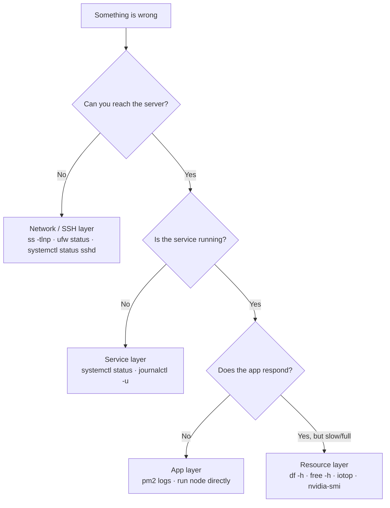

<ChapterMeta />

## TL;DR

- **Work outside-in:** network → service → application → resource. Find *which layer* is broken first.
- **`systemctl status` and `journalctl -u <svc>` answer most service questions.**
- **`ss -tlnp` proves whether a port is actually listening** — before blaming the firewall.
- **Disk full is the most common outage** — `df -h` first, then `du`/`docker system prune`.
- **Run the app directly (`node dist/main.js`)** to see errors PM2 hides.

## Prerequisites

| Requirement | Why |
|-------------|-----|
| All prior chapters | This chapter ties their tools together. |
| A real problem (or curiosity) | You learn troubleshooting by doing it. |

## A troubleshooting method

Don't guess — localize. Start at the outside (can I even reach it?) and move inward.



<p class="ahl-diagram-caption"><strong>Figure 26.1</strong> — The diagnostic tree: each answer narrows the layer before you touch a config.</p>

## Problem: can't SSH into the server

```bash [troubleshoot-ssh.sh]
# Check SSH service is running (on server)
sudo systemctl status sshd

# Check firewall allows SSH
sudo ufw status | grep 22

# Check what's listening on port 22
ss -tlnp | grep :22

# Test from Mac with verbose output
ssh -v homelab
```

| Layer | Command | What it tells you |
|-------|---------|-------------------|
| Service | `systemctl status sshd` | Is the daemon up? |
| Firewall | `ufw status \| grep 22` | Is the port allowed? |
| Listener | `ss -tlnp \| grep :22` | Is anything bound to 22? |
| Client | `ssh -v homelab` | Where the client fails |

## Problem: a service won't start

```bash [troubleshoot-service.sh]
# Always check status first
sudo systemctl status servicename

# Check detailed logs
journalctl -u servicename -n 50 --no-pager

# Check if port is already in use
ss -tlnp | grep :3000
```

## Problem: disk full

```bash [troubleshoot-disk.sh]
# Find what's using space
df -h                           # which partition is full
du -sh /var/log/*               # check logs
du -sh /var/lib/docker/*        # check Docker
docker system prune -f          # clean Docker
sudo journalctl --vacuum-size=500M  # limit systemd logs to 500MB
```

## Problem: can't connect to Postgres

```bash [troubleshoot-postgres.sh]
docker ps | grep postgres       # is container running?
docker logs postgres            # check container logs
docker exec -it postgres psql -U devuser   # test direct connection
ss -tlnp | grep 5432            # is port open?
```

## Problem: NestJS app crashing

```bash [troubleshoot-app.sh]
pm2 logs myapp --lines 100      # check PM2 logs
pm2 show myapp                  # check status and config
node dist/main.js               # run directly to see errors
```

## Problem: GPU not working

```bash [troubleshoot-gpu.sh]
nvidia-smi                      # is GPU detected?
sudo journalctl -k | grep -i nvidia   # kernel messages about GPU
sudo apt install --reinstall nvidia-driver-535   # reinstall drivers
```

<figure>
  <svg viewBox="0 0 720 210" role="img" aria-label="Diagnostic layers from outside in: network, service, application, resource, each with its primary command" width="100%" style="max-width:720px;height:auto;border-radius:10px;border:1px solid var(--vp-c-divider);background:var(--vp-c-bg-soft);padding:1rem;box-sizing:border-box;font-family:Inter,system-ui,sans-serif;">
    <rect x="16" y="40" width="688" height="32" rx="8" fill="var(--vp-c-bg)" stroke="var(--vp-c-divider)"></rect>
    <text x="32" y="61" font-size="12" font-weight="700" fill="var(--vp-c-text-1)">1 · Network</text>
    <text x="240" y="61" font-size="11" fill="var(--vp-c-text-3)" font-family="'JetBrains Mono',monospace">ss -tlnp · ufw status</text>
    <rect x="16" y="78" width="688" height="32" rx="8" fill="var(--vp-c-bg)" stroke="var(--vp-c-divider)"></rect>
    <text x="32" y="99" font-size="12" font-weight="700" fill="var(--vp-c-text-1)">2 · Service</text>
    <text x="240" y="99" font-size="11" fill="var(--vp-c-text-3)" font-family="'JetBrains Mono',monospace">systemctl status · journalctl -u</text>
    <rect x="16" y="116" width="688" height="32" rx="8" fill="var(--vp-c-bg)" stroke="var(--vp-c-divider)"></rect>
    <text x="32" y="137" font-size="12" font-weight="700" fill="var(--vp-c-text-1)">3 · Application</text>
    <text x="240" y="137" font-size="11" fill="var(--vp-c-text-3)" font-family="'JetBrains Mono',monospace">pm2 logs · node dist/main.js</text>
    <rect x="16" y="154" width="688" height="32" rx="8" fill="var(--vp-c-bg)" stroke="var(--vp-c-brand-1)"></rect>
    <text x="32" y="175" font-size="12" font-weight="700" fill="var(--vp-c-brand-1)">4 · Resource</text>
    <text x="240" y="175" font-size="11" fill="var(--vp-c-text-3)" font-family="'JetBrains Mono',monospace">df -h · free -h · iotop · nvidia-smi</text>
  </svg>
  <figcaption><strong>Figure 26.2</strong> — Diagnose in order; each layer has a primary command that confirms or clears it.</figcaption>
</figure>

## Verification

After any fix, confirm the symptom is actually gone:

| Fixed | Verify with |
|-------|-------------|
| SSH | `ssh homelab` succeeds from the Mac |
| Service | `systemctl is-active <svc>` → `active` |
| Disk | `df -h` shows free space |
| Postgres | `docker exec postgres psql -U devuser -c '\l'` |
| App | `pm2 list` → `online`; `curl localhost:3000` |
| GPU | `nvidia-smi` lists the GPU |

```bash [verify.sh]
systemctl is-active nginx
df -h | awk 'NR==1 || /\/$/'
pm2 list
nvidia-smi -L
```

## Common pitfalls

::: warning Top 3 failure modes
1. **Changing configs before localizing the layer.** You end up "fixing" things that weren't broken. Diagnose first.
2. **Trusting `ufw status` alone.** A port can be allowed yet nothing is listening — always cross-check with `ss -tlnp`.
3. **Ignoring the first line of an error.** It usually names the exact cause. Read it before searching.
:::

## Recap & next

You now have a repeatable method: localize the layer, use that layer's primary command, fix, and verify. That beats random guessing every time.

Next: **[Chapter 27 — Cheatsheet & Quick Reference](/chapters/27-cheatsheet-quick-reference)** — the one-page summary of everything.

## References

- [`man systemctl`](https://manpages.ubuntu.com/manpages/noble/en/man1/systemctl.1.html) — status, start, and unit management.
- [`man journalctl`](https://manpages.ubuntu.com/manpages/noble/en/man1/journalctl.1.html) — reading service logs.
- [`man ss`](https://manpages.ubuntu.com/manpages/noble/en/man8/ss.8.html) — socket/listener inspection.
- [`man ssh`](https://manpages.ubuntu.com/manpages/noble/en/man1/ssh.1.html) — verbose client debugging (`-v`).
- [`man df`](https://manpages.ubuntu.com/manpages/noble/en/man1/df.1.html) — filesystem usage.
- [`man dmesg`](https://manpages.ubuntu.com/manpages/noble/en/man1/dmesg.1.html) — kernel/hardware messages (GPU, disks).
