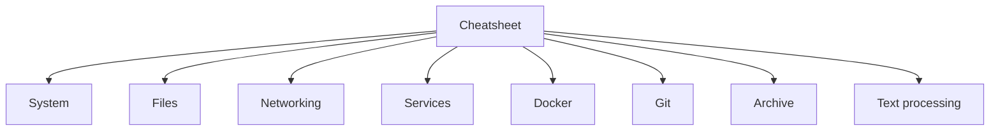

<ChapterMeta />

## TL;DR

- **A one-page reference** for the commands used across all 27 chapters.
- **Copy-paste aliases** turn long commands into short ones.
- **A single `health.sh` script** reports uptime, disk, RAM, GPU, services, containers, and ports at a glance.
- **Ten final habits** that keep a home lab healthy.
- Bookmark this page; everything else links back to it.

## Prerequisites

| Requirement | Why |
|-------------|-----|
| A shell | You'll paste these commands. |
| Earlier chapters | Each command is explained there. |



<p class="ahl-diagram-caption"><strong>Figure 27.1</strong> — The categories covered below, grouped the way you'll actually reach for them.</p>

## Essential commands

```bash [cheatsheet.sh]
# ─── SYSTEM ──────────────────────────────────────────────────
uname -a                    # kernel version + architecture
lscpu                       # CPU info
free -h                     # RAM usage
df -h                       # disk space
lsblk                       # block devices (disks)
ps aux                      # all running processes
ps aux | grep nginx         # find specific process
kill -9 PID                 # force kill process
pkill -f "node dist"        # kill by name pattern
uptime                      # system uptime + load average
who                         # who's logged in
last                        # recent logins

# ─── FILES ───────────────────────────────────────────────────
ls -la                      # list with permissions
ls -lh                      # human-readable sizes
find / -name "*.log" 2>/dev/null    # find files
find /var -size +100M       # files larger than 100MB
grep -r "error" /var/log/   # recursive search
grep -i "error" file.log    # case-insensitive
tail -f file.log            # follow file changes
wc -l file.txt              # count lines
sort file.txt | uniq -c     # sort and count unique lines

# ─── NETWORKING ──────────────────────────────────────────────
ip addr show                # IP addresses
ip route show               # routing table
ss -tlnp                    # listening ports
curl -I https://google.com  # HTTP headers only
wget -q -O - url | head     # download and preview
nmap -p 1-1000 192.168.1.1  # scan ports (install with apt)

# ─── SERVICES ────────────────────────────────────────────────
systemctl list-units --type=service --state=running
systemctl list-timers

# ─── DOCKER ──────────────────────────────────────────────────
docker ps -a                # all containers
docker images               # all images
docker stats                # resource usage live
docker inspect postgres     # detailed container info
docker exec -it NAME bash   # enter container
docker cp NAME:/path ./     # copy from container
docker volume ls            # list volumes
docker network ls           # list networks
docker system df            # disk usage by Docker

# ─── GIT ─────────────────────────────────────────────────────
git log --oneline -10       # recent commits
git diff HEAD~1             # changes in last commit
git stash                   # save uncommitted changes
git stash pop               # restore stashed changes

# ─── ARCHIVE ─────────────────────────────────────────────────
tar -czf archive.tar.gz dir/     # compress directory
tar -xzf archive.tar.gz          # extract
zip -r archive.zip dir/          # zip
unzip archive.zip

# ─── TEXT PROCESSING ─────────────────────────────────────────
cat file.txt | wc -l             # count lines
awk '{print $1}' file.txt        # print first column
sed 's/old/new/g' file.txt       # replace text
cut -d',' -f1,3 file.csv         # extract CSV columns
jq '.name' data.json             # parse JSON
```

| Need to… | Reach for |
|----------|-----------|
| See resource usage | `htop`, `free -h`, `df -h`, `iotop` |
| Find a process/port | `ps aux \| grep`, `ss -tlnp` |
| Inspect a service | `systemctl status`, `journalctl -u` |
| Manage containers | `docker ps`, `docker compose` |
| Parse text/JSON | `grep`, `awk`, `sed`, `jq` |

## Shell aliases — add to `~/.bashrc`

```bash [aliases.sh]
# Navigation
alias ..='cd ..'
alias ...='cd ../..'
alias ll='ls -alF'
alias la='ls -A'
alias proj='cd /srv/apps'
alias stor='cd /mnt/storage'
alias logs='cd /var/log'

# Docker
alias dps='docker ps'
alias dpsa='docker ps -a'
alias dcup='docker compose up -d'
alias dcdn='docker compose down'
alias dlogs='docker compose logs -f'
alias dexec='docker exec -it'
alias dclean='docker system prune -f'

# Server
alias ports='ss -tlnp'
alias myip='hostname -I | awk "{print \$1}"'
alias gpu='watch -n 1 nvidia-smi'
alias disk='df -h'
alias mem='free -h'
alias cpu='htop'
alias syslog='sudo journalctl -f'

# PM2
alias pml='pm2 list'
alias pmlog='pm2 logs'
alias pmmon='pm2 monit'

# Safety
alias rm='rm -i'       # confirm before delete
alias cp='cp -i'       # confirm before overwrite
alias mv='mv -i'       # confirm before overwrite

# Shortcuts
alias update='sudo apt update && sudo apt upgrade -y'
alias reload='source ~/.bashrc'
alias myports='ss -tlnp | grep LISTEN'
alias biggest='du -h /* 2>/dev/null | sort -rh | head -15'
```

Apply: `source ~/.bashrc`

## Quick diagnostics script

Save as `~/scripts/health.sh`:

```bash [health.sh]
#!/bin/bash
echo "════════════════════════════════════════"
echo "  SERVER HEALTH — $(hostname) — $(date)"
echo "════════════════════════════════════════"
echo ""
echo "── UPTIME ──────────────────────────────"
uptime
echo ""
echo "── DISK ────────────────────────────────"
df -h | grep -v tmpfs | grep -v udev
echo ""
echo "── MEMORY ──────────────────────────────"
free -h
echo ""
echo "── CPU LOAD ────────────────────────────"
top -bn1 | grep "Cpu(s)"
echo ""
echo "── GPU ─────────────────────────────────"
nvidia-smi --query-gpu=name,memory.used,memory.total,utilization.gpu,temperature.gpu \
  --format=csv,noheader 2>/dev/null || echo "GPU not available"
echo ""
echo "── SERVICES ────────────────────────────"
for svc in nginx docker sshd fail2ban; do
    status=$(systemctl is-active $svc)
    echo "  $svc: $status"
done
echo ""
echo "── DOCKER CONTAINERS ───────────────────"
docker ps --format "  {{.Names}}: {{.Status}}" 2>/dev/null
echo ""
echo "── PM2 PROCESSES ───────────────────────"
pm2 list 2>/dev/null | grep -v "└\|┌\|│ id" | head -10
echo ""
echo "── OPEN PORTS ──────────────────────────"
ss -tlnp | grep LISTEN
echo "════════════════════════════════════════"
```

```bash [install-health.sh]
chmod +x ~/scripts/health.sh
# Add alias
echo "alias health='~/scripts/health.sh'" >> ~/.bashrc
```

<figure>
  <svg viewBox="0 0 720 240" role="img" aria-label="Mock of the health.sh output showing uptime, disk, memory, GPU, services, containers and open ports sections" width="100%" style="max-width:720px;height:auto;border-radius:10px;border:1px solid #1e293b;background:#0f172a;box-sizing:border-box;font-family:'JetBrains Mono',ui-monospace,monospace;">
    <rect x="0" y="0" width="720" height="34" rx="10" fill="#1e293b"></rect>
    <circle cx="20" cy="17" r="5" fill="#ef4444"></circle>
    <circle cx="38" cy="17" r="5" fill="#f59e0b"></circle>
    <circle cx="56" cy="17" r="5" fill="#22c55e"></circle>
    <text x="76" y="22" font-size="12" fill="#cbd5e1">ahmed@homelab: ~$ health</text>
    <g font-size="12" fill="#e2e8f0">
      <text x="20" y="60">── UPTIME ─────────────────────</text>
      <text x="20" y="80"> up 6 days, load average: 0.12 0.08 0.05</text>
      <text x="20" y="104">── DISK ───────────────────────</text>
      <text x="20" y="124"> / 80G 32% · /var 50G 61% · /mnt/storage 42%</text>
      <text x="20" y="148">── MEMORY ─────────────────────</text>
      <text x="20" y="168"> Mem: 15Gi total, 9.2Gi used, 6.1Gi free</text>
      <text x="20" y="192">── GPU ────────────────────────</text>
      <text x="20" y="212" fill="#5cb39a"> NVIDIA GTX 1050 Ti, 512 MiB / 2048 MiB, 34%</text>
    </g>
    <g font-size="12" fill="#e2e8f0">
      <text x="420" y="60">── SERVICES ───────────────────</text>
      <text x="420" y="80"> nginx: active · docker: active</text>
      <text x="420" y="100"> sshd: active · fail2ban: active</text>
      <text x="420" y="124">── DOCKER CONTAINERS ──────────</text>
      <text x="420" y="144"> postgres: Up 6 days · redis: Up 6 days</text>
      <text x="420" y="168">── OPEN PORTS ─────────────────</text>
      <text x="420" y="188"> :22 :80 :443 :3000 :5432</text>
    </g>
  </svg>
  <figcaption><strong>Figure 27.2</strong> — One command, the whole server: uptime, disk, memory, GPU, services, containers, and ports. (Illustrative output.)</figcaption>
</figure>

## Final tips

1. **Always use `tmux`** — Never run long tasks without it
2. **Document your setup** — Keep a `~/NOTES.md` with what you installed and why
3. **Test backups** — A backup you've never restored is just hope
4. **Keep it simple** — Don't over-engineer. Add complexity only when needed
5. **Update regularly** — `sudo apt update && sudo apt upgrade -y` weekly
6. **Monitor logs** — `journalctl -f` should be your best friend
7. **Use version control** — Store your scripts and configs in a private git repo
8. **Principle of least privilege** — Services should run as non-root users
9. **One service per container** — Makes debugging and scaling much easier
10. **Read error messages** — 90% of the time the solution is in the first line of the error

## Verification

| Check | Command | Expected |
|-------|---------|----------|
| Aliases load | `source ~/.bashrc; alias health` | shows the alias |
| Health script runs | `bash ~/scripts/health.sh` | the full report |
| GPU line present | run `health` | a `NVIDIA ...` line (or "GPU not available") |
| Scripts executable | `ls -l ~/scripts/` | `-rwxr-xr-x` |

```bash [verify.sh]
source ~/.bashrc
bash ~/scripts/health.sh
```

## Recap

That's the whole guide. You started with a bare Ubuntu Server and now run a production-style home lab: partitioned disks, hardened SSH, a firewall, Docker, Nginx, a GPU pipeline, PM2, monitoring, backups, and automation — with a health check to prove it all at once.

*Guide tailored for: Intel i5 7th Gen · GTX 1050 Ti · Samsung NVMe 500GB · WD HDD 500GB · 16GB RAM · Ubuntu Server 24.04 LTS*

## References

- [tldr pages](https://tldr.sh/) — practical examples for hundreds of commands.
- [explainshell](https://explainshell.com/) — paste a command, get a breakdown.
- [ShellCheck](https://www.shellcheck.net/) — lint your shell scripts.
- [`man nmap`](https://manpages.ubuntu.com/manpages/noble/en/man1/nmap.1.html) — port scanning.
- [`man awk`](https://manpages.ubuntu.com/manpages/noble/en/man1/awk.1.html) and [`man sed`](https://manpages.ubuntu.com/manpages/noble/en/man1/sed.1.html) — text processing.
- [crontab.guru](https://crontab.guru/) — decode cron expressions.
